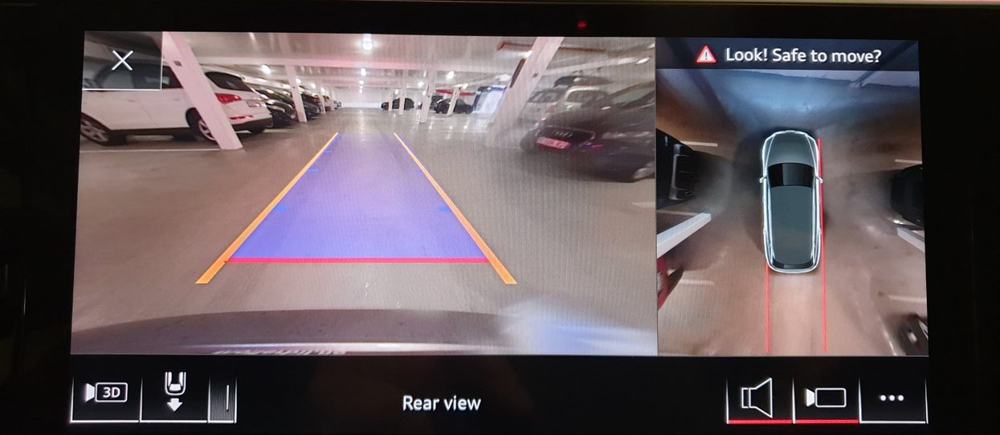

Et virtuelt overheadbilde vist i MMI-displayet gir føreren en oversikt over den generelle parkeringssituasjonen. Panoramautsikten foran og bak dekker en vinkel på nesten 180 grader og gir bedre sikt ved utkjøring av trange parkeringsplasser, gårdsinnganger og uoversiktlige veikryss. Ledelinjer i ryggekameravisningen gjør det lettere å parkere på loddrette plasser og å koble til tilhengere. Utsikten fra frontkameraet hjelper ved manøvrering, da det oppdager hindringer foran bilen. Systemet aktiveres automatisk når du kjører i revers eller ved å trykke på en knapp.

En tilleggsfunksjon for noen modeller er en virtuell 3D-visning. Føreren kan bruke berøringsskjermen til trinnløst å svinge og zoome bildet av bilen og de faktiske kjøretøyomgivelsene. Det er også utsyn til for- eller bakdekkene slik at sjåføren kan trekke bilen opp rett ved kantsteinen.

360-kameraet er original en del av assistentsystempakken pro, men er for øyeblikket ikke tilgjengelig. 

{}
