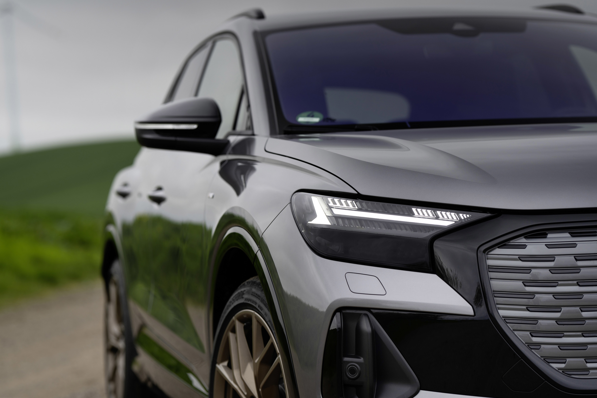

## The headlights

There is two types of headlights available on Audi Q4 e-tron

### Standard headlights

The headlights of the Q4 e-tron and the Q4 Sportback e-tron are fully equipped with LEDs as standard. 

The standard headlights does not include high-beam assistant or head light washers. 

High beam assistant has option id **8G1** and head light washers has option id **8X8**

### Matrix Headlights

On request, Audi also offers the Matrix LED headlights – they lend the two electric compact SUVs a look that is full of character and unmistakable, day and night. The next stage of evolution in daytime running lights is totally new among the competition. Using the MMI touch operating system, the driver can switch between four digital light signatures at any time. Each of them generates its own theme and lends the daytime running lights an individual expression. The variant selected is activated the next time the vehicle is started. The below show the 4 different signatures

The vide below show more details



The Matrix LED headlights are divided into two sections in terms of optics and technology. The completely black lower half conceals the units for the low beam and the Matrix LED high beam. The 16 individual LEDs that comprise it are regulated so that they always illuminate the road as brightly as possible without blinding other road users.

The upper half forms a bright eye. A flat segment runs across the headlights here, serving a dual function in generating a fixed daytime running light and the dynamic turn signals. Above and below it are a total of nine flat daytime running light segments, which, together with the large vertical anchor segment at the outer edge, can be configured into four digital light signatures. Two slat trims made of brushed stainless steel divide the digital daytime running light segments into 49 small sections. Seen from the side, they appear to be well shielded, lying one on top of the other like the slats of vertical blinds; the full power of the individual light segments is easily visible from the front – creating a fascinating effect that plays with light and shadows.

See video below how HD Matrix works on an e-tron



### Striking taillight signature: the light strip at the rear

In combination with the Matrix LED headlights, there is also a particularly elegant light solution at the rear of the compact electric SUV. A light strip runs across its full width; at its center the taillight beams out in a fine line that splits into separate segments at its ends. Each individual segment is modeled as a three-dimensional body, resulting in a light sculpture that is expressive from all perspectives. The light signature opens up into a large light anchor segment on the sides of the vehicle. Its dynamic graphic is inspired by intricate electric circuits and bears the Four Rings radiating in signature red as the central detail. The dynamic turn signals add a further highlight in the reversing lights.

When the car is unlocked and exited, dynamic “leaving home” and “coming home” light sequences are played in the rear lights and the headlights. The sequences in the headlights vary depending on which daytime running light signature is selected.

{}
