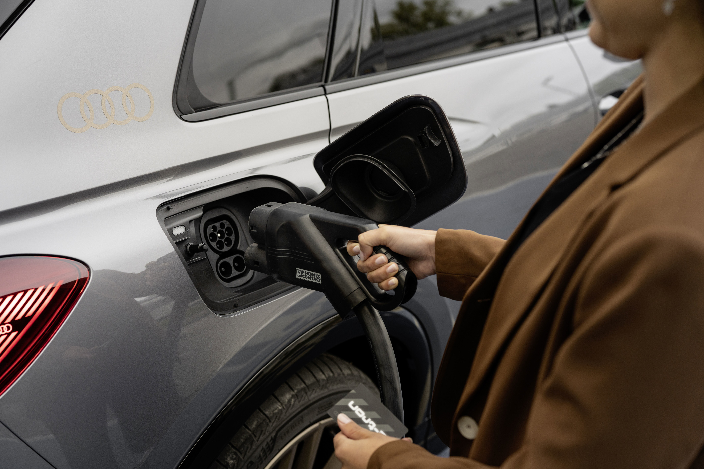
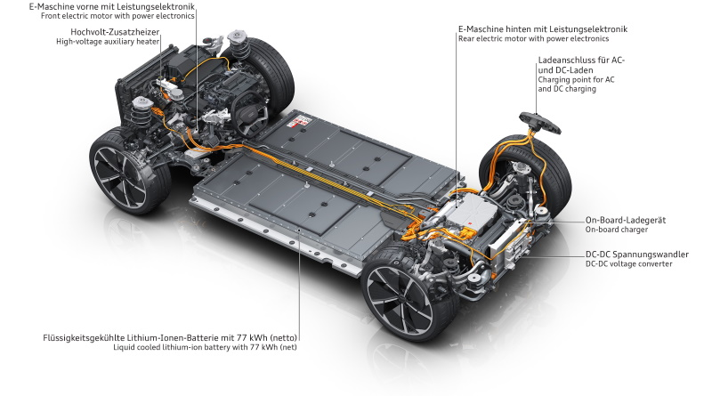

<!-- markdownlint-disable MD033 -->

The onboard charger is responsible for converting AC to DC.

There are two versions of the onboard charger. The charger in Q4 35 support 7.2KW AC charging (KB2) while 40/45 and 50 support 11KW AC charging (KB3)

In the US the charging port has a [J1772 connector](https://en.wikipedia.org/wiki/SAE_J1772) to connect to the car, while in Europe it has a [Type 2 connector](https://en.wikipedia.org/wiki/Type_2_connector).

<figure>
    
    <figcaption><h4>Type 2 Chargeport</h4></figcaption>
</figure>

To charge the car from AC you need a Wallbox to connect to or the [charging system that can connect to the domestic outlet](../chargingsystem). 

### Electric drive unit

In the illustration below you see the location of the charge units.

<figure>
    
    <figcaption><h4>Electric drivetrain with chargeport and AC charger</h4></figcaption>
</figure>

 Only AC charging goes throug the charger. For DC charging the CCS port is directly connected to the battery.

### Capacity based on network / outlet

| Connection | Plug  | capacity | charging 100%  Q4 e-tron 50 |
| ------| ------| ---- |------- |
| 120Volt | Level 1 Domestic NEMA 5-20 | 1.2kW |  64 hours |
| 240Volt | Domestic NEMA 14-50 | 9.6kW |  8 hours |
| 230Volt | Domestic Type F | 1.8kW |  42 hours |
| 400V 16A 3phase | Red Industrial |  11KW | 7 hours |
| 230V 32A 1phase | Blue Industrial |  7.2KW | 10.7 hours |
| 230V 16A 1phase | Blue Industrial |  3.6KW | 21.4 hours |

{}
