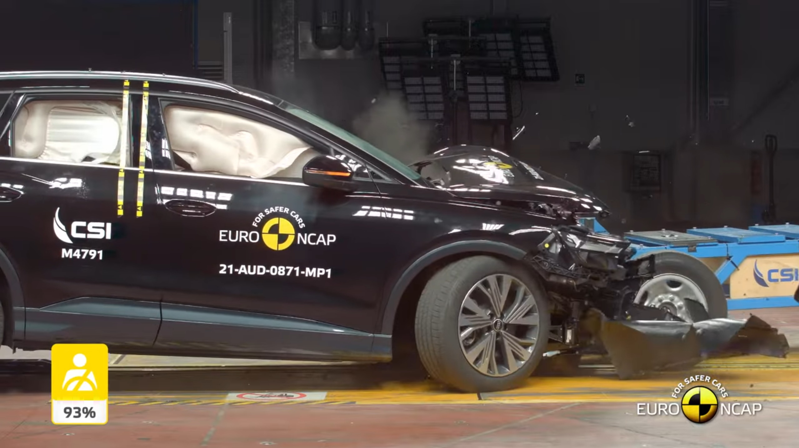
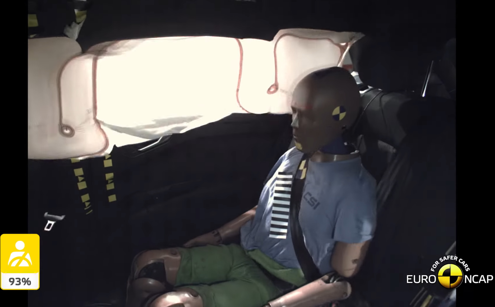
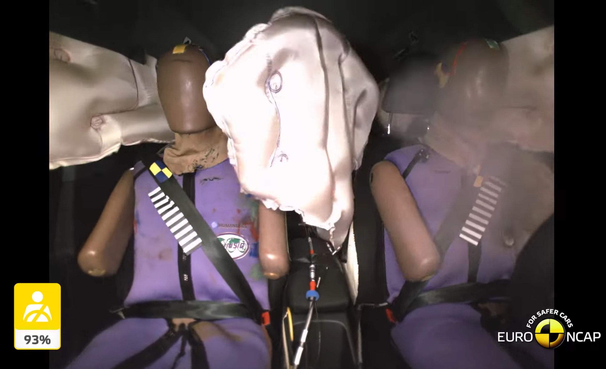
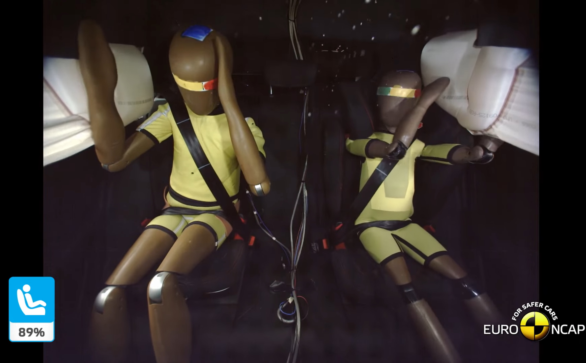

## Kollisjonsputer

Audi Q4 e-tron har flere kollisjonsputer som standard.

### Kollisjonsputer foran

### Hodekollisjonsputer

Både foran og bak er beskyttet med hodekollisjonsputer.

### Sidekollisjonsputer foran

Foran er det standard med sidekollisjonsputer innebygd i setet som beskytter kroppen.

### Midtkollisjonspute foran

I tillegg til sidekollisjonsputene foran og bak og hodekollisjonsputene, er det også en såkalt interaksjonspute fora i midten. Innenfor
systemets begrensinger gir dette beskyttelse for passasjerene i førersetet og passasjersete foran ved en sidekollisjon. Interaksjonskollisjonsputen blåser seg opp mellom forsetene. Ved sidekollisjon blir en kollisjon av de to passasjerene foran
med hverandre eller med passasjersetet foran minsket i stor grad og risikoen for skader reduseres.

### Sidekollisjonsputer bak

På baksiden er sidekollisjonsputene valgfritt. Opsjonsnummer er **6C4** 

## Setebelter

Forsetebelter har reversible beltestrammere foran

## Krasjtesting

Audi Q4 e-tron har fått full score på forskjellige kollisjonstester. Se nedenfor.

### Euro NCAP kollisjonstest av Audi Q4 e-tron 2021



{}
