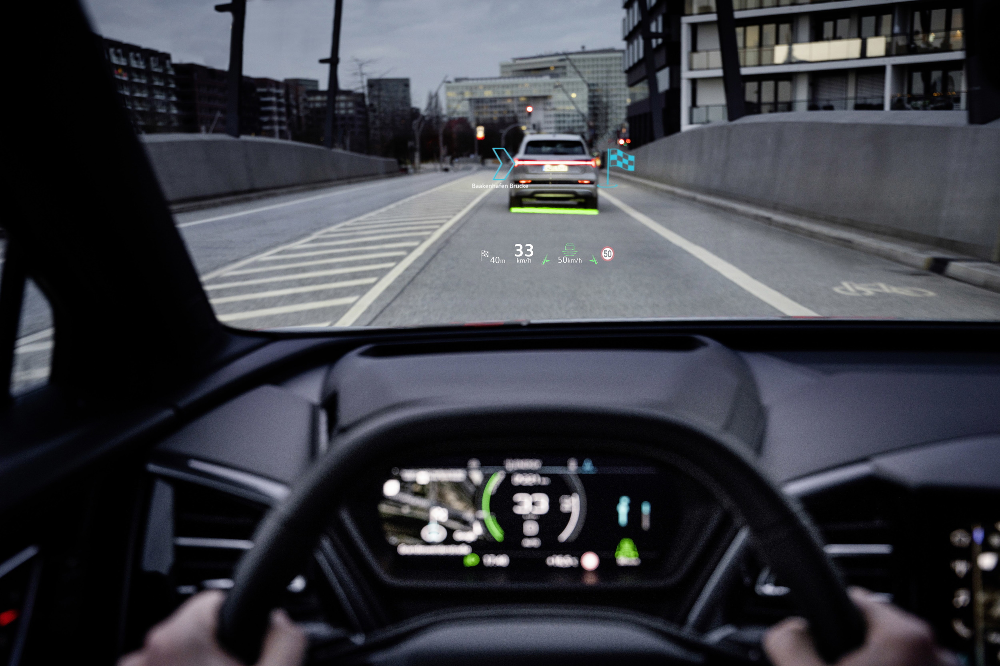
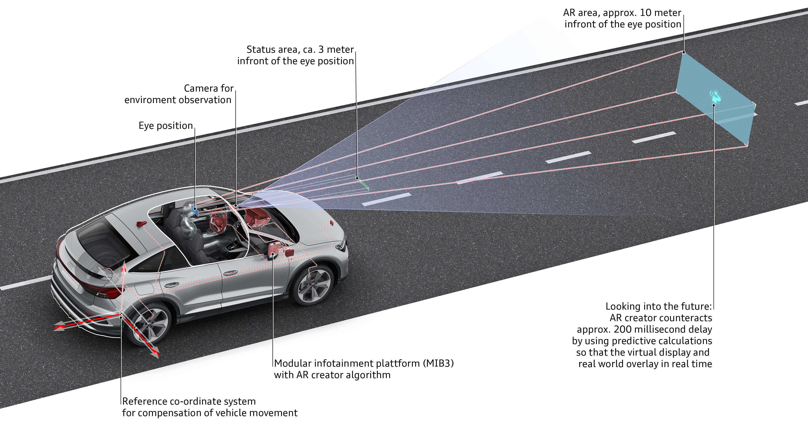

 The display reflects important information via the windshield on two separate levels, the status section and the augmented reality (AR) section. The information provided by some of the assist systems and the turning arrows of the navigation system as well as its starting points and destinations are visually superimposed in the corresponding place on the real-life outside world as content of the AR section and displayed dynamically. They appear to be floating at a distance of roughly ten meters from the driver. Depending on the situation, they can appear considerably further ahead in some cases. The driver can understand the displays very quickly without being confused or distracted by them, and they are extremely helpful in poor visibility conditions.

The field of view for the AR content from the driver’s perspective is equivalent to a diagonal of around 70 inches. Below it is a flat near-field area window, known as the status section. It displays the speed driven and the traffic signs as well as the assist system and navigation symbols as static displays. It appears to hover about three meters in front of the driver.

### The heart of the system: the picture generation unit

The technical heart of the augmented reality head-up display is the picture generation unit (PGU), which is located deep inside the long instrument panel. A particularly bright LCD directs the light beams it generates onto two level mirrors, and special optical components separate the portions for the near-field and distant areas. The level mirrors direct the beams onto a large concave mirror that can be adjusted electrically. From there, they reach the windshield, which reflects them into what is known as the eyebox and thus onto the driver’s eyes. At an apparent distance of ten meters, or even further away depending on the situation, the driver sees the symbols just as clearly as their real-life environment.

### Predictive picture generator: the AR Creator

What is known as the AR Creator serves as the mastermind and picture generator on the software side – this is a processing unit in the modular infotainment platform (MIB 3) that is comprised of multiple individual modules. The AR Creator renders the display symbols at a rate of 60 frames per second and adapts them to the geometry of the projection optics. At the same time, it calculates their location in relation to the environment, on which it obtains information via the raw data of the front camera, the radar sensor, and the GPS navigation. Its software consists of roughly 600,000 lines of programming code, around 50 percent more than the entire control system of the first version of the Space Shuttle.

While performing its computing work, the AR Creator takes into account that there are always a few fractions of a second between the identification of an object by the sensors and the output of the graphic content. During these brief time windows, the Q4 e-tron can change its position considerably, whether due to braking or a pothole. Multiple computations are performed continuously to ensure that the display in the eyebox does not jump into the wrong position. One of them takes place in the camera software. For another, the AR Creator uses the most recent data to make a predictive calculation of the car’s continued forward movement. In a further computation, it estimates the vertical movement on the basis of data supplied by the camera, the radar, and the sensors of the stabilization control (ESC). These insights are incorporated into the “shake compensation,” which takes place a few milliseconds before the picture is output and whose task is to prevent any disruptive shaking of the display.

### Navigation: the drone flies ahead

The augmented reality head-up display demonstrates its strengths in a particularly impressive way during navigation. On the road, what is known as the drone – a floating arrow – shows the next point of action on the route. It is dynamic: When approaching an intersection, for example, the floating arrow first announces the turning maneuver before an animated arrow steers the driver onto the road with precision. If the route then continues straight ahead, the drone flies ahead and disappears in order to then reappear with sufficient time before the next point of action. The distance to the turning point is displayed in meters in the lower window of the near-field area.

Even if the driver has activated the adaptive cruise assist, which keeps the car in the center of the lane, the augmented reality head-up display assists them with visual hints. As soon as the Q4 
e-tron approaches a lane marking without the turn signal having been activated, the lane departure warning superimposes the real-life lane marking with a red line. Another example is regulation in relation to a vehicle driving in front: If it is active, the car is marked on the display with a colored stripe – this allows the driver to understand the status of the adaptive cruise assist or adaptive cruise control without being distracted. A red marking and a warning symbol appear if the adaptive cruise assist prompts the driver to verify that they are paying attention.

{}
