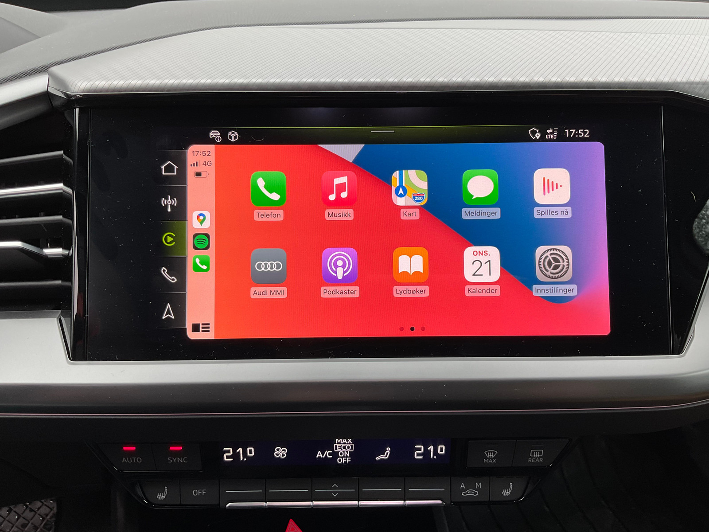

Med Audi smarttelefongrensesnitt med alternativ-id **IU1** får du muligheten til å bruke Apple Carplay eller Android Auto i ditt MMI-system.

Dette gir deg tilgang til mange nyttige apper som Spotify og Waze direkte i MMI.

Bildet nedenfor viser hvordan Waze advarer brukere om et fotoboks i en Audi e-tron.

Android Auto krever at du bruker kabel, men Apple Carplay støttes via kabel og trådløst.

Foreløpig er dette alternativet bare tilgjengelig som en del av [Infotainment-pakken](/models/q4-e-tron/optionguide/list/#infotainment) med alternativ-ID **PYX**, [Infotainment small package](/models/ q4-e-tron/optionguide/list/#infotainment) med alternativ-ID **PY3** og [MMI Navigation Pro-pakken](/models/q4-e-tron/optionguide/list/#infotainment) med alternativ-ID **PYH**

{}
