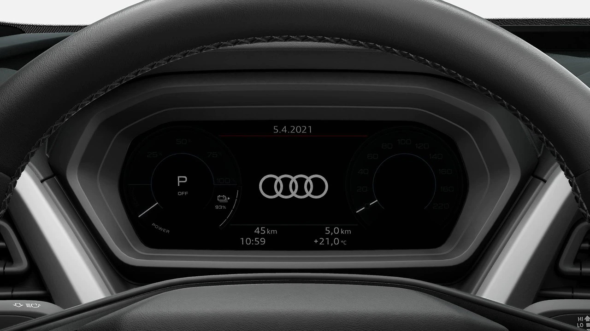

The standard instrumation is a digital screen showing the main car data as range, speeds, battery status

With adding the virtual Cockpit option this display is changed with the virtual cockpit display.

The virtual cockpit display has a resolution of 1,440 x 540 pixels. Its display graphics are  sharp and highly detailed.

The display shows a wide range of information clearly and in neat, sharp, highly detailed graphics.

It includes traditional speed, battery state, power bar figures as well as information on navigation, media and driver assistance systems.

Fixed indicators are shown along the lower edge; they show the outside temperature, time and odometer readings as well as warning and information symbols.

The image is refreshed 60 times per second so that the virtual needle of the rev counter tracks smoothly and very precisely.

The driver can use the View button on the multifunction steering wheel to switch the Audi virtual cockpit between two views:

While the tachometer and speedometer are displayed as large dial-type gages in driving view, a central window dominates in infotainment view. 

It creates a large stage for the navigation map or for lists in the phone, radio and audio areas. In this case, the tachometer and speedometer are displayed as small dial instruments.

 " Virtual Cockpit e-tron mode infotainment view - Nightvision")

{}
