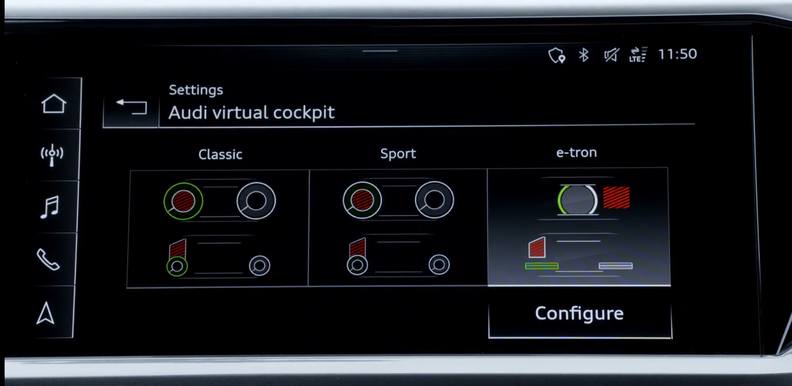

## Standard digital instrumenteringsklynge

Standardinstrumenteringen er en digital skjerm som viser de viktigste bildataene som rekkevidde, hastigheter, batteristatus

## Virtuell cockpit-alternativ

Ved å legge til det virtuelle cockpit-alternativet endres denne skjermen med den virtuelle cockpit-skjermen.

Den virtuelle cockpitskjermen har en oppløsning på 1440 x 540 piksler. Skjermgrafikken er skarp og svært detaljert.

Displayet viser et bredt spekter av informasjon klart og i ryddig, skarp, svært detaljert grafikk.

Den inkluderer tradisjonell hastighet, batteristatus, strømlinjetall samt informasjon om navigasjon, media og førerassistentsystemer.

Faste indikatorer vises langs den nedre kanten; de viser utetemperatur, tid og kilometerstand samt advarsels- og informasjonssymboler.

Bildet oppdateres 60 ganger i sekundet slik at den virtuelle nålen til turtelleren sporer jevnt og veldig presist.

Føreren kan bruke Vis-knappen på multifunksjonsrattet for å bytte Audi virtual cockpit mellom to visninger:
Infotainmentvisning og førervisning

Mens turtelleren og hastighetsmåleren vises som store måleinstrumenter i kjørevisning, dominerer et sentralt vindu i infotainmentvisningen.

Det skaper en stor scene for navigasjonskartet eller for lister i telefon-, radio- og lydområdene. I dette tilfellet vises turtelleren og hastighetsmåleren som små måleinstrumenter.

### Virtual Cockpit Plus

Med virtuell cockpit får du to forskjellige moduser. Men med Virtual Cockpit pluss får du en ekstra e-tron-modus.

{}
