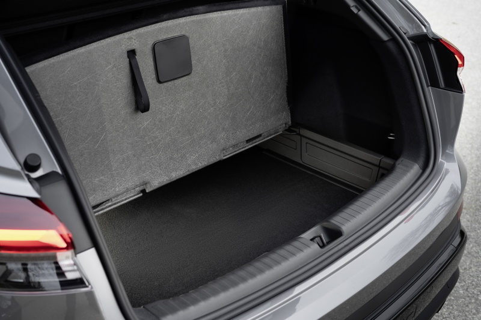
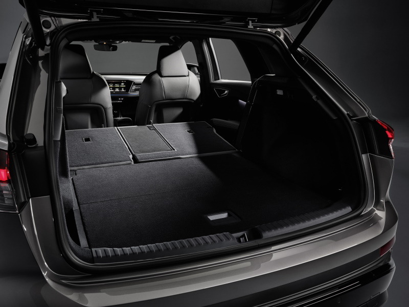
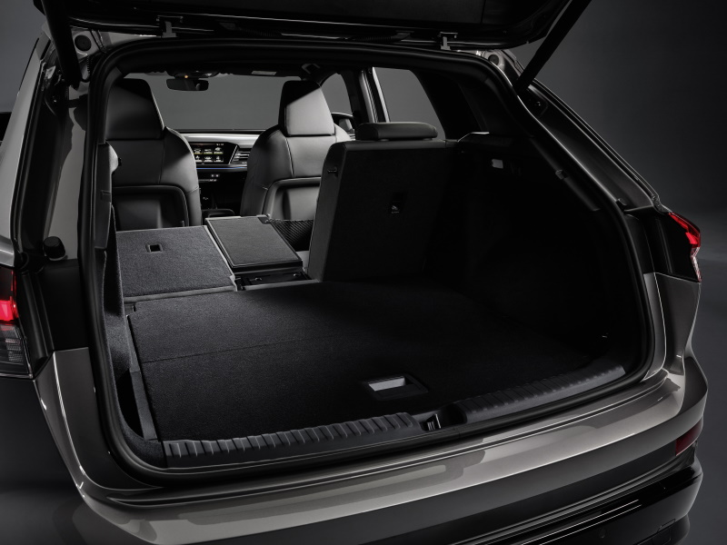

<!-- markdownlint-disable MD033 -->

## Trunk

<figure>
    
    <figcaption><h4>Audi Q4 e-tron trunk</h4></figcaption>
</figure>

<figure>
    
    <figcaption><h4>Audi Q4 e-tron trunk</h4></figcaption>
</figure>

<figure>
    
    <figcaption><h4>Audi Q4 e-tron trunk</h4></figcaption>
</figure>

<figure>
    
    <figcaption><h4>Audi Q4 e-tron trunk</h4></figcaption>
</figure>

<figure>
    
    <figcaption><h4>Audi Q4 e-tron trunk</h4></figcaption>
</figure>

<figure>
    
    <figcaption><h4>Audi Q4 e-tron trunk</h4></figcaption>
</figure>

See below for Banana box test for Audi Q4 e-tron.



## Roof storage

You can store up to 75kg on the roof.

<figure>
    
    <figcaption><h4>Audi Q4 e-tron with packline roof box</h4></figcaption>
</figure>

## Trailer

Audi e-tron can drag trailers up to 1800kg

{}
