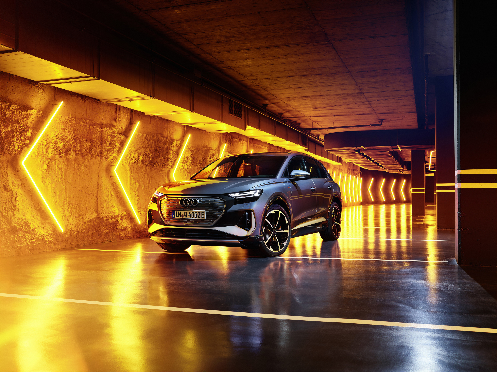

## Audi Q4 e-tron 35

Audi Q4 e-tron 35 is the model with the smallest battery and two wheel drive. 52kWh available battery and WLTP range between 311-341km depending on equipment trim. 170Hp.

## Audi Q4 e-tron 40

Audi Q4 e-tron 40 is the model with the largest battery and two wheel drive. 77kWh available battery and WLTP range between 473-520km depending on equipment trim. 204Hp.

## Audi Q4 e-tron 45 quattro

Audi Q4 e-tron 45 quattro is the model with the largest battery and quattro drive. 77kWh available battery and WLTP range between 449-488km depending on equipment trim. 265Hp.

## Audi Q4 e-tron 50 quattro

Audi Q4 e-tron 50 quattro is the model with the largest battery and quattro drive. 77kWh available battery and WLTP range between 449-488km depending on equipment trim. 299Hp with boost.

## Audi Q4 Sportback e-tron 35

Audi Q4 e-tron 35 is the model with the smallest battery and two wheel drive. 52kWh available battery and WLTP range between 341-311km depending on equipment trim. 170Hp.

## Audi Q4 Sportback e-tron 40

Audi Q4 e-tron 40 is the model with the largest battery and two wheel drive. 77kWh available battery and WLTP range between 473-520km depending on equipment trim. 204Hp.

## Audi Q4 Sportback e-tron 50 quattro

Audi Q4 e-tron 50 quattro is the model with the largest battery and quattro drive. 77kWh available battery and WLTP range between 449-488km depending on equipment trim. 299Hp.

{}
