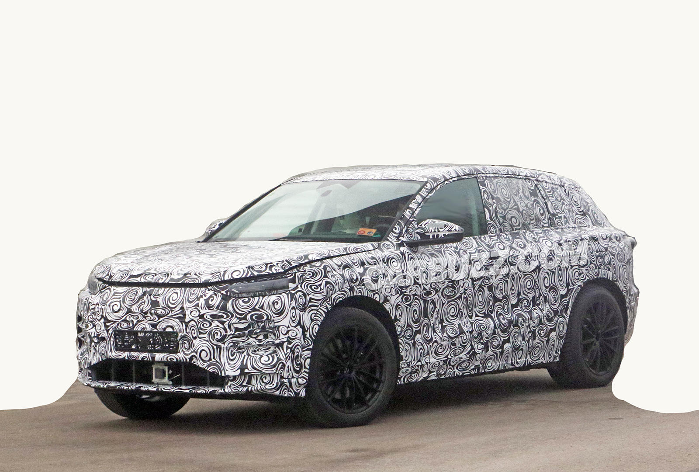
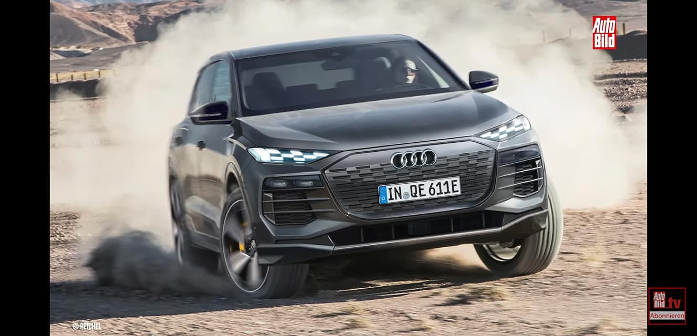
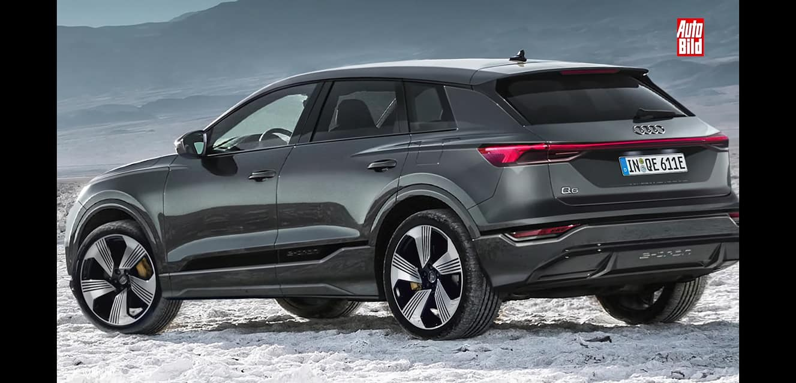
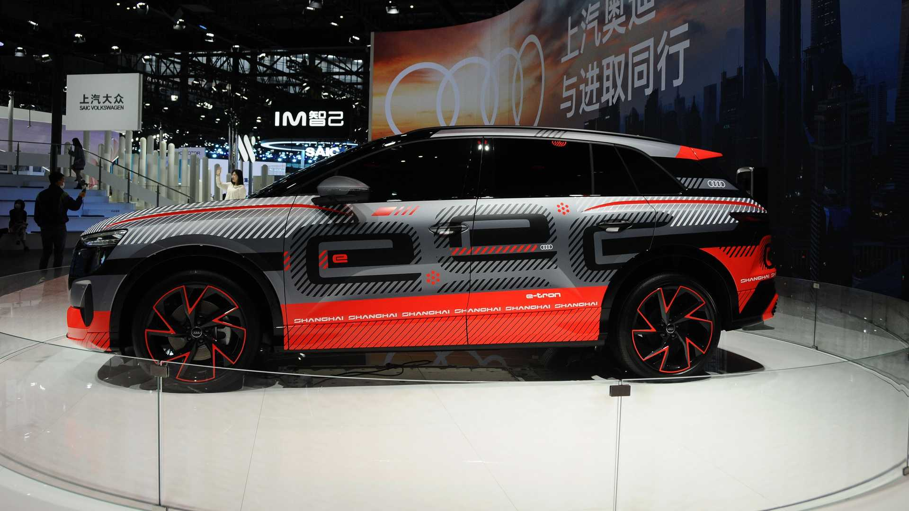

On March 18. 2021 Audi confirmed the Audi Q6 e-tron will have a world premiere in 2022. This will be build on the new PPE platform.

It is also expected it will be an Audi SQ6 e-tron.

Auto Bild has created images how they belive it will look.



In Shanghai Auto 2021 a [new concept was shown](https://www.motor1.com/photo/5769654/audi-electric-suv-study-at-auto-shanghai-2021/). Some belive this is the Q6 but other belive it is a long version of Q4.

{}
