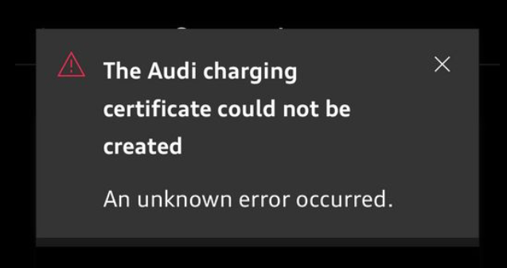

# Problem mit der Zertifikatsgenerierung für Plug&Charge

Wenn Sie diese Nachricht erhalten, gibt es 3 Möglichkeiten, wie Sie sie lösen können

1. Das Auto wurde werkseitig zurückgesetzt. Dies ist umständlich und erfordert, dass Sie das Auto erneut mit Ihrem myAudi-Konto koppeln.
2. Kontaktieren Sie den Audi Charging Service. Telefon: 00 800 11557799. Sie können dieses Zertifikat tatsächlich generieren und an Ihr Auto senden.
3. Einige Benutzer haben sich abgemeldet, die App von ihrem Telefon deinstalliert, neu installiert und es geschafft, sie zum Laufen zu bringen.