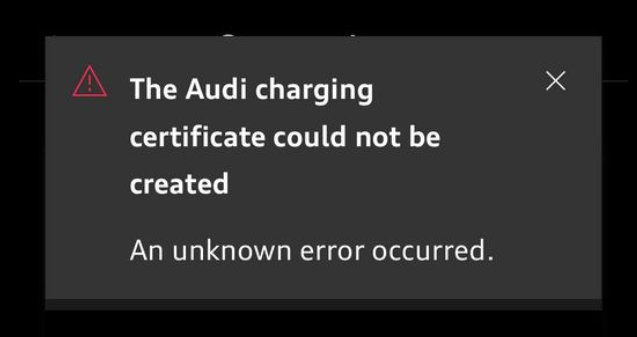

# Problème avec la génération de certificat pour Plug & Charge

Si vous recevez ce message, il y a 3 façons de le résoudre

1. L'usine réinitialise la voiture. C'est lourd et vous oblige à coupler la voiture à nouveau avec votre compte myAudi.
2. Contactez le service de recharge Audi. Téléphone: 00 800 11557799. Ils sont en fait en mesure de générer ce certificat et de l'envoyer à votre voiture.
3. Certains utilisateurs se sont déconnectés, ont désinstallé l'application de leur téléphone, l'ont réinstallé et ont réussi à l'obtenir fonctionner.
