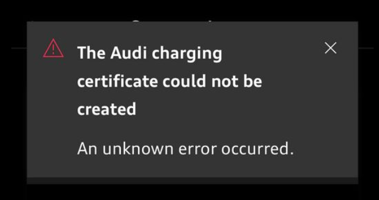

# Problem with certificate generation

If you receive this message, there are 3 ways you can resolve it

1. Factory reset the car. This is cumbersome and requires you to pair the car again with your myAudi account.
2. Contact Audi Charging Service. Phone: 00 800 11557799. They are actually able to generate this certificate and send it to your car.
3. Some users have logged out, uninstalled the app from their phone, reinstalled it, and managed to get it working.