## Batterievorwärmung
Audi Q6 und andere Autos auf der PPE-Plattform verfügen über eine automatische Batterievorwärmung.

## Warum möchten Sie die Batterie vorwärmen?

Warum sollte man die Batterie vorwärmen? **Ein Zweck**, das heißt, eine gute Temperatur zu erzeugen, bevor Sie eine Schnellladesitzung starten (150 kW und höher), sonst ist es völlig unnötig. Die optimale Temperatur beträgt etwa 25 °C und dann werden Sie und nur dann erreichen Sie bis zu 280 kW Ladegeschwindigkeit auf einem 800V Ladegerät im SoC-Bereich von 10-30%, dann beginnt es zu fallen.

Im Winter ist es vielleicht auch nicht möglich 280 kW zu erreichen, aber andere können vielleicht Erfahrungen machen. Aber bei einer kalten Batterie wird die Ladesitzung zu Beginn sehr langsam sein. Allmählich steigt die Batterietemperatur aufgrund des Ladeeffekts und der erzeugten Wärme, und dann wird es am Ende eine bessere Geschwindigkeit geben, aber die Zeit vergeht.

Selbst im Herbst mit Temperaturen bis auf 0 Grad wird eine Vorwärmung notwendig sein, um die wirklich schnellen 200+ kW-Geschwindigkeiten zu erhalten.

Es gibt jedoch einige wichtige Dinge, die Sie beachten sollten
- Man kann die Vorwärmung nicht manuell einschalten, was bei späteren Modellen oder Updates der Fall sein kann.
- Die einzige Möglichkeit besteht darin, ein Ladeziel in Ihrer Navigation einzugeben, entweder manuell oder akzeptieren Sie die Ladestopps, die Audi Charging Planner Ihrer Route hinzufügt.
- Das Auto plant dann die Vorwärmung selbst, so dass es die richtige Temperatur hat. Normalerweise sind es etwa 25 Grad Celsius.

Es ist daher sehr wichtig, dass Sie eine Navigationsroute erstellen, die **tatsächlich** Es geht um eine Ladesitzung/Ladestopp.

Es ist **NICHT** Es reicht aus, um nur ein Ziel einzugeben, das ein Schnellladegerät ist, wenn Ihre Ladeeinstellungen so sind, dass Sie nicht aufladen müssen, wenn Sie Ihr Ziel erreicht haben.

Zum Beispiel wird dies **NICHT** Triggern Sie eine Vorwärmung, einfach weil das Auto nicht davon ausgeht, dass Sie tatsächlich aufladen müssen.

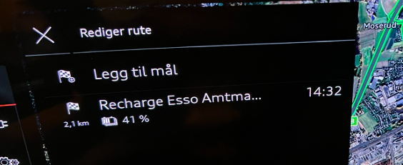

Wie bringt man das Auto zum Vorwärmen? Es ist nicht wirklich so schwierig, man muss nur die Tricks kennen.

Im Bild oben wurden diese Einstellungen eingestellt:

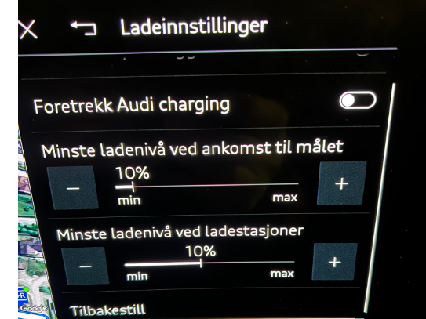

Wenn ich jedoch eingebe, dass ich bei der Ankunft am Zielort ein Mindestniveau haben möchte, wird der Ladeplaner verstehen, dass es tatsächlich in Rechnung gestellt werden muss, um Ihr Ziel zu erreichen.

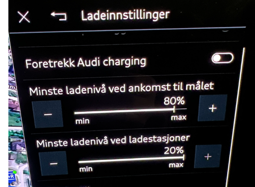

Dann bekomme ich das

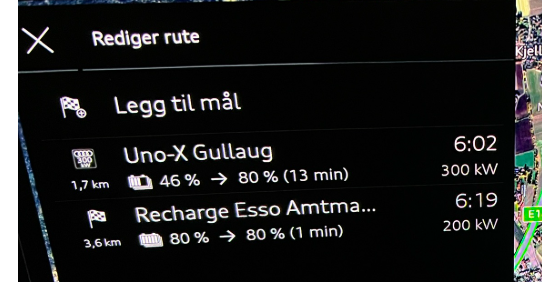

Praktisches Beispiel: Während ich heute auf den Zug wartete, mit der Navigationsroute oben aktiv und das Auto gerade geparkt war, erwärmte sich die Batterie in etwa 5 Minuten von 1 auf 2 Grad, als es draußen -8,5 war. Obwohl ich damals geparkt war.

Es ist ziemlich offensichtlich, dass es eine bessere visuelle Kommunikation gegeben hätte, wenn es ein Vorwärmesymbol im Batteriebild gegeben hätte, das Rückmeldung geben könnte, dass die Vorwärmung aktiv ist, aber wir sind noch nicht da.

# Praktische Prüfung

Die nächsten Abschnitte sind Tests, was man von dieser Temperatur erwarten kann und andere praktische Erfahrungen zu diesem Thema. Der Unterzeichnende hat dies mit einem Audi SQ6 2025 Modell getestet, das im Juli 2024 hergestellt wurde.

## Usecases

### Aufladegeschwindigkeit und -temperatur, mit und ohne Vorwärmung

Prüfung zur Ermittlung der Drehzahldifferenz mit und ohne Vorwärmung.

**Ladegerät** UnoX 300 kW (800V)

**Außentemperatur** : -11 °C

**Batterietemperatur** : 1 °C, SoC 35 %

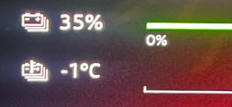

Erreichte Geschwindigkeit mit kalter Batterie: **51 kW**

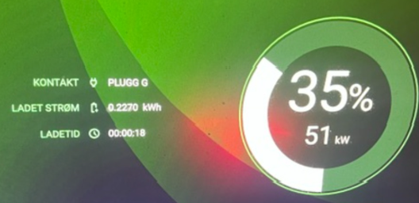

Dann gab man ein Ladeziel für ein zufälliges Schnellladegerät in der Nähe ein. Es ist wichtig, dass es ein Ladegerät in der Nähe gibt, damit das Auto sofort mit dem Vorheizen beginnt.

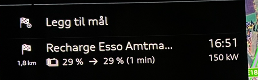

Der kurze erste Ladetest gab mir einen 1% SoC und 1 °C mehr auf der Batterie

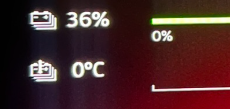

Es war dann 16:48. Ich fuhr gerade eine sehr kurze Autofahrt und parkte das Auto, während ich auf dem Vordersitz saß und nur mit der Zündung wartete und den Sicherheitsgurt befestigte (was einen Antrieb simulierte).

Um 17:14 Uhr hatte ich 10 °C zu einem "Preis" von 4 % SoC bekommen. Vereinfachte Mathematik ist, dass bisher 4 kWh beim Vorheizen und 26 Minuten verwendet wurden.

Um 17:30 hatte ich 16 °C und 29 % SoC erreicht, d.h. 7 % / 7 kWh verbraucht beim Vorheizen.

Ich entschied mich dann, zurück zum UnoX-Ladegerät zu fahren und wieder aufzuladen.

Eine kleine Kuriosität, die ich mit dem KD2-Update vermute, ist, dass die Navigation berechnet, dass das Auto 7% SoC verwenden wird, um die 2 km nach UnoX zu fahren.

Nun, zurück zu UnoX, die Zahlen sprechen für sich: 28% / 16 °C

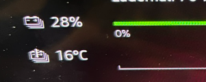

Wenn man sich anschließt und sieht, dass das Vorheizen nützlich ist, dann ist das fast 150 kW. Man kann bis zu 3 mal so schnell eine Ladegeschwindigkeit erreichen, also

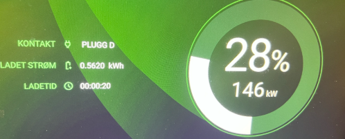

Zu Ihrer Information, beide Ladesitzungen fanden statt, während ein anderes Auto eingesteckt wurde, so dass es möglich ist, dass verschiedene Nummern aufgekommen wären, wenn ich das Ladegerät ganz alleine hätte.

Das ist mein Auto rechts im Bild unten. Das andere war ein 400V Architekturauto, das wahrscheinlich für eine Weile da sein würde ... 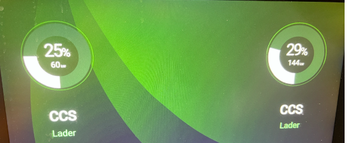 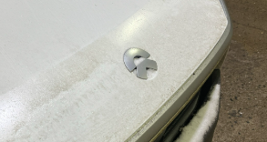

Ich habe nur 2% geladen, und es gab schnell einen Temperaturanstieg, ich denke, die Vorheizelemente in der Batterie haben ein wenig geholfen.

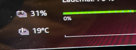

**Schlussfolgerung**

Das Vorwärmen ist nützlich. Und 15 Grad helfen sehr. Ich habe das Vorwärmen nicht mehr getestet, um möglicherweise 25 °C zu erreichen. Das Prinzip ist im obigen Abschnitt gut erklärt und das Ergebnis ist klar.

### Vorwärmung und extreme Temperaturen

Basierend auf einem praktischen Test von einem anderen Q6-Besitzer auf Facebook, der die Vorwärmung in 16-20 Grad unter Null implementierte, erfuhr, dass die Vorwärmung nicht mehr als +15 °C ansteigen konnte. Dies könnte auf die niedrige Temperatur zurückzuführen sein oder das Auto, das mit der Vorwärmung zu spät im Verhältnis zur Außentemperatur beginnt.

Der obige Abschnitt zeigt, dass +15 °C einen signifikanten Unterschied macht, also macht es Sinn.

Es kann sein, dass ein Trick darin besteht, eine **Extra** Ladestation in der Navigation, die ein wenig vor der ist, die Sie tatsächlich planen, um das Auto in Start Vorwärmung früher zu tricksen und dann einfach vorbei fahren oder löschen, wenn Sie es erreicht haben und dann hoffen, dass die Vorwärmung bis zum Ende des **tatsächlich** Ladestopp.

### Vorwärmen vor Beginn der Autofahrt

Es wurde auch "gewünscht", dass Sie die Batterie vorheizen können, wenn Sie eine lange Reise beginnen, indem Sie sofort nach der Fahrt von zu Hause aus schnell aufladen.

Es ist tatsächlich möglich mit Hilfe eines kleinen "Tricks", den ich zu Hause verifiziert habe.

Hier ist, wie Sie es tun, wenn Sie vor dem Fahren vorwärmen möchten.

- Bringen Sie den Autoschlüssel ins Auto
- Geben Sie ein Ladeziel in die Navigation ein, das das Laden einleitet
z. B.:

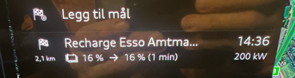

- Mein Auto war draußen mit einer kalten Batterie gewesen, bevor es in die Garage gefahren wurde

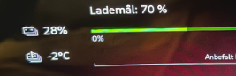
- Zündung einschalten und **den Sicherheitsgurt in seinen Halter stecken**während Sie im Auto sitzen
- Schalten Sie die Lüftung und die Scheinwerfer aus
- Lassen Sie den Schlüssel im Auto und Sie können hineingehen und die letzten Taschen vor der Abfahrt packen
- Alles ist 'aus', aber das Auto ist vorgeheizt ...

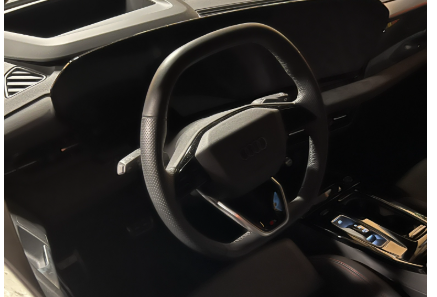

- Nach 10 Minuten war ich von -2 auf +5 °C gegangen, zu einem Preis von 2% SoC

- Das bedeutet, dass etwa 20-30 Minuten ausreichen, um eine ziemlich gute Batterietemperatur zu erzielen, die Ihnen einen ziemlich schnellen und guten Start in eine Schnellladesitzung in der Nähe ermöglicht.

### Vorwärmen hat einen "Preis"

Wie die obigen Absätze zeigen, scheint es, dass man bei einer vollen Vorwärmung bei einigermaßen kalten Bedingungen mit einem SoC-Verlust von 7-10% rechnen muss, so dass immer eine Bewertung in Bezug auf die Ladezeit vorgenommen werden muss.