## Préchauffage de la batterie
Audi Q6 et d'autres voitures sur la plate-forme PPE ont préchauffage automatique de la batterie.

## Pourquoi voulez-vous préchauffer la batterie ?

Alors pourquoi préchauffer la batterie ? Préchauffer la batterie n'a qu'un seul objectif, qui est de créer une bonne température avant de commencer une séance de recharge rapide (150 kW et plus). Sinon, il est complètement inutile. La température optimale est d'environ 25 °C et vous obtiendrez, et seulement alors, jusqu'à 280 kW de vitesse de recharge sur un chargeur 800V dans la gamme SoC de 10-30%, puis il commence à baisser.

En hiver, il ne sera peut-être pas possible d'atteindre 280 kW, mais d'autres pourront fournir de l'expérience sur ce sujet. Mais avec une batterie froide, la séance de chargement sera très lente au début. Progressivement, la température de la batterie augmente en raison de l'effet de charge et de la chaleur qu'elle produit, et puis il y aura une meilleure vitesse à la fin, mais le temps vole.

Même à l'automne avec des températures inférieures à 0 degrés, le préchauffage sera nécessaire pour obtenir les vitesses de 200 kW et plus vraiment rapides.

Cependant, il y a des choses importantes à savoir
- Vous ne pouvez pas activer le préchauffage manuellement. Ceci peut venir dans les modèles ou les mises à jour ultérieurs
- La seule façon d'entrer une destination de recharge dans votre navigation est soit manuellement, soit d'accepter le ou les arrêts de recharge que Audi Charging Planner ajoute à votre itinéraire.
- La voiture va alors planifier la préchauffage elle-même de sorte qu'il est à la température correcte. Normalement, il est environ 25 degrés Celsius

Il est donc très critique que vous créiez une route de navigation qui **en fait** implique une session de chargement/arrêt de chargement.

Il est **NOT** assez pour entrer une destination qui est un chargeur rapide si vos paramètres de charge sont tels que vous n'avez pas besoin de charger lorsque vous avez atteint votre destination.

Par exemple, cela sera **NOT** déclencher la préchauffage, simplement parce que la voiture ne suppose pas que vous avez réellement besoin de charger.

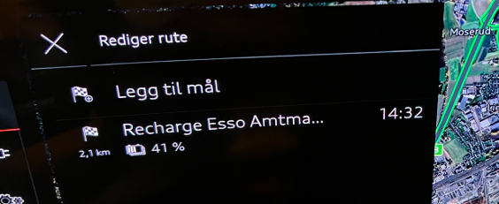

Comment allez-vous faire préchauffer la voiture ?

Dans l'image ci-dessus, ces paramètres ont été définis :

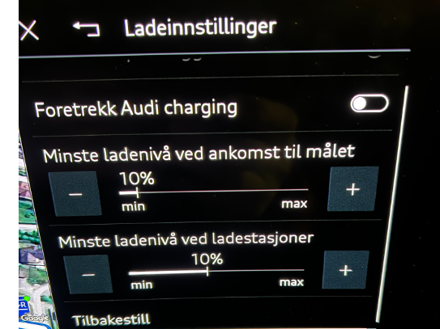

Cependant, si je sais que je VAIS avoir un niveau minimum à l'arrivée à la destination, le planificateur de charge comprendra qu'il doit réellement être facturé pour atteindre votre destination.

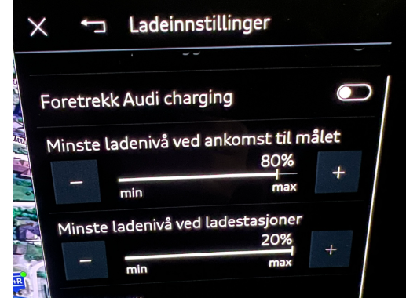

Alors j'ai compris.

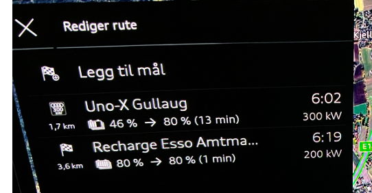

Exemple pratique : Pendant que j'attendais le train aujourd'hui, avec la route de navigation au-dessus active et la voiture était juste garée, la batterie s'est échauffée de 1 à 2 degrés en environ 5 minutes, quand il était -8.5 dehors.

Il est évident qu'il aurait fourni une meilleure communication visuelle s'il y avait eu un symbole de préchauffage dans l'image de la batterie qui pourrait fournir une rétroaction que le préchauffage est actif, mais nous n'y sommes pas encore.

# Essai pratique

Les prochaines sections sont des tests de ce que l'on peut s'attendre à ce que la température et d'autres expériences pratiques sur ce sujet. Le soussigné a testé ceci avec un modèle Audi SQ6 2025 fabriqué Juillet 2024

## Cas d'utilisation

### Vitesse et température de charge, avec et sans préchauffage

Test effectué pour déterminer la différence de vitesse avec et sans préchauffage.

** Chargeur** : UnoX 300 kW (800V)

**Temps extérieur** : -11 °C

** Température de la batterie** : 1 °C, SoC 35 %

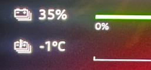

Vitesse atteinte avec batterie froide : **51 kW**

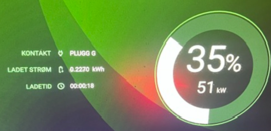

Puis entré une cible de charge pour un chargeur rapide aléatoire à proximité. Il est important qu'il y ait un chargeur à proximité pour que la voiture commence à préchauffer immédiatement

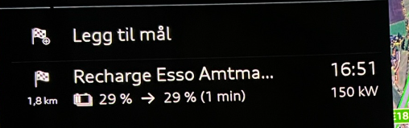

Le court test de charge initiale m'a donné un SoC de 1% et 1 °C de plus sur la batterie

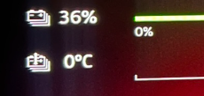

Il était alors 16:48. Je viens de conduire un voyage en voiture très court et garé la voiture, tandis que je me suis assis dans le siège avant et j'ai juste attendu avec l'allumage et la ceinture de sécurité attaché (simulation d'une conduite).

A 17:14, j'avais obtenu 10 °C à un prix de 4 % SoC. Les mathématiques simplifiées sont que 4 kWh ont été utilisés jusqu'à présent sur le préchauffage et 26 minutes.

À 17 h 30, j'avais atteint 16 °C et 29 % de SOC, soit 7 % / 7 kWh consommés lors du préchauffage.

J'ai ensuite choisi de retourner au chargeur UnoX et de recharger à nouveau.

Une petite curiosité que je soupçonne est venue avec la mise à jour KD2 est que quand la navigation calcule que la voiture utilisera 7% SoC pour conduire les 2 km à UnoX. Ce n'est probablement pas vrai ...

Bien retour à UnoX, les chiffres parlent d'eux-mêmes: 28% / 16 °C

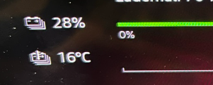

Brancher et voir que le préchauffage est utile, pour ainsi dire. Près de 150 kW maintenant. Vous pouvez obtenir jusqu'à 3 fois plus rapide une vitesse de charge, donc

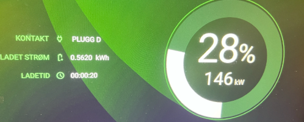

Pour votre information, les deux séances de chargement ont eu lieu pendant qu'une autre voiture était branchée, il est donc possible que différents numéros se seraient présentés si j'avais le chargeur tout seul.

C'est ma voiture à droite dans la photo ci-dessous. L'autre était une voiture d'architecture 400V, qui allait probablement être là pour un moment ... 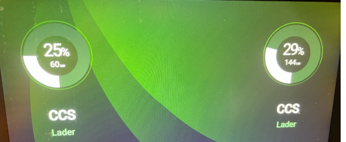 

Je n'ai chargé que 2%, et ça a rapidement donné une hausse de température, je pense que les éléments de préchauffage dans la batterie ont aidé un peu.

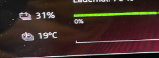

**Conclusion**

Le préchauffage est utile. Et 15 degrés aide beaucoup. Je n'ai pas testé le préchauffage plus pour atteindre éventuellement 25 °C. Le principe est bien expliqué dans la section ci-dessus et le résultat est clair.

### Préchauffage et températures extrêmes

Sur la base d'un essai pratique effectué par un autre propriétaire du Q6 sur Facebook qui a mis en œuvre le préchauffage en 16-20 degrés sous zéro, on a constaté que le préchauffage n'était pas en mesure de remonter plus de +15 °C. Cela pourrait être dû à la basse température, ou au démarrage de la voiture en préchauffage trop tard par rapport à la température extérieure.

La section ci-dessus montre que +15 °C fait une différence significative, donc il est logique.

Il peut être possible qu'un truc soit d'entrer dans un **extra** arrêt de station de recharge dans la navigation qui est un peu avant celui que vous prévoyez réellement de charger, pour tromper la voiture pour commencer à préchauffer plus tôt, puis juste conduire passé ou supprimer quand vous l'avez atteint et ensuite espérer que le préchauffage continue jusqu'à l'arrêt de charge **actuel**.

### Préchauffage avant le début du voyage en voiture

Il a également été 'désiré' que vous pouvez préchauffer la batterie si vous allez commencer un long voyage en chargeant rapidement immédiatement après avoir conduit de la maison.

C'est en fait possible avec l'aide d'un petit «trick», que j'ai vérifié à la maison.

Voici comment vous le faites si vous voulez préchauffer avant de conduire.

- Apportez la clé de voiture dans la voiture
- Saisissez une cible de charge dans la navigation qui lance la charge
Par exemple:

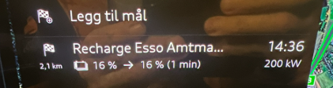

- Ma voiture était dehors avec une batterie froide avant qu'elle ne soit conduite dans le garage.

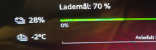
- Allumez le contact et ** mettez la ceinture de sécurité dans son support**, pendant que vous êtes assis dans la voiture
- Éteignez la ventilation et les phares
- Laissez la clé dans la voiture et vous pouvez entrer et faire vos valises avant le départ
- Tout est hors service, mais la voiture préchauffe...

- Après 10 minutes, je suis passé de -2 à +5 °C au coût de 2% SoC

- Cela signifie qu'environ 20-30 minutes est suffisant pour donner une assez bonne température de la batterie qui vous donnera un bon début assez rapide et une session de chargement rapide à proximité.

### La préchauffage a un 'prix'

Comme le montrent les paragraphes ci-dessus, il semble que vous devez vous attendre à une perte de SOC de 7-10% pour une préchauffage complète dans des conditions raisonnablement froides, donc il y a toujours une évaluation à faire en ce qui concerne le temps de charge.
