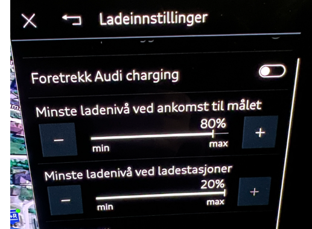
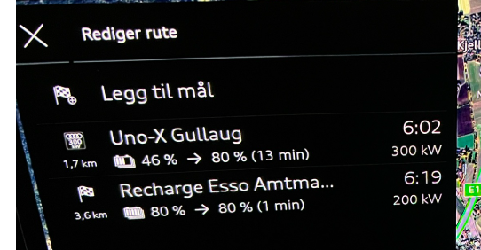
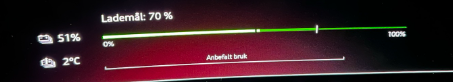

## Forvarming av batteri
Audi Q6 og andre biler på PPE platformen har automatisk forvarming av batteri. 

## Hvorfor ønsker du å forvarme batterie ?

Ja, hvorfor skal du forvarme batteriet? Forvarming av batteriet har kun **ett formål**, det er å skape en god temperatur før du begynner en hurtigladesesjon (150 kW og oppover). Ellers er det helt unødvendig. Den optimale temperaturen er ca 25 grader og da vil du, og kun da, oppnå opp i mot 280 kW ladehastighet på en 800V lader i SoC området fra 10-30 %, så begynner det å falle.

Om vinteren er det muligens ikke mulig å oppnå 280 kW heller, men det kan muligens andre gi erfaring på. Men med kaldt batteri vil det gå veldig sakte i starten at ladesesjonen. Etterhvert øker batteritemperaturen pga ladeeffekten og den varmen den produserer, og da vil det blir bedre fart på slutten, men tiden løper fort.

Selv om høsten med temperaturer ned mot 0  grader, vil forvarming være nødvendig for å få de helt store 200+ kW hastighetene.

Det er imidlertid en viktig ting man må være klar over
- Man kan ikke slå på denne forvarmingen manuelt. Dette kan komme i senere modeller eller oppdateringer
- Eneste måten er å legge inn et lademål i din navigasjon, enten manuelt eller godta den eller de ladestoppene som Audi Ladeplanlegger legger inn i ruta di.
- Da vil bilen selv planlegge forvarming slik at den skal være på korrekt temperatur. Normalt er dette ca 25 grader celsius

Det er altså veldig kritisk at man oppretter en navigasjonsrute som faktisk innebærer en ladesesjon/ladestopp. 

Det holder **IKKE** å bare legge inn en destinasjon som er en hurtiglader hvis dine ladeinnstillinger er slik at du ikke trenger å lade når du har nådd målet ditt.

For eksempel dette, vil IKKE trigge forvarming, rett og slett fordi bilen ikke antar at du faktisk trenger å lade.

Så hvordan skal du da få bilen til å forvarme? Det er ikke så vanskelig egentlig, man må bare kjenne til triksene.

I bildet over var disse innstillingene satt:

Hvis jeg derimot legger inn at jeg VIL ha et minimumsnivå ved ankomst målet, så vil ladeplaneggeren skjønne at vi faktisk må lade for å oppnå ditt mål. Så når jeg endrer til dette

Så får jeg dette

Og mens jeg satt og ventet på toget i dag, med rute over aktiv og bilen bare var parkert, så varmet batteriet seg fra 1 til 2 grader på ca 5 min, når det var -8,5 ute. Selv om jeg da var parkert.

Det er helt opplagt at det hadde gitt bedre visuell formidling om det har være et forvarmingssymbol i batteribildet som kunne gi tilbakemelding om at forvarmingen er aktiv, men der er vi altså ikke ennå.

Og med et slikt oppsett vil bilen starte forvarming. Nå er dette eksemplet litt søkt, siden jeg la inn litt kort reise, og man skulle jo kanskje ønsket at det ikke ble lagt inn en mellomstopp, men dette er i grunnen et annet tema, og det er at bilen navigasjon og ruteplanlegger fremdeles er svært prematur og trenger mye overhaling før det blir denne bilens pris verdig.

