## Forvarming av batteri
Audi Q6 og andre biler på PPE platformen har automatisk forvarming av batteri. 

## Hvorfor ønsker du å forvarme batteriet ?

Ja, hvorfor skal du forvarme batteriet? Forvarming av batteriet har kun **ett formål**, det er å skape en god temperatur før du begynner en hurtigladesesjon (150 kW og oppover). Ellers er det helt unødvendig. Den optimale temperaturen er ca 25 grader og da vil du, og kun da, oppnå opp i mot 280 kW ladehastighet på en 800V lader i SoC området fra 10-30 %, så begynner det å falle.

Om vinteren er det muligens ikke mulig å oppnå 280 kW heller, men det kan muligens andre gi erfaring på. Men med kaldt batteri vil det gå veldig sakte i starten at ladesesjonen. Etterhvert øker batteritemperaturen pga ladeeffekten og den varmen den produserer, og da vil det blir bedre fart på slutten, men tiden løper fort.

Selv om høsten med temperaturer ned mot 0  grader, vil forvarming være nødvendig for å få de helt store 200+ kW hastighetene.

Det er imidlertid en viktig ting man må være klar over
- Man kan ikke slå på denne forvarmingen manuelt. Dette kan komme i senere modeller eller oppdateringer
- Eneste måten er å legge inn et lademål i din navigasjon, enten manuelt eller godta den eller de ladestoppene som Audi Ladeplanlegger legger inn i ruta di.
- Da vil bilen selv planlegge forvarming slik at den skal være på korrekt temperatur. Normalt er dette ca 25 grader celsius

Det er altså veldig kritisk at man oppretter en navigasjonsrute som **faktisk innebærer** en ladesesjon/ladestopp. 

Det holder **IKKE** å bare legge inn en destinasjon som er en hurtiglader hvis dine ladeinnstillinger er slik at du ikke trenger å lade når du har nådd målet ditt.

For eksempel dette, vil **IKKE** trigge forvarming, rett og slett fordi bilen ikke antar at du faktisk trenger å lade.

Så hvordan skal du da få bilen til å forvarme? Det er ikke så vanskelig egentlig, man må bare kjenne til triksene.

I bildet over var disse innstillingene satt:

Hvis jeg derimot legger inn at jeg VIL ha et minimumsnivå ved ankomst målet, så vil ladeplaneggeren skjønne at det faktisk må lades for å oppnå ditt mål. Så når du endrer til dette

Så får jeg dette

Praktisk eksempel: Mens jeg satt og ventet på toget i dag, med navigasjonsruten over aktiv og bilen bare var parkert, så varmet batteriet seg fra 1 til 2 grader på ca 5 min, når det var -8,5 ute. Selv om jeg da var parkert.

Det er helt opplagt at det hadde gitt bedre visuell formidling om det har være et forvarmingssymbol i batteribildet som kunne gi tilbakemelding om at forvarmingen er aktiv, men der er vi altså ikke ennå.

# Praktisk test

I løpet av kort tid vil det komme et nytt avsnitt her med noen tester av hva man kan forvente at temperatur og andre praktisk erfaringer om dette emnet. Undertegnede har testet dette med en Audi SQ6 2025 modell produsert juli 2024

## Brukerhistorier

### Ladehastighet og temperatur, med og uten forvarming

Utført test for å finne ut hastighetsforskjell med og uten forvarming.

Lader : UnoX 300 kW (800V)
Ute temp : -11 °C

Batteri temp 1 SoC 35 %

Oppnådd hastighet : 51 kW

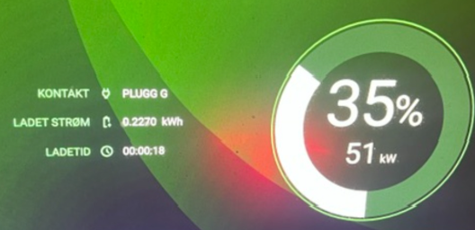

La så inn et lademål til en tilfeldig hurtiglader i nærheten. Litt viktig at det er en lader i nærheten for at bilen skal iverksette forvarming med en gang

Den korte initiell ladetesten ga meg et 1% SoC og 1 °C mer på batteriet

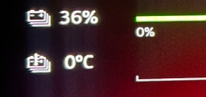

Klokken var da 16:48. Jeg bare kjørte en en helt kort biltur og parkerte bilen, mens jeg satt i førsersetet og bare ventet.

Kl 17.14 hadde jeg fått 10 °C til en 'pris' av 4 % SoC. Forenklet matematikk er da at det har vært brukt 4 kWh så lang på forvarming og 26 minutter.

Kl 17.30 hadde jeg kommet opp i 16 °C og 29 % SoC, dvs 7 % / 7 kWh forbrukt på forvarming.

Jeg valgte da å kjøre tilbake til UnoX laderen og lade på nytt.

En liten kuriositet som jeg mistenker kom med KD2 oppdateringen er at når kalkulerer altså navigasjonen at  bilen skal ruke 7 % SoC på å kjøre de 2 km til UnoX. Det stemmer nok ikke ...

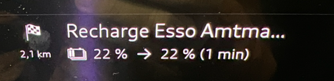

Vel tilbake på UnoX er tallenes tale 28% /16 °C

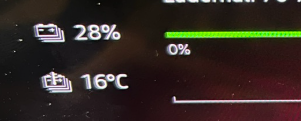

Plugger inn og ser jo at forvarming nytter, for å si det sånn. Man kan oppnå  3 ganger så rask ladehastighet altså

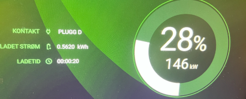

Til info foregikk begge ladesesjonene mens det var plugget inn en annen bil, så det kan tenkes at andre tall ville kommet opp om jeg hadde laderen helt alene.

Det er min bil til høyre i bildet under. Den andre var en 400V arkitektur bil, som sannsynligvis kom til å stå der en stund ...

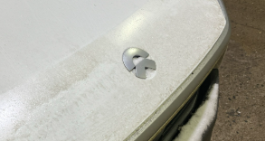

Jeg ladet kun 2 %, og det ga raskt temperatur stigning, tenker at forvarmingselementene i batteriet og hjalp litt til.

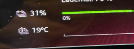

**Konklusjon** 

Forvarming nytter. Og 15 grader hjelper godt. Jeg har ikke testet å forvarme mer. Prinsipper er godt forklar i avsnitett over og resultatet er tydelig.

### Forvarming og ekstrem temperatur

Basert på en praktisk test fra en annen Q6 eier på Facebook som iverksatt forvarming i 16-20 minusgrader, opplevde at forvarmingen ikke klarte å heve mer enn til +15 °C. Dette kan komme av den lave temperaturen, eller at bilen iverksetter forvarming for sendt i forhold til utetemperaturen.

Avsnittet over viser jo at +15 °C utgjør en vesentlig forskjell, så det monner.

Det kan være mulig at et trix er å legge inn en **ekstra** ladestasjonsstopp i navigasjonen som er litt før den man egentlig har tenk å lade på, for å lure bilen til å starte forvarming tidligere og så bare kjøre forbi ev. slette den når man har nått fram til den og da håe at forvarmingen fortsetter fram til det **egentlige** ladestoppet. 

### Forvarming før bilturen starter

Det har også vært 'ønsket' at man kan forvarme batteriet hvis man skal starte langturen med å hurtiglade umiddelbart etter man kjører hjemmefra.

Det er faktisk mulig ved hjelp av et lite 'trix', som jeg har verifisert hjemme.

Slik gjør du om du vil forvarme før du kjører.

- Ta med bilnøkkel i bilen
- Legg inn et lademål i navigasjon som iverksetter lading
  f.eks slik : 

  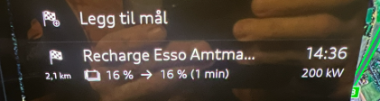

  - Min bil hadde stått ute med kaldt batteri før den ble kjørt inn i garasjen

  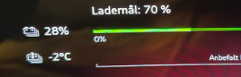
  - Slå på tenning og **sett bilbeltet i holderen sin**, mens du sitter i bilen
  - Slå av ventilasjon og hovedlys
  - La nøkkel ligge i bilen og du kan gå inn og pakke de siste baggene før avreise
  - Alt er 'av', men bilen forvarmer ...

    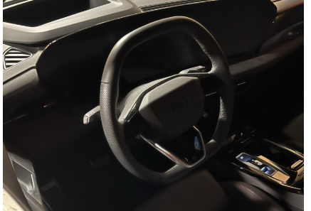

  - Etter 10 minutter hadde jeg gått fra -2 til +5 °C til en pris av 2 % SoC

    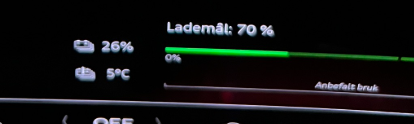
  - Vil betyr at ca 20-30 minutetr er nok til å gi en ganske god batteritemperatur som vil gi deg en ganske rask og god start på en hurtigladingssesjon i nærheten.

### Forvarming har en 'pris'

Som avsnittene over viser, så virker det jo som du må regne med et SoC tap på 7-10 % for en full forvarming i rimelig kalde forhold, så det er alltid en vurdering man kan ta i forhold til ladetid. Kan man f.eks ta en matbit når det lades, så er kansje ikke batteritemperaturen så viktig likevel ?

