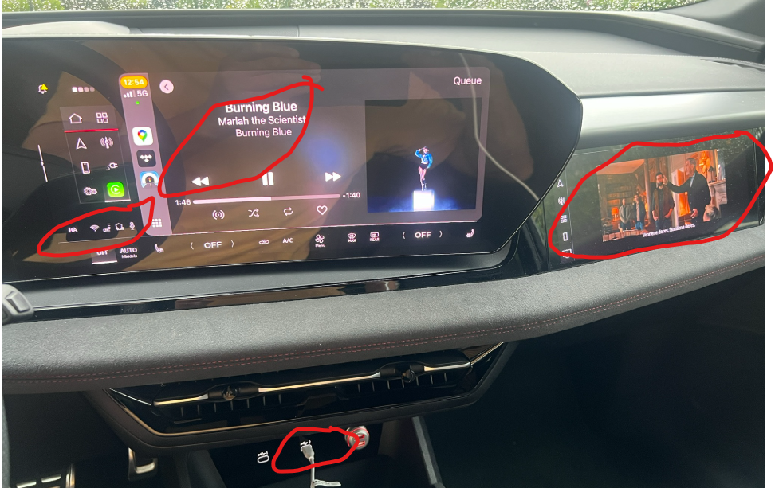
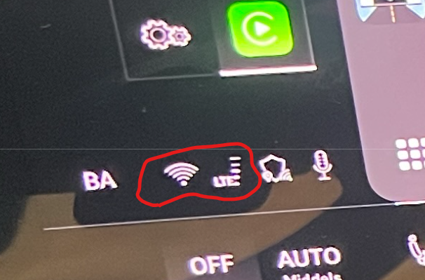

Wireless CarPlay nutzt die Wi-Fi-Verbindung des Telefons, um mit dem Auto zu kommunizieren. Dies verhindert, dass das Telefon gleichzeitig als Wi-Fi-Hotspot fungiert, der Daten an das MMI liefert.

Die praktische Lösung ist, das iPhone mit einem USB-Kabel zu verbinden. CarPlay läuft dann über USB, während das Telefon seine mobile Verbindung mit dem Auto über Wi-Fi teilen kann. Dies ermöglicht Online-Diensten im MMI, wie dem Vivaldi-Browser, die Datenzulage des Telefons anstelle des inkludierten mobilen Datenkontingents des Autos zu verwenden.

Das folgende Beispiel zeigt TIDAL, das durch CarPlay läuft, während ein Video in Vivaldi geöffnet ist. Die beiden Quellen können Audio nicht gleichzeitig wiedergeben, aber beide können die Datenverbindung des Telefons nutzen.

Das Netzwerksymbol links neben dem hervorgehobenen Bereich zeigt an, dass das Auto einen Wi-Fi-Uplink verwendet.

USB kann auch eine bessere und konsistentere Audioqualität bieten als eine drahtlose CarPlay-Verbindung. [detailed article about Apple CarPlay and Audi e-tron](https://wiki.bwa.no/spaces/EUA/pages/150601759/Apple+CarPlay+og+Audi+e-tron) für weitere Hintergrundinformationen.
