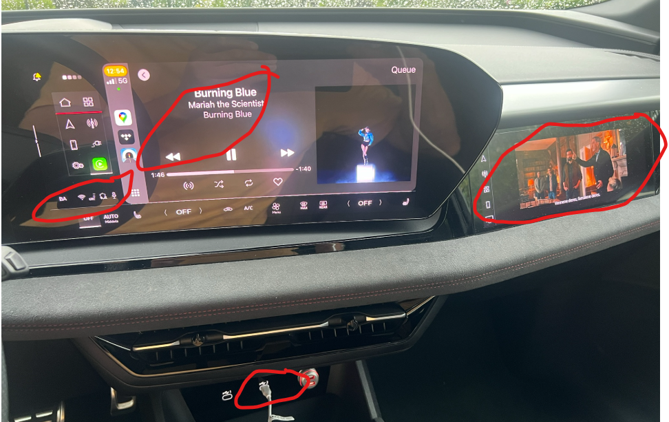
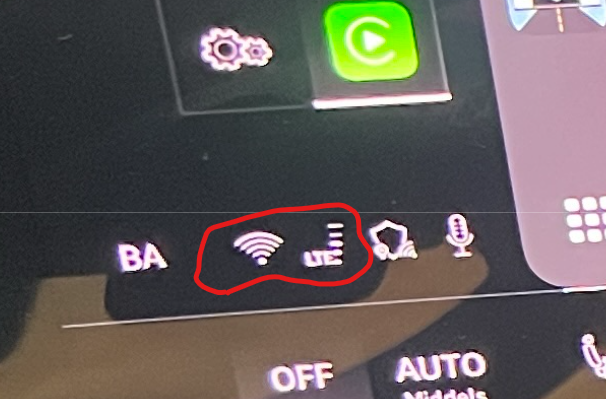

CarPlay sans fil utilise la connexion Wi-Fi du téléphone pour communiquer avec la voiture. Cela empêche le téléphone d'agir simultanément comme le point d'accès Wi-Fi qui fournit des données au MMI.

La solution pratique est de connecter l'iPhone avec un câble USB. CarPlay fonctionne alors sur USB, tandis que le téléphone peut partager sa connexion mobile avec la voiture sur Wi-Fi. Cela permet aux services en ligne dans le MMI, comme le navigateur Vivaldi, d'utiliser la franchise de données du téléphone au lieu du quota de données mobiles inclus de la voiture.

L'exemple ci-dessous montre TIDAL en cours d'exécution à travers CarPlay alors qu'une vidéo est ouverte à Vivaldi. Les deux sources ne peuvent pas lire l'audio simultanément, mais les deux peuvent utiliser la connexion de données du téléphone.

Le symbole réseau affiché à gauche de la zone surlignée indique que la voiture utilise une connexion Wi-Fi.

USB peut également fournir une meilleure qualité audio et plus cohérente qu'une connexion sans fil CarPlay. Voir ceci [detailed article about Apple CarPlay and Audi e-tron](https://wiki.bwa.no/spaces/EUA/pages/150601759/Apple+CarPlay+og+Audi+e-tron) pour plus de renseignements.
