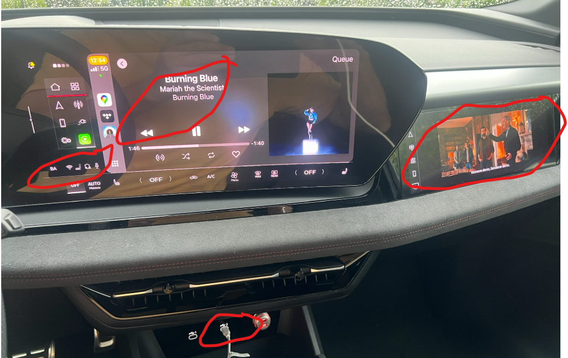
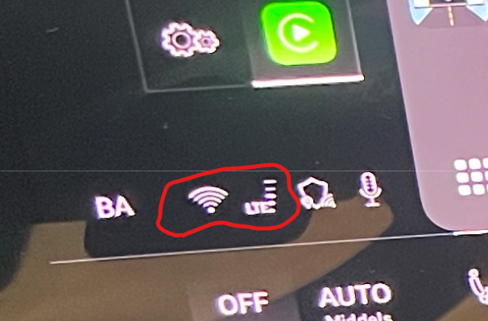

Som beskrevet i en annen [artikkel](../internet-in-the-car/_index.nb.md) kan man velge å dele data med bilen med delt internet på iPhone.

Men hvordan skal man få dette til med CarPlay. For med CarPlay må man kople opp mobilen til bilens Wifi og da er Wifi forbindelsen opptatt for dette formålet (dvs bil er router til internet og mobilen er bare en wifi klient)

Det er faktisk mulig å kople til bilen på delt internet fra mobilen på den løsningen som er beskrevet over, men da bruker bilen likevel av sin mobildatakvote (3 GB pr måned via myAudi). Så i praksis vil det ikke fungere.

Det er likevel en løsning som kan gi deg CarPlay med delt datakvote fra mobil.

Og det er USB kabel.

Om du kopler opp mobilen med USB kabel, vil du få CarPlay via USB. CarPlay vil da bruke av mobilens datakvote. Og hvis du har behov for f.eks å se YouTube i bilens MMI, så kan du dele data fra mobilen og dermed ikke bruke av din 3 GB datakvote.

I bildet under ser du et slikt oppsett.

Her spilles TIDAL i CarPlay og det streames en film i Vivaldi. Man kan ikke spille lyd samtidig (amatørmessig av Audi som ikke har åpnet for egen lydsone til f.eks headset for passasjerer), men man kan veksle mellom dette og hele tiden bruke data fra mobilen

Man skal følge med på disse symbolene. Her vises symbolen til venstre i ringen at bilen bruker en wifi uplink.

Ikke bruker USB sier du ?

Vel USB er bedre enn du er klar over, når det kommer til lydkvalitet.

Les en artikkel undertegnede har skrevet om dette emnet her:

https://wiki.bwa.no/spaces/EUA/pages/150601759/Apple+CarPlay+og+Audi+e-tron