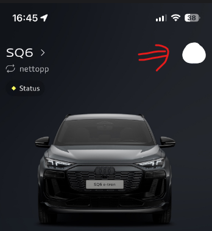
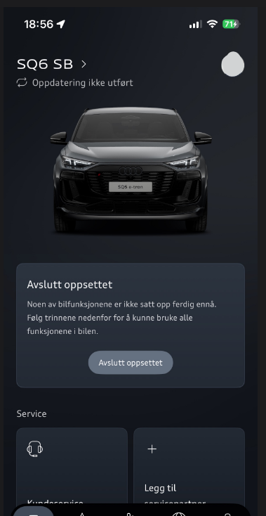

Etter at du er logget på i myAudi Appen, må din forhandler legg inn den nye bilen på din audi konto. Når det er gjort vil bilen dukker opp i din Garasje:

Slik kommer du deg til garasjen

Tykk på ikonet i øvre høyre hjørne, enten dine initialer eller ditt profilbilde

Her finner du 'Min garasje', i eksemplet under eksisterer det allerede en bil om du allerede eier en eller flere audier fra før.

Trykk på bilen i garasjen, du vil da få opp din garasje, og et valg i bunnen som viser et felt hvor du kan søke opp din bestillingsstatus. Mangler du dette, så må din forhandler kople bilen til din myAudi konto.

Her får du framdriften med 6 ulike stadier.

Sannsynligvis vil bilen også dukke opp i myAudi garasjen når framdriften er på pkt 3 eller 4

Men det er ikke så mye du kan gjøre før du har logget på som deg selv i bilens MMI

