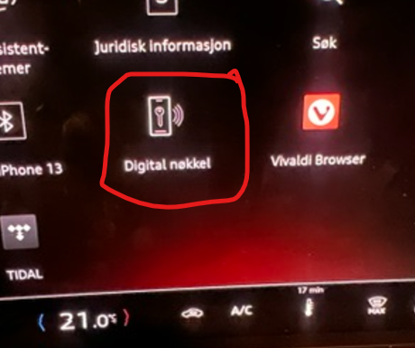

Ihr Auto muss das Paket für die digitale Schlüsselausrüstung haben.

Sie finden dieses Symbol in Ihrem MMI, wenn Sie einen digitalen Schlüssel haben

Es ist auch erforderlich, dass Sie installiert haben [Update 06XM](https://electrichasgoneaudi.net/models/q6-e-tron/knowledgeexchange/updates/patch06xm/)

Es ist verlockend, auf das Symbol im Auto zu klicken und mit der Paarung zu beginnen, aber ich konnte dies nicht tun, als ich es versuchte.

Sie erhalten diesen Bildschirm, wenn Sie Digital Key drücken, und Sie können dann "Haupteinheit einrichten" drücken, aber es hat nicht funktioniert.

Ich endete mit diesem Bildschirm und es hing auf unbestimmte Zeit.

Was jedoch gut funktionierte, war, die myAudi App im Auto zu öffnen.

Wählen Sie "Alle Funktionen"

Und dann noch Digital Key

Wählen Sie dann "Digitaler Schlüssel einrichten" und folgen Sie den Anweisungen

Wenn Sie fertig sind, werden Sie dies auf Ihrem Handy sehen (ich habe iOS / iPhone), Android kann etwas anders sein

**WARNUNG!**

Ich finde, dass die Reichweite des digitalen Schlüssels sehr groß ist, also saß ich in der Küche und drückte versehentlich "Offener Kofferraum" und zu meinem großen Entsetzen funktionierte es gut. Es ist ungefähr 20m bis zum Auto in der Garage, also habe ich den Kofferraum direkt in die Garagentür geöffnet. Ich habe keine Tür in die Garage, also war es zu Hause eine Krise. Zum Glück wurde es gelöst, indem ich vor dem Garagentor stand, auf den Garagenöffnerknopf auf den Schlüssel doppelklickte, dann den Knopf gedrückt und ich konnte den Kofferraum schließen.

Sie können auf Ihren digitalen Schlüssel auf dem iPhone zugreifen, indem Sie auf die Schaltfläche "Apple Pay" doppelklicken.

Wenn Sie Ihren Schlüssel eingerichtet haben, sieht es in der myAudi-App so aus, und Sie können auch ganz einfach Schlüsselkarten programmieren. Mit ihm können Sie die im Auto enthaltene Schlüsselkarte für einen begrenzten Zeitraum als Schlüssel verwenden, bis Sie Ihren permanenten Schlüssel oder digitalen Schlüssel verwenden.

