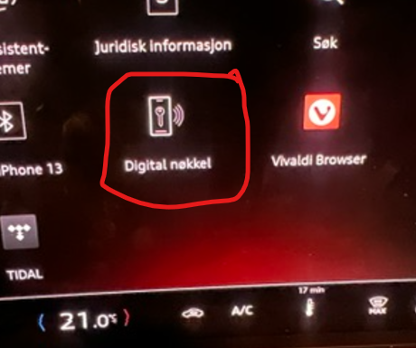
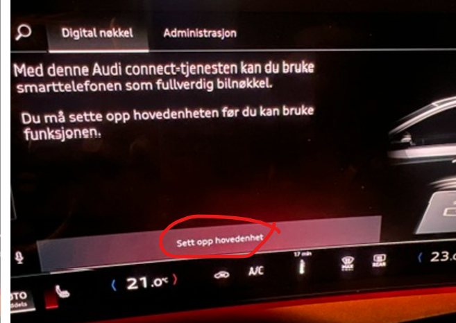
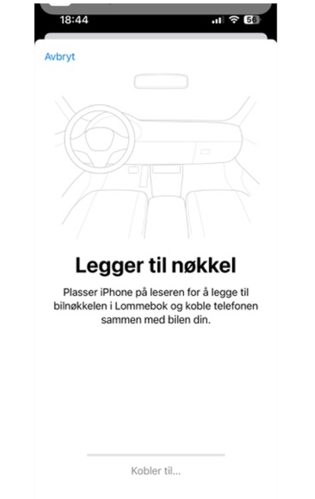
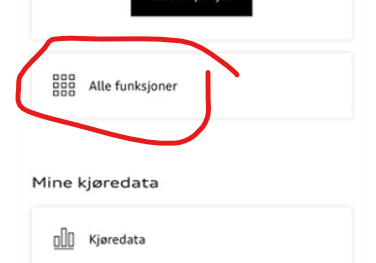
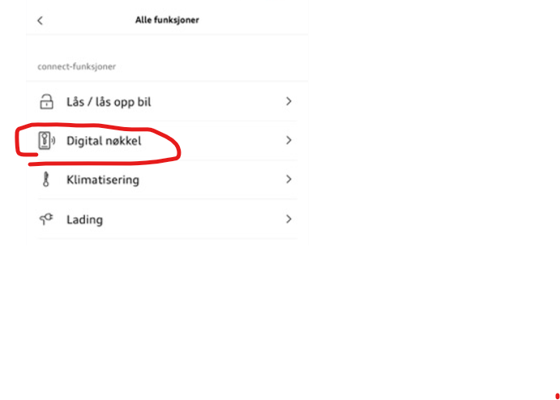
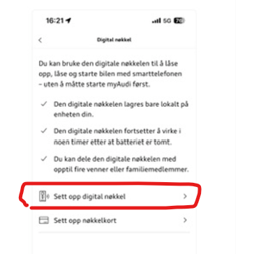
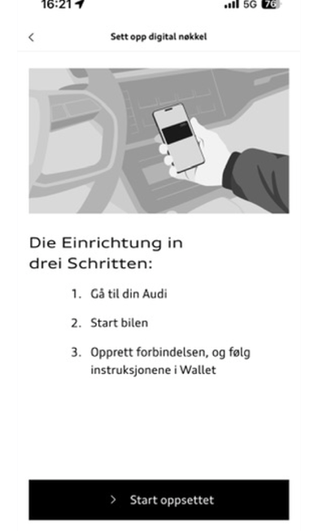
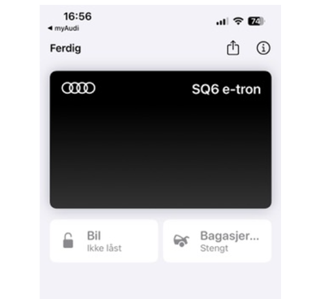
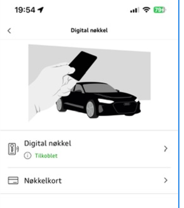

Votre voiture doit avoir le paquet de clés numériques.

Vous trouverez ce symbole dans votre MMI si vous avez une clé numérique

Il est également nécessaire que vous ayez installé [Update 06XM](https://electrichasgoneaudi.net/models/q6-e-tron/knowledgeexchange/updates/patch06xm/)

Il est tentant de cliquer sur l'icône de la voiture et de commencer à jumeler, mais je n'ai pas pu le faire quand j'ai essayé.

Vous obtenez cet écran lorsque vous appuyez sur la touche numérique, et vous pouvez ensuite appuyer sur 'Set up main unit', mais cela n'a pas fonctionné.

J'ai fini avec cet écran et il a été suspendu indéfiniment.

Ce qui a bien fonctionné, cependant, c'était d'ouvrir l'application myAudi pendant qu'elle était dans la voiture.

Sélectionner 'Toutes les fonctions'

Et puis, clé numérique

Puis sélectionnez 'Set up digital key', et suivez les instructions

Lorsque vous avez terminé, vous verrez cela sur votre mobile (j'ai iOS/iPhone), Android peut être légèrement différent

**À L'AVENIR!**

Je trouve que la portée de la clé numérique est très longue, donc j'étais assis dans la cuisine et accidentellement pressé 'Kon ouvert' et à ma grande horreur, ça a bien fonctionné. C'est à environ 20m de la voiture dans le garage, donc j'ai fini par ouvrir le coffre directement dans la porte du garage. Je n'ai pas une porte dans le garage donc c'était un peu une crise à la maison. Heureusement, il a été résolu en se tenant à l'extérieur de la porte du garage, double-cliquant le bouton d'ouverture du garage sur la clé, puis en tenant le bouton et j'ai pu fermer le coffre.

Vous pouvez accéder à votre clé numérique sur iPhone en double-cliquant sur votre bouton 'Apple Pay'.

Lorsque vous avez configuré votre clé, il ressemble à ceci dans l'application myAudi, et vous pouvez en fait très facilement programmer les cartes clés ainsi. Avec elle, vous pouvez obtenir la carte clé incluse dans la voiture pour travailler comme une clé pendant une période limitée jusqu'à ce que vous utilisez votre clé permanente ou clé numérique.

