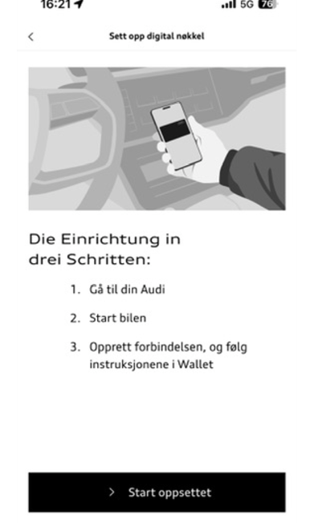
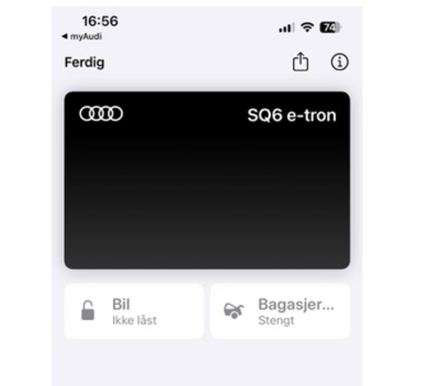
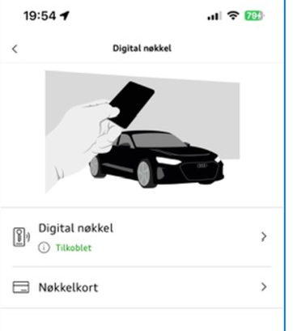

Your car must have the digital key equipment package.

You will find this symbol in your MMI if you have a digital key

It is also required that you have installed [Update 06XM](https://electrichasgoneaudi.net/models/q6-e-tron/knowledgeexchange/updates/patch06xm/)

It is tempting to click on the icon in the car and start pairing, but I was not able to do this when I tried.

You get this screen when you press Digital Key, and you can then press 'Set up main unit', but it did not work.

I ended up with this screen and it hung indefinitely.

What worked fine, however, was to open the myAudi App while in the car.

Select 'All functions'

And then Digital Key

Then select 'Set up digital key', and follow the instructions

When you are done, you will see this on your mobile (I have iOS/iPhone), Android may be slightly different

**WARNING!**

I find that the range of the digital key is very long, so I was sitting in the kitchen and accidentally pressed 'Open trunk' and to my great horror, it worked fine. It is about 20m to the car in the garage, so I ended up opening the trunk right into the garage door. I don't have a door into the garage so it was a bit of a crisis at home. Fortunately, it was resolved by standing outside the garage door, double-clicking the garage opener button on the key, then holding down the button and I was able to close the trunk.

You can access your digital key on iPhone by double-clicking your 'Apple Pay' button.

When you have set up your key, it looks like this in the myAudi app, and you can actually very easily program key cards as well. With it, you can get the included key card in the car to work as a key for a limited period until you use your permanent key or Digital key.

