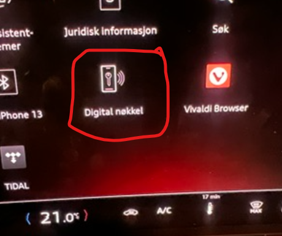
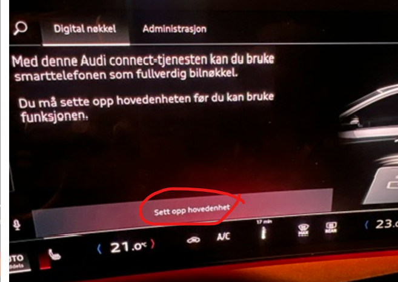

Det er et krav om at bilen din har utstyrspakken for digital nøkkel.

Du finner dette symbolet i din MMI om du har digital nøkkel

Det er også et krav om at du har fått installert [Oppdatering 06XM](https://electrichasgoneaudi.net/models/q6-e-tron/knowledgeexchange/updates/patch06xm/)

Det er lett å bli fristet til å klikke på ikonet i bilen og starte parringen, men undertegnede fikk ikke dette til når jeg forsøkte.

Man får dette bildet om man trykker på Digital Nøkkel, og kan da trykke på 'Sett opp hovedehet', men det fungerte altså ikke.

Jeg endte opp med dette bildet og det hang til evig tid.

Det som derimot fungerte fint var å åpne myAudi Appen mens man er i bilen.

Velg 'Alle funksjoner'

Og deretter Digital Nøkkel

Velg så 'Sett opp digital nøkkel', og følg instruksjonene

Når du er ferdig ser du dette på din mobil (jeg har iOS/iPhone), androind kan være noe ulik

**ADVARSEL !**

Jeg opplever at rekkevidden på den digitale nøkkelen er veldig lang, så jeg satt i kjøkkenet og trykket ved en tilfeldighet på 'Åpne bagasjerom' og til min store skrekk, fungerte det fint. Det er ca 20m til bilen i garasjen, så jeg endte opp med å åpne bagasjeluka rett inn i garasjeporten. Har ikke dør inn til garasjen så det var litt kristestemning i heimen. Heldigvis løste det seg med å stå utenfor garasjeporten, dobbeltklikke med garasjeåpner knappen på nøkkel, for deretter å holde inn knappen og fikk da lukket bagasjelokket.

Du får opp din digital nøkkel på iPhone ved å dobbelt trykke på 'Apple Pay' knappen din.

Når du har fått satt opp din nøkkelser det slik ut i myAudi appen, og du kan faktisk veldig enkelt programmere nøkkelkort også. Med den kan du få det medfølgende nøkkelkortet i bilen til å fungere som nøkkel i en begrenset periode fram til du tar i bruk din faste nøkkel eller Digital nøkkel.

