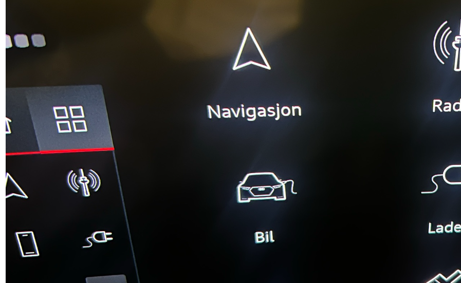
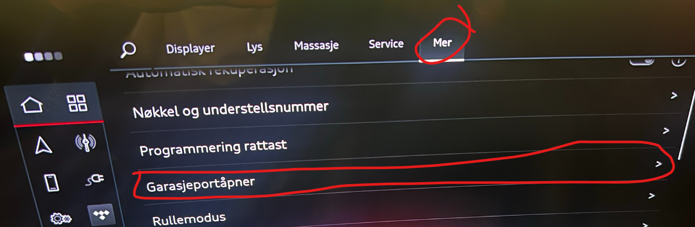
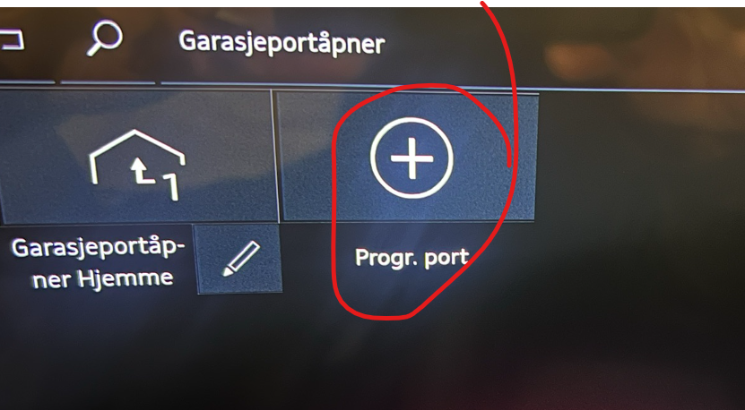
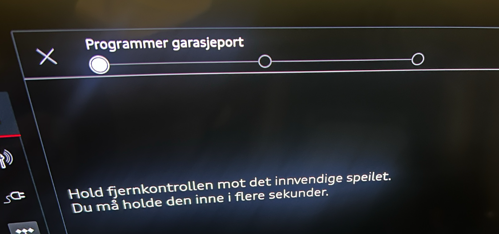

Hvis bilen har garasjeportåpner som ekstrautstyr, kan du programmere den og knytte den til en GPS-posisjon. Da vises et valg for å åpne porten når du nærmer deg den angitte posisjonen, for eksempel når du kommer hjem.

Her er stegene

Velg bil i MMI menyen

Velg mer og Garasjeportåpner

Velg pluss tegnet for å legge til en ny garasjeport, eller ev penen for å oppdatere en allerede programmert port

Følg anvisningene

