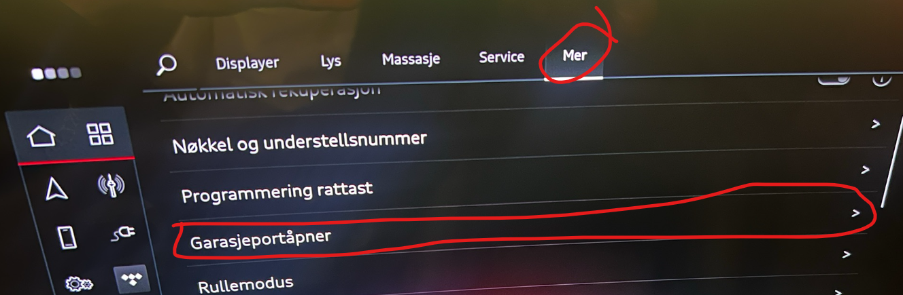
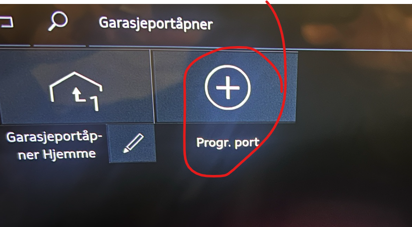
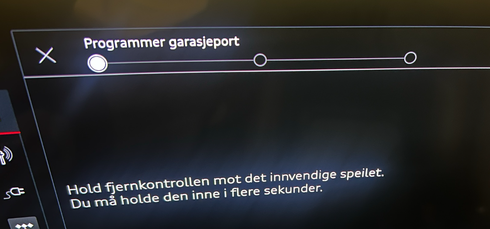

Hvis bilen har garasjeportåpner som ekstra utstyr kan du prorammere denne og tilegne den en GPS posisjon slik at det popper opp et valg for å åpne poren når du nærmer den den posisjonen du har angitt, typisk når du kommer hjem

Her er stegene

Velg bil i MMI menyen

Velg mer og Garasjeportåpner

Velg pluss tegnet for å legge til en ny garasjeport, eller ev penen for å oppdatere en allerede programmert port

Følg anvisningene

