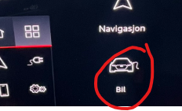
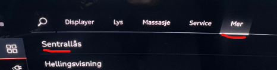
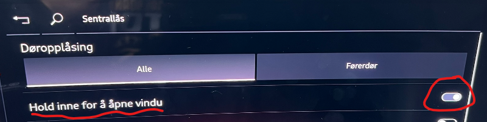
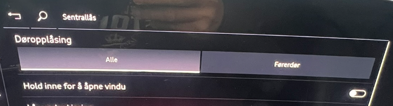

Diese Funktion ist Bestandteil der Option Komfortschlüssel. Sie ermöglicht es Ihnen, die Entriegelungstaste auf dem Fahrzeugschlüssel gedrückt zu halten, um alle vier Fenster gleichzeitig zu öffnen. Der Öffnungsvorgang stoppt, sobald Sie die Taste loslassen. Wenn Sie lange genug gedrückt halten, öffnen sich die Fenster vollständig.

Auf die gleiche Weise können Sie auch die Verriegelungstaste gedrückt halten, um die Fenster wieder zu schließen.

Obwohl dies eine praktische Funktion ist, birgt sie ein gewisses Risiko, wenn der Autoschlüssel in einer Tasche eingeklemmt oder versehentlich betätigt wird – beispielsweise wenn das Auto bei Regen und Wind vor der Hütte steht. Es ist sehr ärgerlich, am nächsten Morgen zu einem Auto voller Wasser oder Schnee zu kommen.

Es gibt jedoch eine einfache Möglichkeit, dies zu verhindern. Sie können diese Funktion im MMI deaktivieren. Leider ist sie standardmäßig aktiviert, weshalb fast jeder diese Einstellung sofort ändern sollte.

Und so gehen Sie vor:

- Wählen Sie Fahrzeug im Hauptmenü

  

- Wählen Sie Einstellungen & Service, Zentralverriegelung

  

- Deaktivieren Sie die Funktion 'Komfortöffnen Fenster'

    

- Das war's – damit bleibt Ihnen diese Art von Überraschung in Zukunft hoffentlich erspart

  
