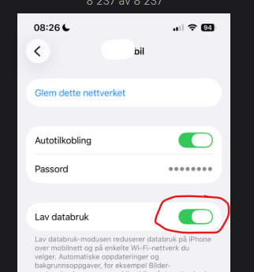
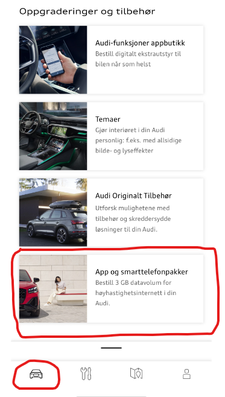
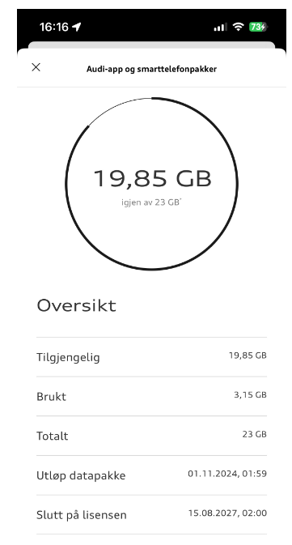
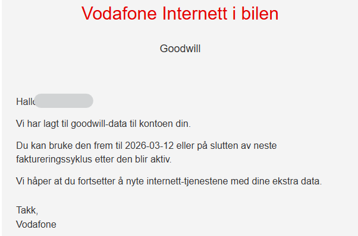
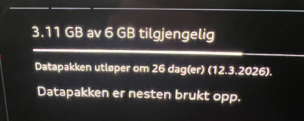

Zunächst eine Beschreibung der verschiedenen Kommunikationswege des Audi Q6 mit der Cloud und den zentralen Servern von Audi. In der Praxis gibt es 3 verschiedene Verbindungen:
1. Audi Connect (Karte und MMI Navigationsupdates)
2. Audi Connect Notruf & Service
3. App und Smartphone Datenpaket.

### Audi Connect (Karte und MMI Navigationsupdates)
Diese Verbindung nutzt eSIM und ist für 3 Jahre lizenziert, wenn das Auto neu ist, und muss dann nach 3 Jahren erneuert werden.

### Audi Connect Notruf & Service
Diese Verbindung verwendet eSIM und ist für 10 Jahre lizenziert, wenn das Auto neu ist.

### App und Smartphone Datenpaket
Diese Verbindung nutzt auch eSIM und muss vom Benutzer aktiviert werden, bevor sie fertig ist.
1. Datennutzung für installierte Apps (Vivaldi, Spotify, etc.)
2. Datennutzung (Internet) für die gemeinsame WLAN-Zone im Auto. Diese Funktion müssen Sie im MMI aktivieren und mobile Geräte im Auto müssen sich dann mit dieser WLAN-Zone verbinden und nutzen dann dieses Datenkontingent.

Wenn Sie Ihr Handy mit dieser WiFi-Zone verbinden, ist es besonders ratsam, die geringe Datennutzung auf Ihrem iPhone einzuschalten (vorausgesetzt, es gibt eine ähnliche Option auf Android-Handys), da sonst das Datenkontingent schnell geleert werden kann, wenn das Handy beispielsweise Updates herunterlädt.

Beachten Sie auch, dass, wenn Sie das Internet von Ihrem Handy aus teilen oder ein WiFi-Netzwerk zur Verfügung haben, in dem das Auto geparkt ist (normalerweise Ihr Heimnetzwerk), diese Datenverbindung auch als Quelle für die beiden oben genannten Punkte fungiert.

TIPP: Wenn Sie Apps aus dem App Store installieren, ist es ziemlich klug, entweder das Internet von Ihrem Telefon aus zu teilen oder Wifi (Home Network) zu verwenden, da diese Apps oft eine bestimmte Größe haben und Sie die Datennutzung aus Ihrem 3GB-Kontingent oder Abonnement speichern können.

HINWEIS: Beachten Sie, dass es ein Problem gibt, das darauf hindeutet, dass der AppStore und möglicherweise andere Funktionen nicht wie erwartet funktionieren, wenn das Auto keine LTE/5G-Verbindung hat (für die Punkte 1 und 2 aus der Einleitung). https://github.com/electrichasgoneaudi/q6-e-tron/issues/45

# Beschreibung, wie Sie ein Abonnement für das App- und Smartphone-Datenpaket verbinden und erstellen

Ein Datenpaket von 3 GB (aktualisiert auf 10 GB im Juli 2026) pro Monat wird für die ersten 3 Jahre mit dem Auto geliefert. Zusätzlich können Sie ein Abonnement kaufen, das automatisch mit mehr Daten nachfüllt, wenn das kostenlose Kontingent aufgebraucht ist.

Wenn Sie nicht, und haben Sie Ihre kostenlose 10 GB, werden Sie ohne Internet im Auto bis zum 1. des nächsten Monats.

Um den Status Ihrer Nutzung zu sehen, können Sie das MMI in Ihrem Auto verwenden, oder Sie können dies über die myAudi App sehen, Sie finden es auf der ersten Seite ganz unten:

Klicken Sie einfach auf die Option und Sie kommen zu Ihrer Statusseite mit Links zum Kauf und Verwalten Ihrer Datenpakete:

Hinweis: Diese Funktion hat in mehreren Ländern nicht mehr funktioniert, så dies ist möglicherweise nicht mehr gültig

Im folgenden Beispiel wurde ein zusätzliches Datenpaket von 20 GB hinzugefügt, das dann zu dem 10 GB-Paket hinzugefügt wird, das mit dem Auto geliefert wird.

Wählen Sie in MMI Verbindungen und dann Datenpakete aus.

Um ein Abonnement zu erstellen und zu bestellen, muss man zuerst eine Vereinbarung treffen. Es ist eigentlich Telia, der dies für Autos in Norwegen anbietet. Es wird wahrscheinlich andere lokale Anbieter für andere Länder geben.

Dann gehen Sie wieder zur Option in der myAudi App und scrollen Sie nach unten, wo Sie diese Option finden. Klicken Sie auf den Link und Sie werden zur Verwaltungsseite weitergeleitet.

Aber es gibt eigentlich nicht viel nützlich, was Sie hier tun können.

Am einfachsten ist es vielleicht, Ihren Browser zu verwenden. und Öffnen Sie diese Adresse:

https://internetinthecar.telia.vodafone.com/m2miitcfo/faces/account.jspx

Wenn Sie sich anmelden müssen, müssen Sie den myAudi-Benutzernamen und das Passwort verwenden, und Sie erkennen den Anmeldedialog, wenn Sie ihn sehen.

Sie haben diese Willkommensseite, die den Status zeigt. höchstwahrscheinlich gehen Sie direkt zur MANAGE-Option 

Hier wird der Status angezeigt und Sie können beispielsweise wählen, ob Sie das Abonnement ändern oder eine Zahlungsmethode ändern/verknüpfen möchten.

Sie haben die Option 'Häufige Höchstgrenze für das Nachfüllen auswählen', die angibt, wie oft Sie ein neues Datenpaket automatisch pro Monat erstellen lassen. Dies ist so, dass es nicht nur weiter nachfüllt, wenn Sie aus irgendeinem Grund plötzlich große Datenmengen verwenden. 

Wenn Sie sich entscheiden, das Abonnement zu ändern, wird eine solche Seite angezeigt:

Ziemlich einfach zu ändern, und eine Änderung wird wirksam, wenn das aktuelle Abonnement abläuft.

Insgesamt ist diese Seite ziemlich einfach zu verstehen und Sie werden wahrscheinlich in der Lage sein, die Vereinbarungen und Zahlungsmethoden zu erstellen, die Sie möchten.

In den obigen Beispielen sind ein Auto und eine Zahlungsmethode bereits verbunden.

Das erste Mal müssen Sie sich registrieren, ein Auto anschließen und eine Zahlungskarte verknüpfen, dann ein Datenpaket auswählen. Das profitabelste ist 30 GB für 25kr. Es ist immer noch ein bisschen bedauerlich, dass Sie Ihr eigenes privates Abonnement nicht verwenden können, aber wenn dies die Lösung ist, sind die Preise nicht so hoffnungslos wie das Cubic Telecom Setup, das für den e-tron / Q8 e-tron existiert.

### Update Januar 2026

Bis auf weiteres (möglicherweise nur in Norwegen) erhalten Sie automatisch ein zusätzliches Goodwill-Paket von 3 GB, wenn Ihre ursprünglichen 3 GB Daten aufgebraucht sind.

Ein Beispiel für diese E-Mail ist:

So wird es im Auto aussehen, hier erhalten Sie mehr Daten **vor** Die alten sind aufgebraucht.

Diese Option funktioniert vorerst nicht.

