D'abord, une description des différentes façons dont le Audi Q6 communique avec le cloud et les serveurs centraux d'Audi. En pratique, il y a 3 connexions différentes:
1. Audi Connect (mises à jour de navigation MMI et MMI)
2. Audi Connect appel d'urgence & service
3. App et paquet de données Smartphone.

### Audi Connect (mises à jour de navigation MMI et MMI)
Cette connexion utilise eSIM et est autorisée pendant 3 ans lorsque la voiture est neuve, et doit ensuite être renouvelée après 3 ans. Le prix de cette connexion est divisé en soit par mois ou par an.

### Audi Connect appel d'urgence & service
Cette connexion utilise eSIM et est autorisée pendant 10 ans lorsque la voiture est neuve.

### Paquet de données App et Smartphone
Cette connexion utilise également eSIM et doit être activée par l'utilisateur avant d'être prête. Cette connexion est utilisée pour 2 choses:
1. Utilisation des données pour les applications installées (Vivaldi, Spotify, etc.)
2. Utilisation des données (internet) pour la zone wifi partagée dans la voiture. Vous devez activer cette fonction dans MMI et les appareils mobiles dans la voiture doivent ensuite se connecter à cette zone Wifi et utiliser ce quota de données.

Si vous connectez votre mobile à cette zone WiFi, il est particulièrement conseillé d'activer une utilisation de données faibles sur votre iPhone (en supposant qu'il y ait une option similaire sur les téléphones Android), sinon le quota de données peut être rapidement vidé si le mobile commence à télécharger des mises à jour, par exemple.

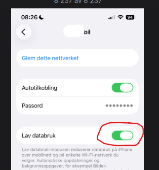

Sachez également que si vous partagez Internet depuis votre mobile ou si vous disposez d'un réseau WiFi où la voiture est garée (généralement votre réseau domestique), cette connexion de données fonctionnera également comme source pour les 2 points ci-dessus. Dans ce cas, votre quota de données ne sera pas utilisé.

CONSEIL: Lorsque vous installez des applications depuis l'App Store, il est très intelligent de partager Internet depuis votre téléphone ou d'utiliser Wifi (réseau domestique) car ces applications sont souvent d'une certaine taille et vous pouvez enregistrer l'utilisation des données à partir de votre quota 3GB ou de votre abonnement.

NOTE: Soyez conscient qu'il y a un problème suggérant que l'AppStore et éventuellement d'autres fonctions ne fonctionnent pas comme prévu lorsque la voiture manque de connexion LTE/5G (pour les points 1 et 2 de l'introduction). https://github.com/electrichasgoneaudi/q6-e-tron/issues/45

# Description de la façon de connecter et de créer un abonnement pour le paquet de données App et Smartphone

Un paquet de données de 3 Go (mise à jour à 10 Go en juillet 2026) par mois est livré avec la voiture pour les 3 premières années. De plus, vous pouvez acheter un abonnement qui se recharge automatiquement avec plus de données lorsque le quota gratuit est épuisé.

Vous pouvez choisir si vous voulez ou non un abonnement. Si vous ne le faites pas, et avez épuisé votre 10 Go gratuit, vous serez sans internet dans la voiture jusqu'au 1er du mois prochain. C'est si simple.

Pour voir l'état de votre utilisation, vous pouvez utiliser le MMI dans votre voiture, ou vous pouvez le voir via l'application myAudi, vous le trouverez sur la première page en bas de page:

Il suffit de cliquer sur l'option et vous arriverez à votre page d'état avec des liens pour acheter et gérer vos paquets de données:

Note: Cette fonction n'a pas fonctionné depuis longtemps dans plusieurs pays, så cela peut ne plus être valable

Dans l'exemple ci-dessous, un paquet de données supplémentaires de 20 Go a été ajouté, qui est ensuite ajouté au paquet de 10 Go qui vient avec la voiture

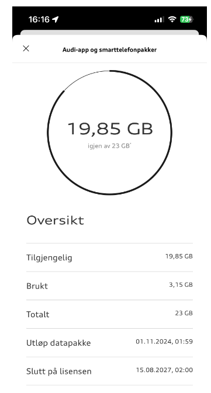

Dans MMI, sélectionnez Connexions, puis paquets de données.

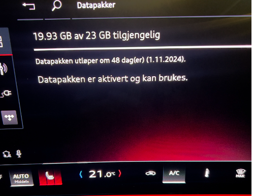

Pour créer et commander un abonnement, vous devez d'abord créer un accord. C'est en fait Telia qui est le fournisseur de ceci pour les voitures en Norvège. Il y aura probablement d'autres fournisseurs locaux pour d'autres pays.

Ensuite, allez à l'option dans l'application myAudi à nouveau et faites défiler vers le bas, où vous trouverez cette option. Cliquez sur le lien et vous serez redirigé vers la page d'administration.

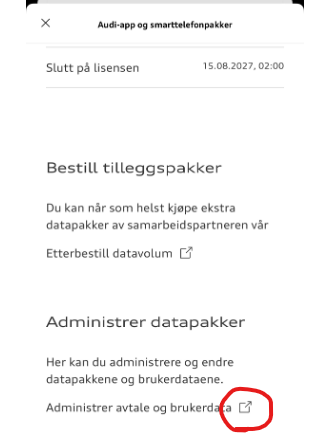

Mais en fait, vous ne pouvez pas faire grand chose ici.

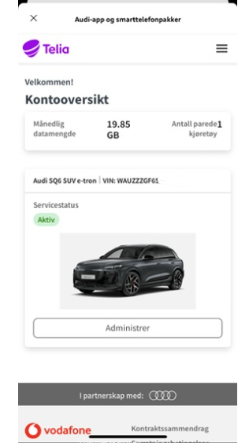

La chose la plus facile est peut-être d'utiliser votre navigateur. et Ouvrez cette adresse:

https://internetinthecar.telia.vodafone.com/m2miitcfo/faces/account.jspx

Vous devrez probablement vous connecter, je trouve que le navigateur se souvient de la connexion pendant un certain temps. Si vous devez vous connecter, vous devez utiliser le nom d'utilisateur et le mot de passe myAudi. Vous reconnaîtrez la boîte de dialogue de connexion lorsque vous la verrez.

Vous avez cette page de bienvenue qui montre l'état. Très probablement, vous allez directement à l'option MANAGE 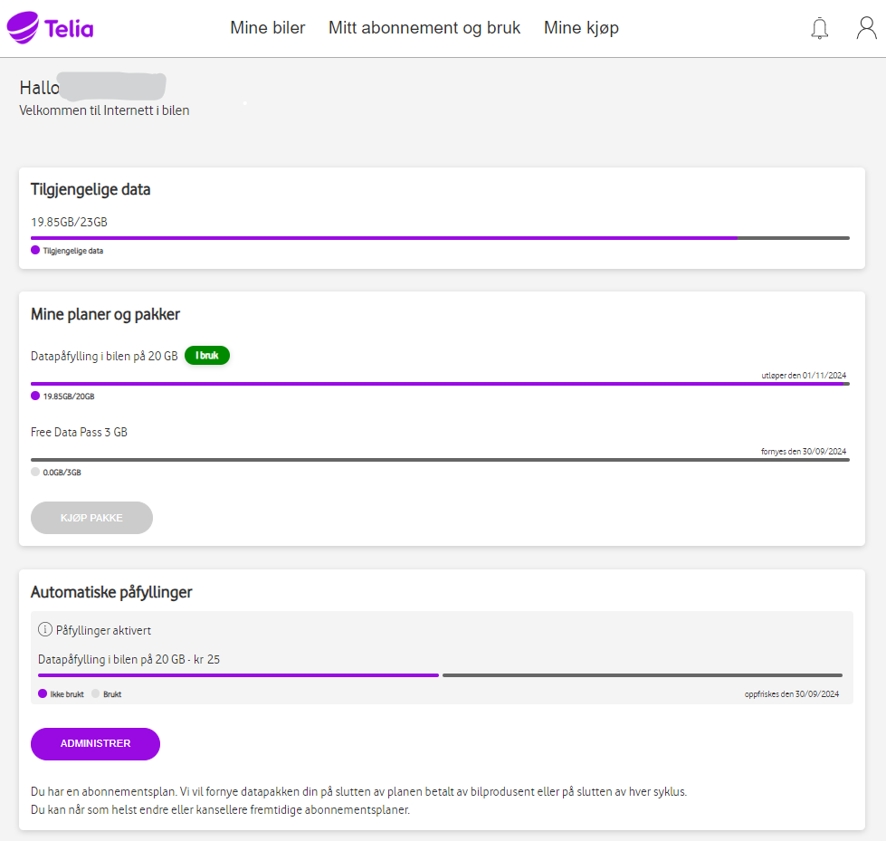

Ici, le statut est affiché et vous pouvez, par exemple, choisir de modifier l'abonnement ou de modifier/liener un mode de paiement.

Vous avez l'option « Choisir la limite maximale pour recharger » qui indique combien de fois vous autorisez la création automatique d'un nouveau paquet de données par mois. Ceci est de sorte qu'il ne continue pas seulement à recharger si vous commencez soudainement pour une raison quelconque à utiliser de grandes quantités de données. 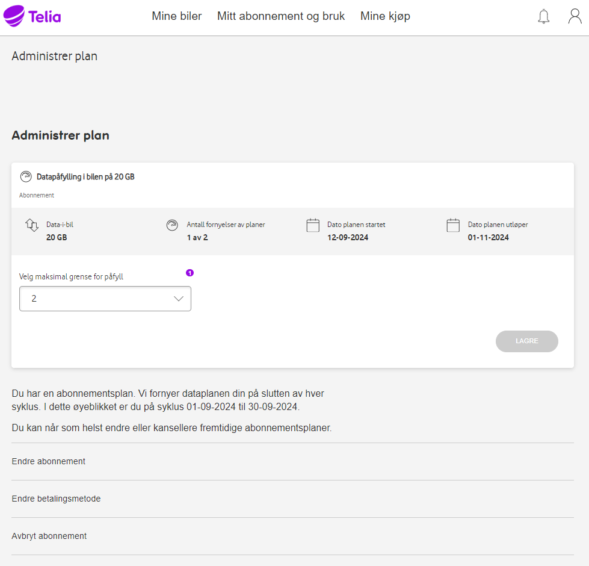

Si vous choisissez de changer l'abonnement, une telle page apparaîtra :

Il est assez facile de changer, et un changement prendra effet à l'expiration de l'abonnement actuel.

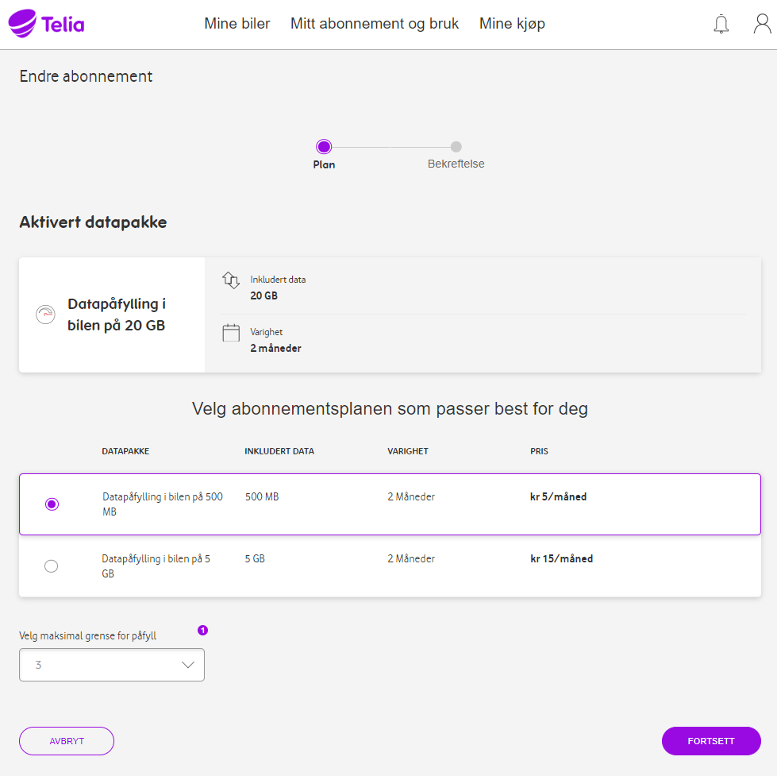

Dans l'ensemble, cette page est assez facile à comprendre et vous serez probablement en mesure de créer les accords et les méthodes de paiement que vous voulez.

Dans les exemples ci-dessus, une voiture et un mode de paiement sont déjà connectés.

La première fois que vous devez vous enregistrer, connecter une voiture et relier une carte de paiement, puis choisir un paquet de données. Le plus rentable est 30 Go pour 25kr. Il est encore un peu malheureux que vous ne puissiez pas utiliser votre propre abonnement privé, mais quand c'est la solution, les prix ne sont pas aussi désespérés que la configuration Cubic Telecom qui existe pour l'e-tron/Q8 e-tron.

### Mise à jour janvier 2026

Jusqu'à nouvel ordre (peut seulement s'appliquer en Norvège), vous recevrez automatiquement un paquet de bonne volonté supplémentaire de 3 Go lorsque vos 3 Go de données originales sont épuisées. Cela se produit automatiquement et vous recevrez un email de Vodafone à ce sujet.

Un exemple de ce courriel est :

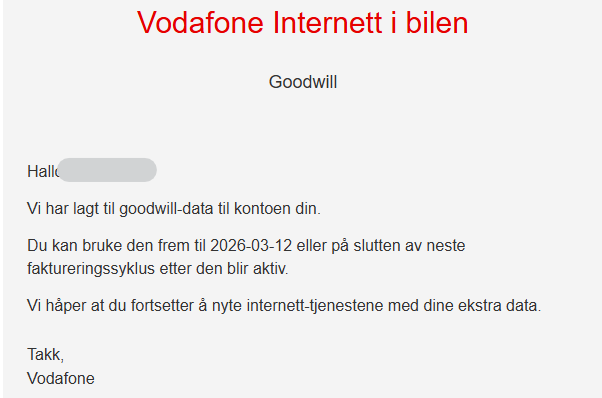

C'est à ça qu'il ressemblera dans la voiture, ici vous recevez plus de données **avant** les anciennes sont épuisées.

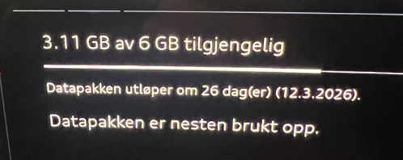

Cette option ne fonctionne pas pour le moment.

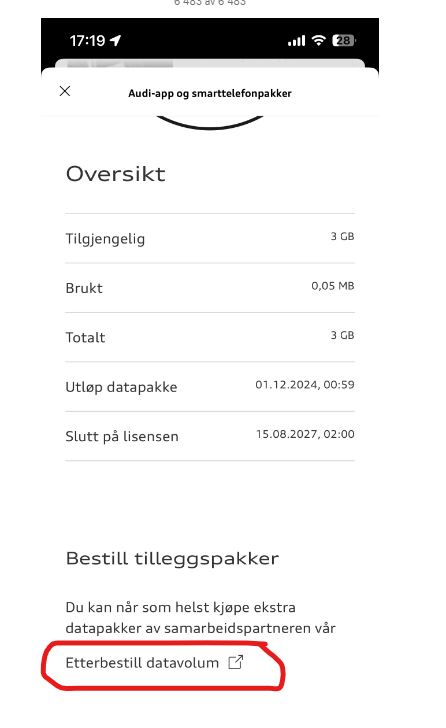
