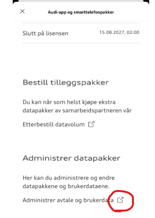
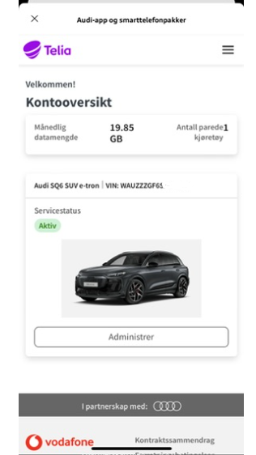

First, a description of the different ways the Audi Q6 communicates with the cloud and Audi's central servers. In practice, there are 3 different connections:
1. Audi Connect (Map and MMI navigation updates)
2. Audi Connect emergency call & service
3. App and Smartphone data package.

### Audi Connect (Map and MMI navigation updates)
This connection uses eSIM and is licensed for 3 years when the car is new, and must then be renewed after 3 years. The price for this is divided into either per month or per year.

### Audi Connect emergency call & service
This connection uses eSIM and is licensed for 10 years when the car is new.

### App and Smartphone data package
This connection also uses eSIM and must be activated by the user before it is ready. This connection is used for 2 things:
1. Data usage for installed Apps (Vivaldi, Spotify, etc.)
2. Data usage (internet) for the shared wifi zone in the car. You must enable this function in MMI and mobile devices in the car must then connect to this Wifi zone and will then use this data quota.

Also, be aware that if you share the internet from your mobile or have a WiFi network available where the car is parked (typically your home network), this data connection will also function as a source for the 2 points above. In such a case, your data quota will not be used.

TIP: When you install apps from the App Store, it is quite smart to either share the internet from your phone or use Wifi (Home network) as these apps are often of a certain size and you can save data usage from your 3GB quota or subscription.

NOTE: Be aware that there is an issue suggesting that the AppStore and possibly other functions do not work as expected when the car lacks LTE/5G connection (for points 1 and 2 from the introduction). Read more about this issue here: https://github.com/electrichasgoneaudi/q6-e-tron/issues/45

# Description of how to connect and establish a subscription for the App and Smartphone data package

A data package of 3 GB per month comes with the car for the first 3 years. In addition, you can buy a subscription that automatically refills with more data when the free quota is used up.

You can choose whether you want a subscription or not. If you do not, and have used up your free 3 GB, you will be without internet in the car until the 1st of the next month. It's that simple.

To see the status of your usage, you can use the MMI in your car, or you can see this via the myAudi App, you will find it on the first page at the very bottom:

Just click on the option and you will come to your status page with links to buy and manage your data packages:

In the example below, an additional data package of 20 GB has been added, which is then added to the 3 GB package that comes with the car

In MMI, select Connections, and then Data packages.

To create and order a subscription, you must first create an agreement. It is actually Telia that is the provider of this for cars in Norway. There will probably be other local providers for other countries.

Then go to the option in the myAudi app again and scroll down to the bottom, where you will find this option. Click on the link and you will be redirected to the administration page.

But there is actually not much useful you can do here.

The easiest thing is perhaps to use your browser. and Open this address:

https://internetinthecar.telia.vodafone.com/m2miitcfo/faces/account.jspx

You will probably need to log in, I find that the browser remembers the login for a while. If you need to log in, you must use the myAudi username and password. You will recognize the login dialog when you see it.

You have this welcome page that shows the status. Most likely, you will go straight to the MANAGE option

Here the status is shown and you can, for example, choose to change the subscription or change/link a payment method.

You have the option for 'Choose maximum limit for refill' which indicates how many times you allow a new data package to be automatically created per month. This is so that it does not just keep refilling if you for some reason suddenly start using large amounts of data.

If you choose to change the subscription, such a page will appear:

Quite easy to change, and a change will take effect when the current subscription expires.

Overall, this page is quite easy to understand and you will probably be able to create the agreements and payment methods you want.

In the examples above, a car and a payment method are already connected.

The very first time you must both register, connect a car, and link a payment card, then choose a data package. The most profitable is 30 GB for 25kr. It is still a bit unfortunate that you cannot use your own private subscription, but when this is the solution, the prices are not as hopeless as the Cubic Telecom setup that exists for the e-tron/Q8 e-tron.
