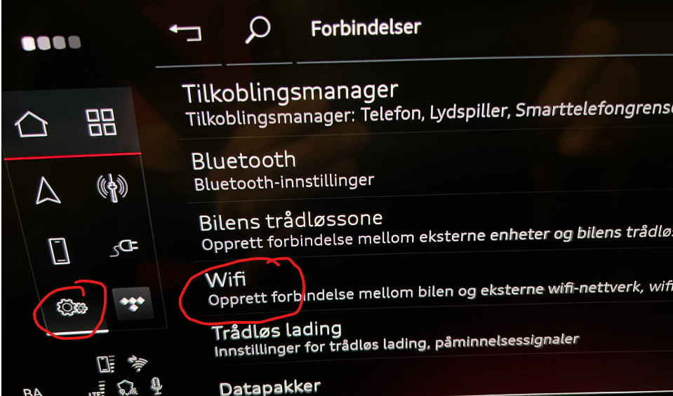
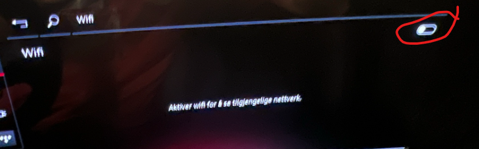
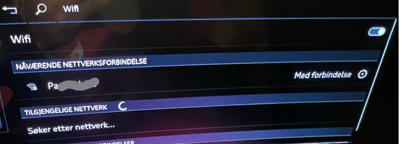
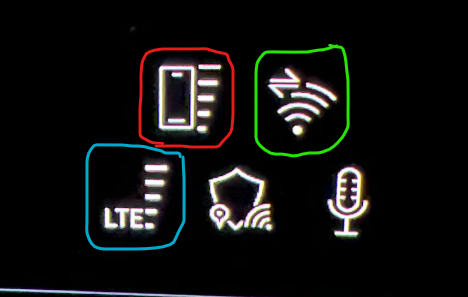
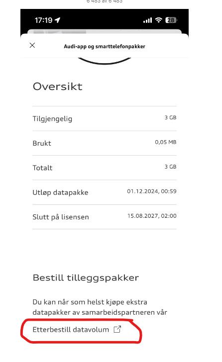

Først en beskrivelse om de ulike måtene Audi Q6 kommuniserer med skyen og Audi sine sentrale servere. I praksis finnes det 3 ulike forbindelser:
1. Audi Connect (Kart og MMI navigasjons oppdateringer)
2. Audi Connect nødanrop & service
3. App og Smart telefon datapakke.

### Audi Connect (Kart og MMI navigasjons oppdateringer)
Denne forbindelsen bruker eSIM og er lisensiert for 3 år når bilen er ny, og må da fornyes etter 3 år, prisen for dette deles opp i enten pr måned eller pr år.

### Audi Connect nødanrop & service
Denne forbindelsen bruker eSIM og er lisensiert for 10 år når bilen er ny.

### App og Smart telefon datapakke
Denne forbindelsen bruker også eSIM og må aktiveres av bruker før den er klar. Denne forbindelsen brukes til 2 ting:
1. Databruk for installerte Apper (Vivaldi, Spotify etc)
2. Databruk (internet) for den delte wifi sonen i bilen. Da må du enable denne funksjonen i MMI og mobile enheter i bilen må da kople seg til denne Wifi sonen og vil da bruke av denne datakvoten.

Vær også obs på at om du deler internett på din mobil eller har et WiFi nettverk tilgjengelig der bilen står (typisk ditt hjemmenettverk) så vil også denne dataforbindelsen fungere som kilde for de 2 ovenstående punktene. I så tilfelle blir det ikke brukt av din datakvote.

TIPS: Når du skal installere apps fra App Store er det nok ganske lurt å enten dele internatt fra din telefon eller bruke Wifi (Hjemmenettverk) da disse appene ofte er av en viss størrelse og du kan spare databruk fra din 3GB kvote eller abonnement.

NB: Vær obs på at det finnes en issue som antyder at AppStore og ev. andre funksjoner ikke fungerer som forventet når bilen mangler LTE/5G forbindelse (for pkt 1 og 2 fra innledningen). Les mer om dette issuet her : https://github.com/electrichasgoneaudi/q6-e-tron/issues/45

# Beskrivelse av hvordan du deler wifi med bilen fra din mobil
Om Smarttelefonpakken, som er beskrevet i avsnittet lengre ned i artikkelen, ikke virker eller er tom for data, kan du velge å dele fra fra din mobil. 

Det fungerer slik at dette valget vil bli prioritert foran den innebygde 3GB datakvoten, og bilen kopler seg opp automatisk. Så dette kan brukes f.eks på langtur om du vil spare av 3GB datakvoten. Om du legger din mobil på ladeplassen, så skal det også bli brukt bilens innebygde antenne slik at du, i teorien, skal få bedre 4G/5G dekning. 

Slik gjør du dette

1. Først må du slå på deling av WiFi fra din mobil

Du finner det her :

2. Så må du slå på WiFi valget i bilen MMI

3. Til sist må du legge inn mobilen wifi passord i MMI

NB! Vær obs på at det er en kjent feil som men jevne og ujevne mellomrom slår av MMI valget i bilen og da må du enable dette manuelt igjen før du kan kople opp igjen.
Les om dette her :  https://github.com/electrichasgoneaudi/q6-e-tron/issues/20

Tips: Du kan se i displayet om bilen er koplet til et 'ekstern' WiFi nett. Da skal du ha ikonet vist i den grønn ringen

# Beskrivelse av hvordan du kopler og etablerer abonnement for App og Smarttelefon datapakke

Det følger med en datapakke på 3 GB per måned som du får med bilen de 3 første årene. I tillegg kan du kjøpe et abonnement som automatisk fyller på med mer data når den gratis kvoten er brukt opp.

Du kan selv velge om du vil ha et abonnement eller ikke. Om du ikke gjør så, og har brukt opp dine gratis 3 GB er du uten internet i bilen fram til den 1. i neste måned. Så enkelt er det.

[Slik oppretter du en ny avtale for aller første gang](create-new)

Hvis du ikke har behov for mer enn 3 GB data (gratis kvoten) som trenger du ikke lese videre.

Vennligst gå gjennom stegene som er forklart over før du fortsetter.

# Opprette ekstra datakvote

For å se status på forbruket ditt kan du bruke MMI i bilen din, eller du kan se dette via myAudi Appen, du finner den på første side helt nederst :

Bare trykk på valget og du kommer til din statusside og med linker til å kjøpe og administrere dine datapakker :

Her skal du trykke på 'Etterbestill datavolum', men dessverre pr 24.11.2024 fungerer dette ikke. Dette er meldt til Digital Support og denne guiden vil bli oppdatert når det fungerer igjen

