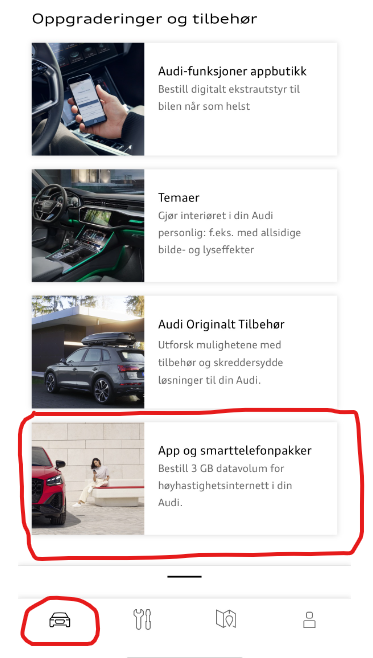
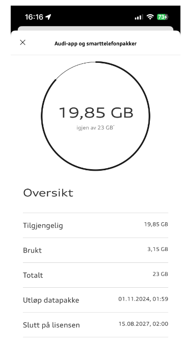
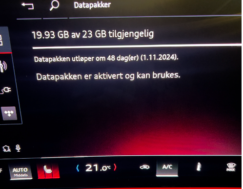
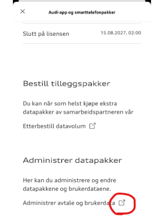
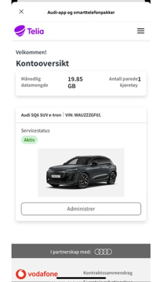
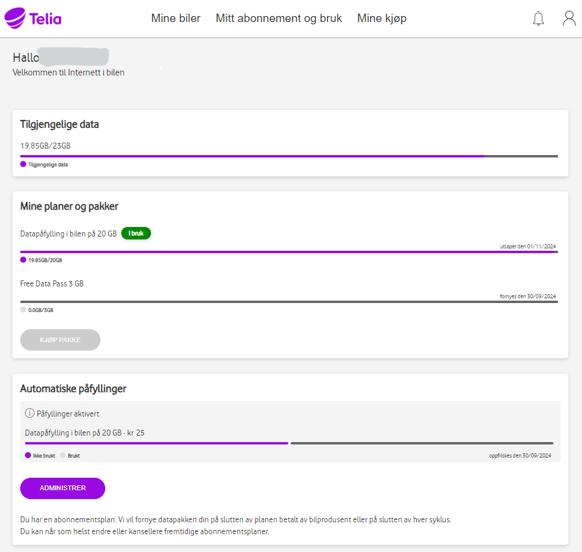
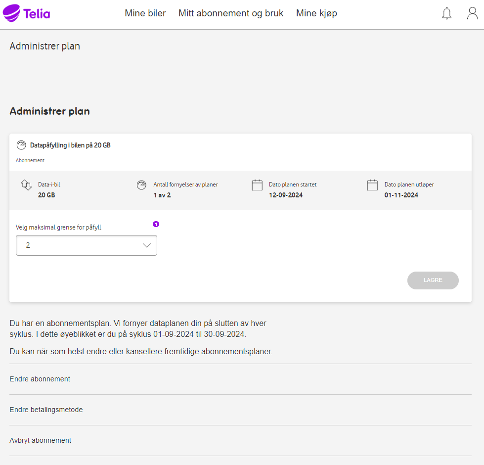
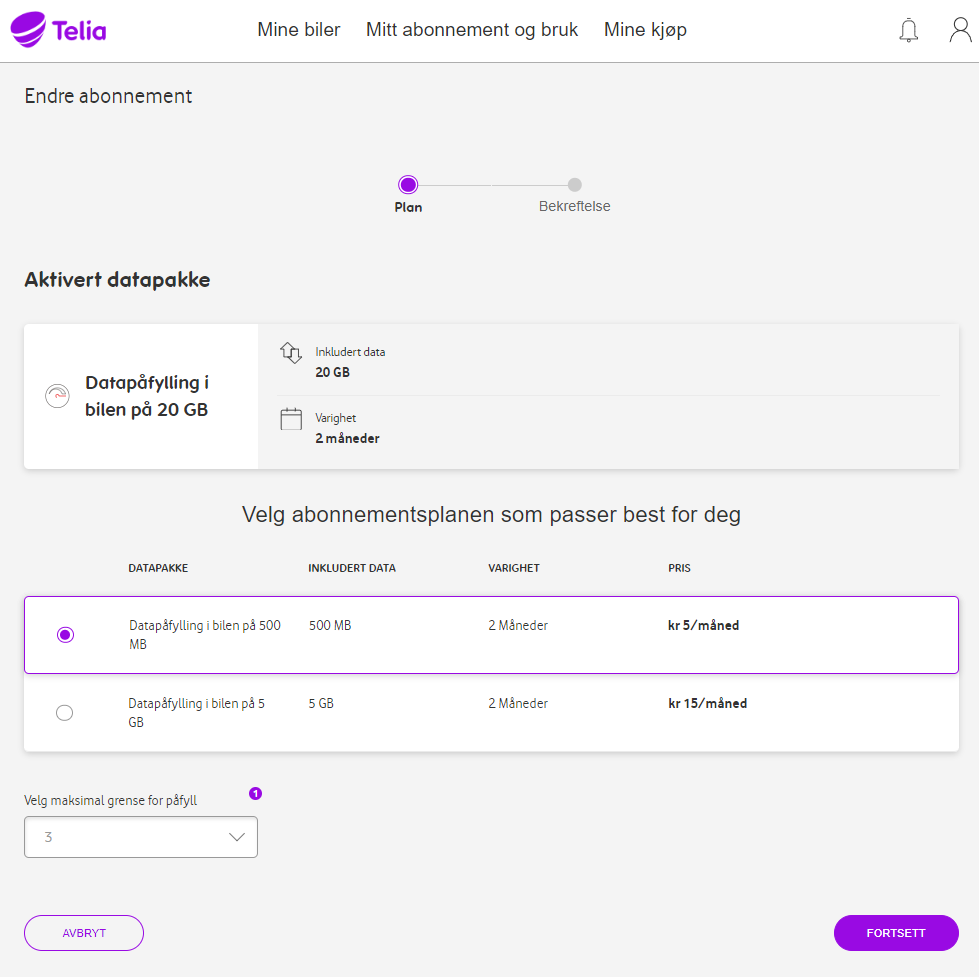

Først en beskrivelse om de ulike måtene Audi Q6 kommuniserer med skyen og Audi sine sentrale servere. I praksis finnes det 3 ulike forbindelser:
1. Audi Connect (Kart og MMI navigasjons oppdateringer)
2. Audi Connect nødanrop & service
3. App og Smart telefon datapakke.

### Audi Connect (Kart og MMI navigasjons oppdateringer)
Denne forbindelsen bruker eSIM og er lisensiert for 3 år når bilen er ny, og må da fornyes etter 3 år, prisen for dette deles opp i enten pr måned eller pr år.

### Audi Connect nødanrop & service
Denne forbindelsen bruker eSIM og er lisensiert for 10 år når bilen er ny.

### App og Smart telefon datapakke
Denne forbindelsen bruker også eSIM og må aktiveres av bruker før den er klar. Denne forbindelsen brukes til 2 ting:
1. Databruk for installerte Apper (Vivaldi, Spotify etc)
2. Databruk (internet) for den delte wifi sonen i bilen. Da må du enable denne funksjonen i MMI og mobile enheter i bilen må da kople seg til denne Wifi sonen og vil da bruke av denne datakvoten.

Vær også obs på at om du deler internett på din mobil eller har et WiFi nettverk tilgjengelig der bilen står (typisk ditt hjemmenettverk) så vil også denne dataforbindelsen fungere som kilde for de 2 ovenstående punktene. I så tilfelle blir det ikke brukt av din datakvote.

TIPS: Når du skal installere apps fra App Store er det nok ganske lurt å enten dele internatt fra din telefon eller bruke Wifi (Hjemmenettverk) da disse appene ofte er av en viss størrelse og du kan spare databruk fra din 3GB kvote eller abonnement.

NB: Vær obs på at det finnes en issue som antyder at AppStore og ev. andre funksjoner ikke fungerer som forventet når bilen mangler LTE/5G forbindelse (for pkt 1 og 2 fra innledningen). Les mer om dette issuet her : https://github.com/electrichasgoneaudi/q6-e-tron/issues/45

# Beskrivelse av hvordan du kopler og etablerer abonnement for App og Smarttelefon datapakke

Det følger med en datapakke på 3 GB per måned som du får med bilen de 3 første årene. I tillegg kan du kjøpe et abonnement som automatisk fyller på med mer data når den gratis kvoten er brukt opp.

Du kan selv velge om du vil ha et abonnement eller ikke. Om du ikke gjør så, og har brukt opp dine gratis 3 GB er du uten internet i bilen fram til den 1. i neste måned. Så enkelt er det.

For å se status på forbruket ditt kan du bruke MMI i bilen din, eller du kan se dette via myAudi Appen, du finner den på første side helt nederst :

Bare trykk på valget og du kommer til din statusside og med linker til å kjøpe og administrare dine datapakker :

I eksemplet under er det lagt til en ekstra datapakke på 20 GB som da legges til den 3 GB pakken man får med bilen

I MMI velget man Forbindelser, og så Datapakker.

For å opprette og bestille et abonnement må man først opprette en avtale. Det er faktisk Telia som er leverandør av dette for biler i Norge. Det vil nok være andre lokale leverandører for andre land.

Gå da inn på valget i myAudi appen på nytt og bla den ned til bunnen, der finner du dette valget. Klikk på linken og du blir videresendt til administrasjonssiden.

Men det er faktisk ikke så mye nyttig du faktisk kan gjøre her.

Det letteste er kanskje å bruke din nettleser. og Åpne denne adressen :

https://internetinthecar.telia.vodafone.com/m2miitcfo/faces/account.jspx

Du må nok logge på, jeg opplever at nettleseren husker innloggingen for en stund. Om du må logge på så er det myAudi bruker og passord du må bruke. Du vil kjenne igjen den påloggingsdialogen når du ser den.

Man har denne velkomstsiden som viser status. Mest sannsynlig vil du gå rett til ADMINISTRER valget

Her vises status og du kan f.eks velg eå endre abonnement eller endre/knytte opp en betalingsmetode.

Du har valget for 'Velg maksimal granse for påfyll' det angir hvor mange ganger du tillater at det automatisk opprettes ny data pakke pr mnd. Dette er for at det ikke skal bare fylle og fylle om du av en eller annen grunn plutselig begynner å bruke store mengder med data.

Velger du å endre abonnement kommer det opp en slik side :

Ganske lett å endre, og en en endring legger seg inn når gjeldene abonnement er utløpt.

I det hele tatt så er denne siden ganske lett å forstå og du klarer sannsynligvis å opprette de avtaler og betalingsmetoder du ønsker.

I eksemplene over så er det allerede koplet opp en bil, og en  betalingsmetode.

Aller første gang må du både registrere deg, kople opp en bil og knytte til et betalingskort, for så å velge en datapakke. Det mest lønnsomme er 30 GB for 25kr. Det er fremdeles litt leit at man ikke man bruke sitt eget private abonnement, men når dette er løsningen, er er vel ikke prisene så helt håpløse som det Cubic Telecom opplegget som finnes til e-tron/ Q8 e-tron.
