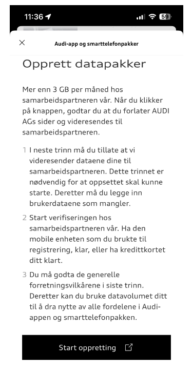
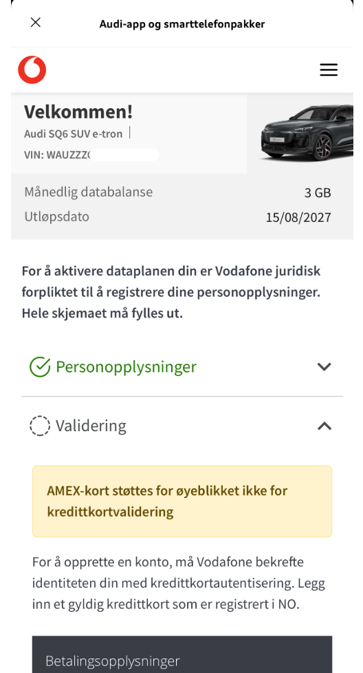
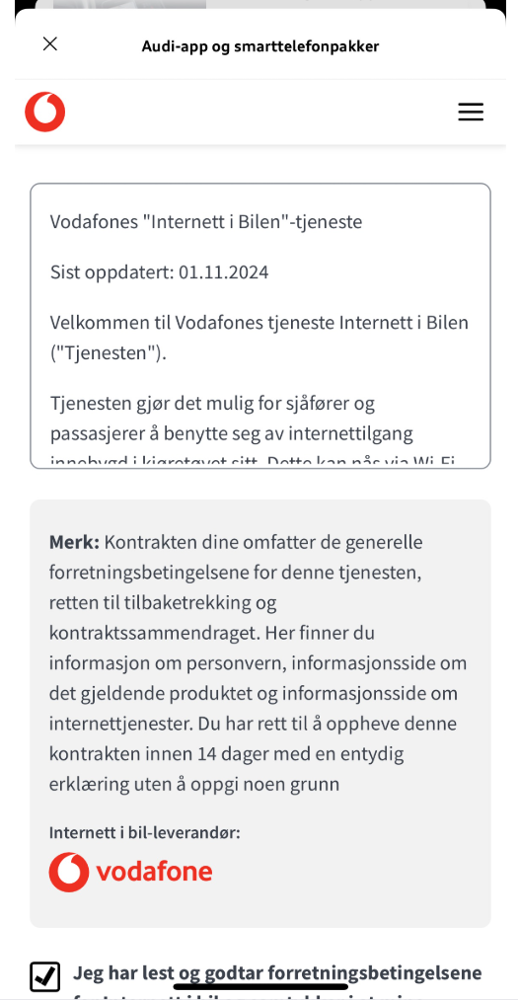
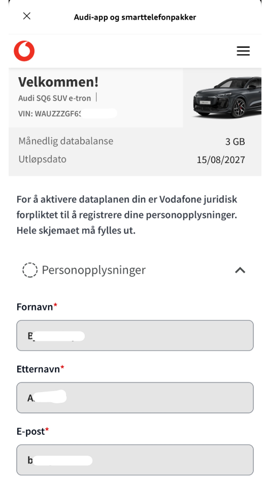

# Beschreibung, wie Sie das App- und Smartphone-Datenpaket erstmals verbinden und abonnementieren

Öffnen Sie die myAudi App und klicken Sie auf diese Option

Sie sehen diesen Bildschirm, wenn Sie keine aktive Vereinbarung für Ihr Auto haben, und klicken Sie auf "Erstellung starten", um Ihr Auto mit Vodafone Internet im Auto zu verbinden.

Als nächstes sehen Sie einen Bildschirm, auf dem Sie gefragt werden, ob Sie den Datenaustausch von Ihrem Audi-Konto zu Vodafone zulassen.

Sie werden kurz Cubic Telecom (!)

Bevor Sie Vodafone erreichen

Hier füllen Sie Ihre Daten so gut wie möglich aus

Wenn Sie auf Weiter geklickt haben, erreichen Sie die Option, bei der Sie tatsächlich eine gültige Zahlungskarte eingeben müssen

Hoffentlich haben Sie es geschafft, eine genehmigte Kreditkarte einzugeben, und Sie werden zum Vereinbarungsdokument geschickt

Und Sie müssen überprüfen, ob Sie die Bedingungen gelesen haben und zustimmen, und klicken Sie auf "Konto aktivieren"

Es braucht einige Zeit, um dies zu schaffen, also seien Sie geduldig ...

"Erfolgreich" ist die Botschaft, auf die Sie warten.

Und schließlich landen Sie in Ihrer Vereinbarungsübersicht

Wenn Sie jetzt die Option für Smartphone-Pakete im Auto wählen

Sie sollten so etwas wie das sehen:

