# Description de la façon de connecter et de créer un abonnement pour le pack de données App et Smartphone pour la première fois

Ouvrez l'application myAudi et cliquez sur cette option

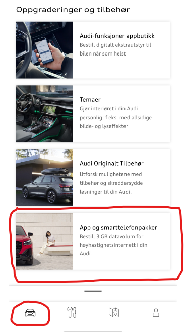

Vous verrez cet écran si vous n'avez pas un accord actif pour votre voiture. Ensuite, vous devez cliquer sur 'Démarrer la création' pour connecter votre voiture à Vodafone Internet dans la voiture

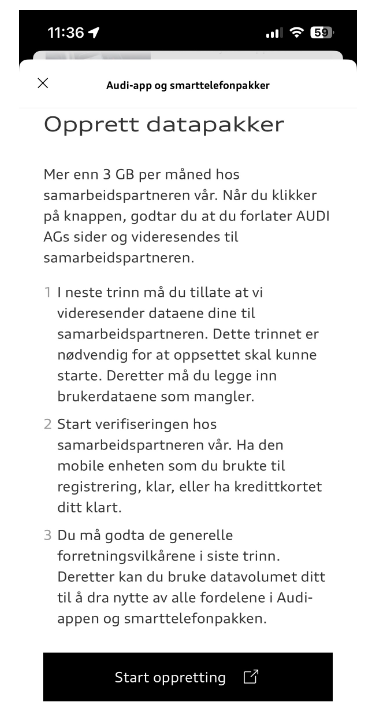

Ensuite, vous verrez un écran vous demandant si vous autorisez l'échange de données de votre compte Audi à Vodafone. Ici, vous devez cliquer sur 'Autoriser'

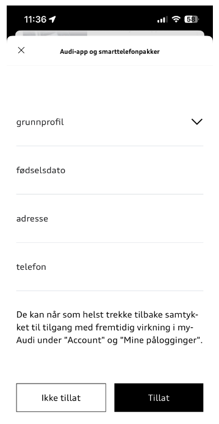

Vous verrez brièvement Cubic telecom (!)

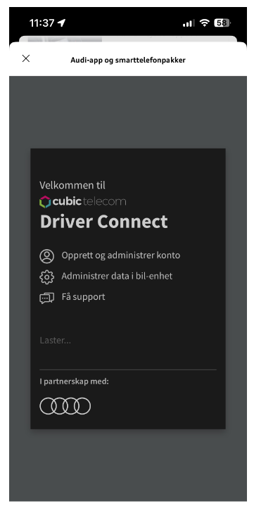

Avant d'atteindre Vodafone

Ici vous remplissez vos détails le mieux que vous pouvez

Lorsque vous avez cliqué continuer, vous atteindrez l'option où vous devez effectivement entrer une carte de paiement valide

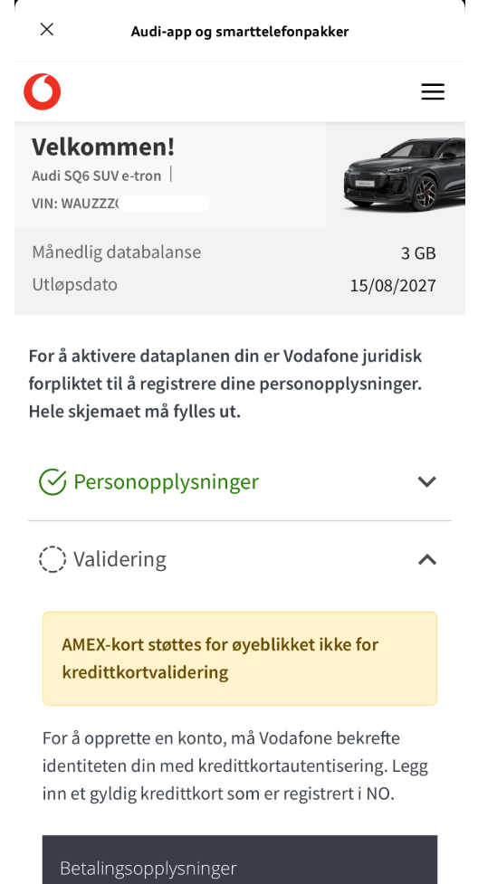

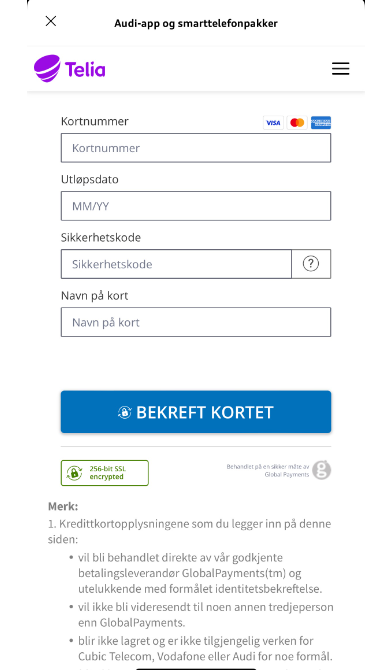

J'espère que vous avez réussi à saisir une carte de crédit approuvée et que vous serez envoyé au document de l'entente.

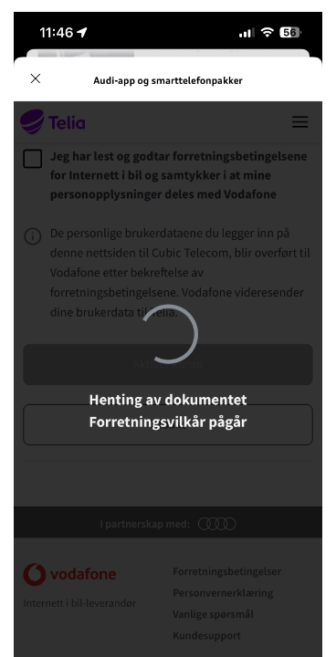

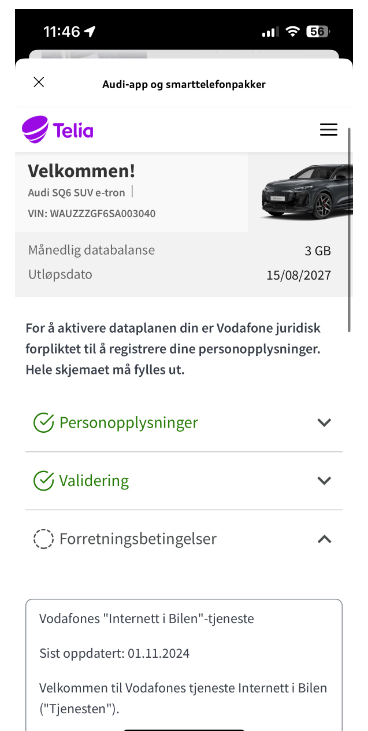

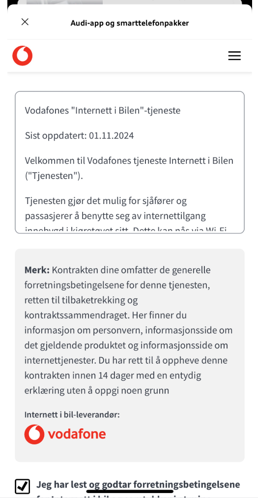

Et vous devez vérifier que vous avez lu et accepté les termes, et cliquez sur 'Activer le compte'

Il faut du temps pour créer ça, alors soyez patient...

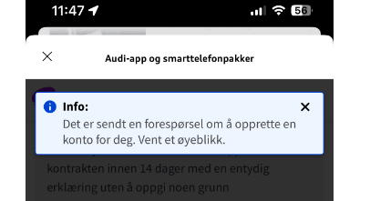

'succès' est le message que vous attendez..

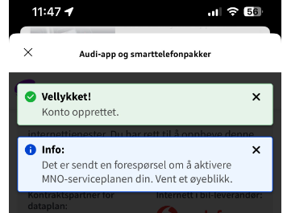

Et enfin, vous vous retrouvez dans votre aperçu de l'accord

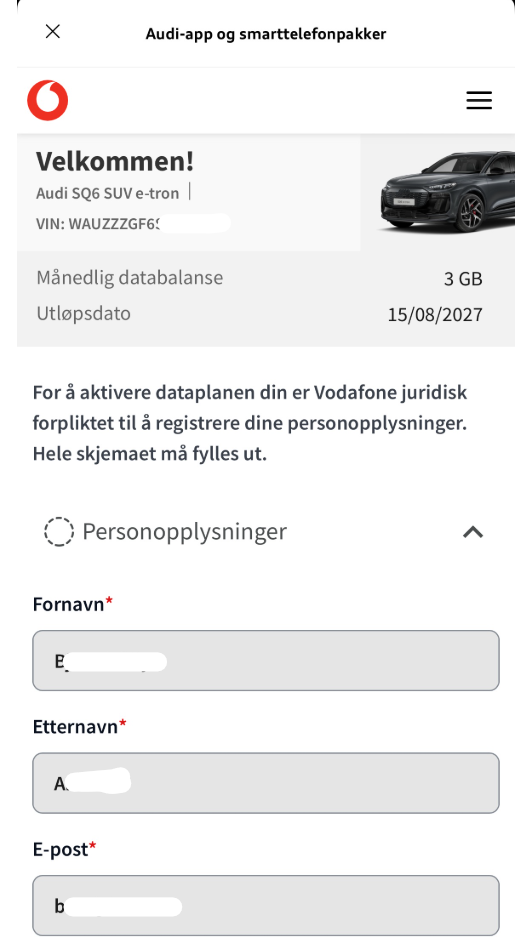

Si vous allez maintenant à l'option pour les paquets de smartphone dans la voiture

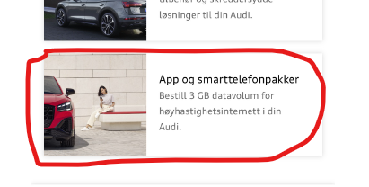

Vous devriez voir quelque chose comme ça:

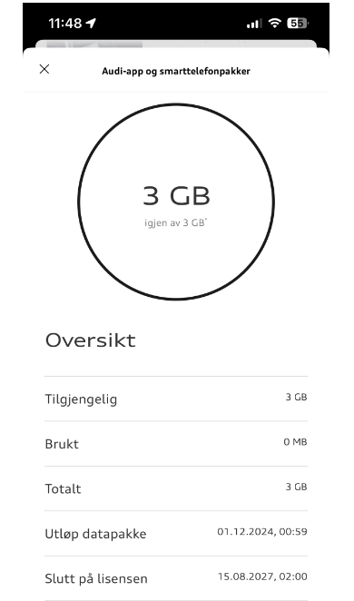
