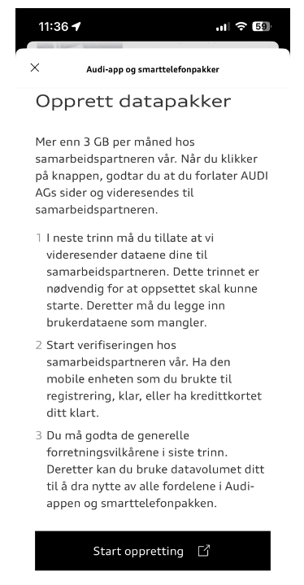
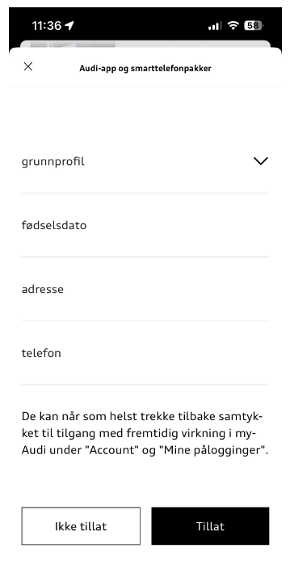
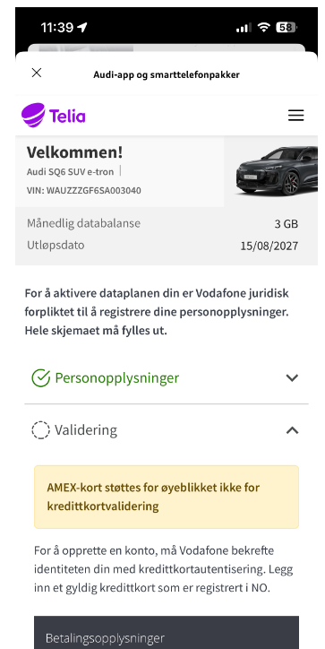
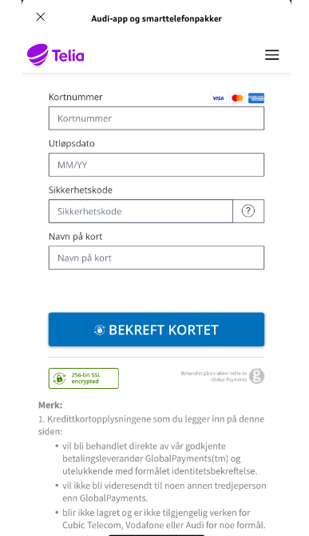
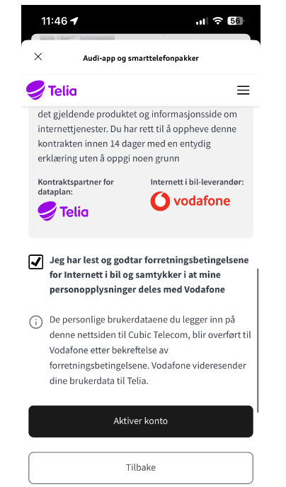
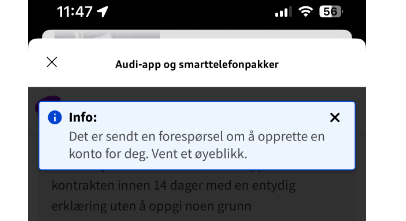
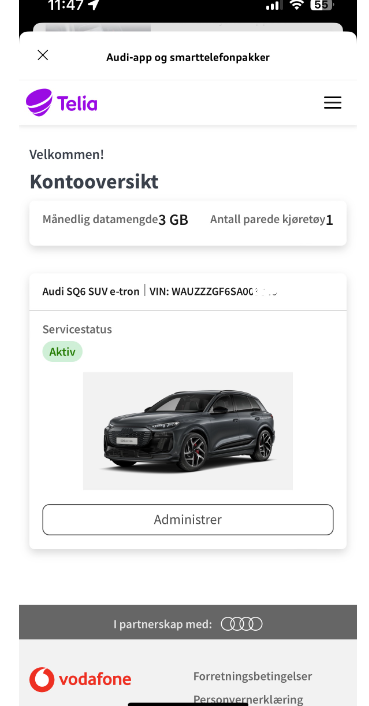
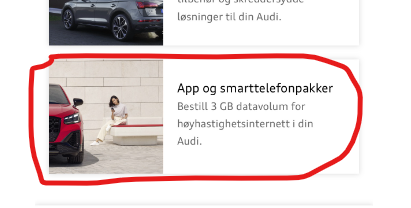

# Description of how to connect and establish a subscription for the App and Smartphone data package for the first time

Open the myAudi App and click on this option

You will see this screen if you do not have an active agreement for your car. Then you need to click 'Start creation' to connect your car to Vodafone Internet in the car

Next, you will see a screen asking if you allow data exchange from your Audi account to Vodafone. Here you need to click 'Allow'

You will briefly see Cubic telecom (!)

Before you reach Vodafone (with a mix of logos from Telia, Cubic telecom, and Vodafone, which is probably why this is so difficult to set up ...)

Here you fill in your details as best as you can

When you have clicked continue, you will reach the option where you actually need to enter a valid payment card

Hopefully, you managed to enter an approved credit card, and you will be sent to the agreement document

And you need to check that you have read and agree to the terms, and click 'Activate account'

It takes some time to create this, so be patient ...

'Successful' is the message you are waiting for ..

And finally, you end up in your agreement overview, with Telia as the logo ...

If you now go to the option for smartphone packages in the car

you should see something like this:

