# Beskrivelse av hvordan du kopler og etablerer abonnement for App og Smarttelefon datapakke for første gang

Åpne myAudi Appen og klikk på dette valget

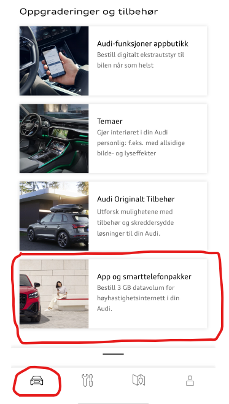

Du vil få opp dette bildet om du ikke har en aktiv avtale for din bil. Da må du klikke 'Start oppretting' for å kople din bil til Vodaphone Internett i bilen

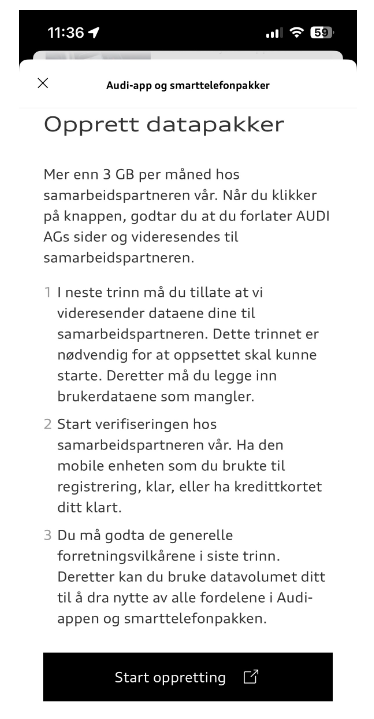

Neste som kommer opp er et bilde ser du tillater at det utveksles data fra din Audi konto til Vodaphone. Her må du klikke 'Tillat'

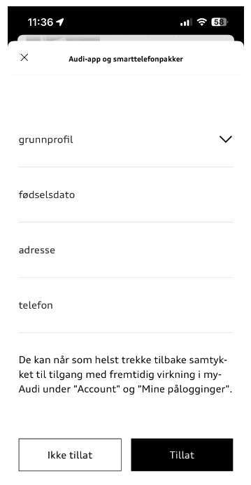

Du vil se at du er raskt innom Cubic telecom (!)

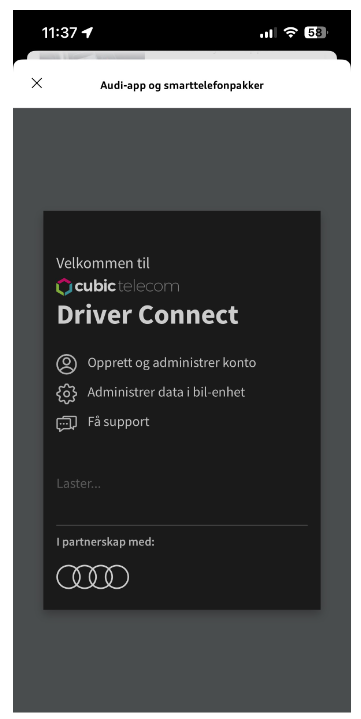

Før du kommer til Vodaphone (med en mix av logoer far Telia, Cubic telecom og Vodaphone, som sannsynligvis er forklaringen på hvorfor dette er så vanskelig å få til ...)

Her fyller du ut dine data så godt du kan

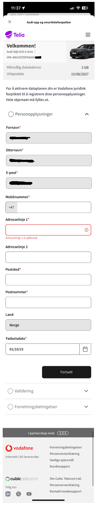

Når du har trykket på fortsett, kommer du til valget hvor du faktisk må legge inn et gyldig betalingskort

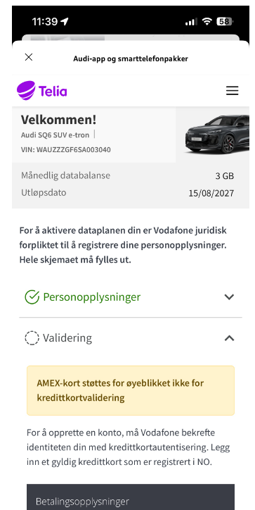

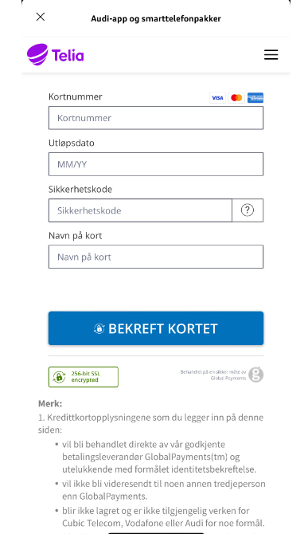

Forhåpentligvis klarte du å få inn et godkjent kredittkort, og du blir sendt videre til avtaledokumentet

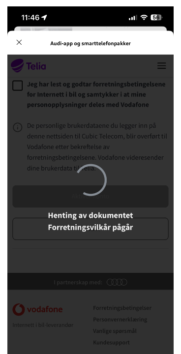

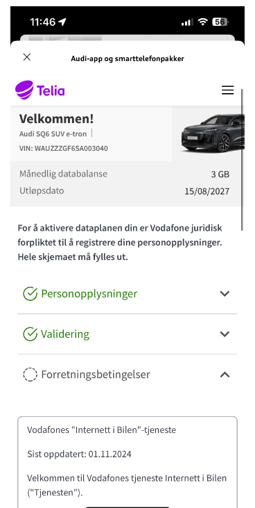

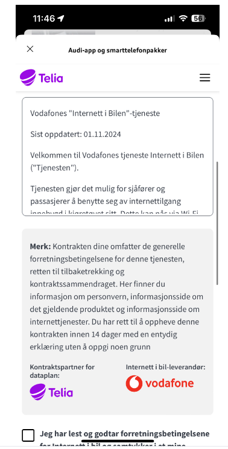

Og du må krysse av for å ha lest og godkjenner vilkårene, og klikk 'Aktiver konto'

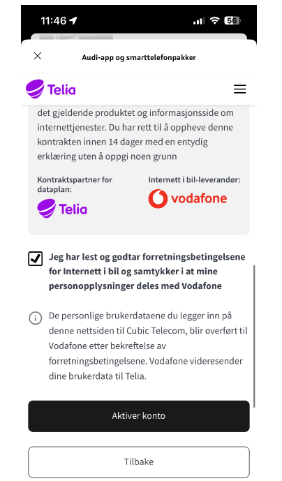

Det tar litt tid å opprette dette, så vær tålmodig ...

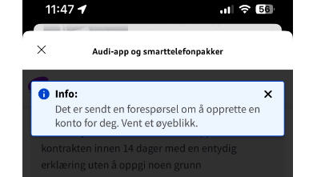

Vellykket er den meldingen du venter på ..

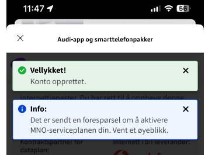

Og til slutt ender du opp i din avtale oversikt, med Telia som logo ...

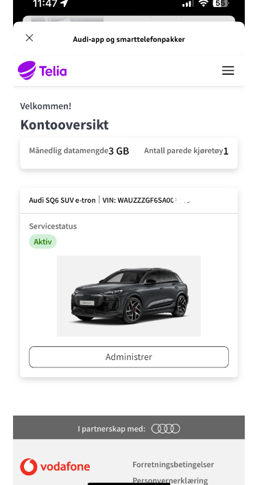

Hvis du nå går inn på valget for smarttelefonpakker i bilen

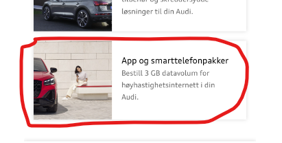

bør du få opp noe slikt :

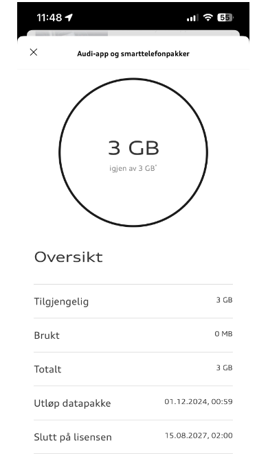

