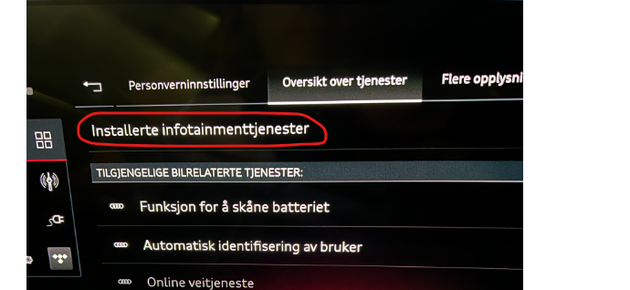
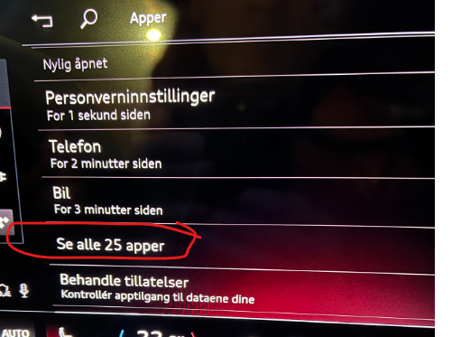
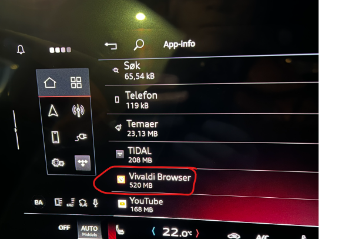
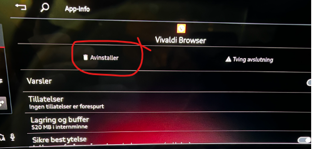
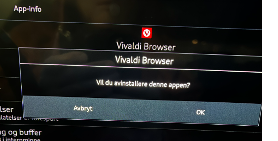
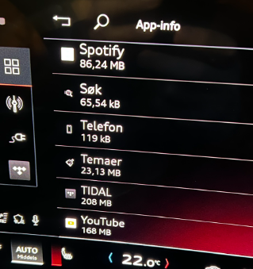
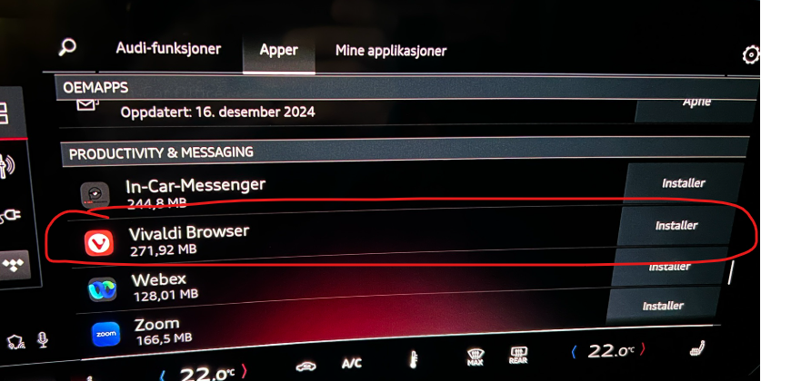

Einige Benutzer haben bereits erlebt, dass installierte Apps aus einem MMI-Profil verschwinden, während sie in anderen Profilen verfügbar bleiben.Wenn eine App wie Spotify oder Vivaldi im Hauptmenü fehlt, wird sie möglicherweise immer noch als in den Datenschutzeinstellungen installiert aufgeführt.

Bis das zugrunde liegende Softwareproblem behoben ist, kann die Deinstallation und Neuinstallation der versteckten App wiederhergestellt werden:

1. Offen **Datenschutzeinstellungen**.
2. Wählen **Serviceübersicht**, dann **Installierte Infotainmentdienste**.
3. Wählen **Alle Apps anzeigen**.
4. Finden Sie die fehlende App und wählen Sie **Deinstallieren**.
5. Bestätigen Sie mit **OK**.
6. Kehren Sie zum App Store zurück und installieren Sie die App erneut.

Dieser Workaround korrigiert die Ursache nicht, ist aber weniger störend als das Zurücksetzen des Autos in die Werkseinstellungen.
