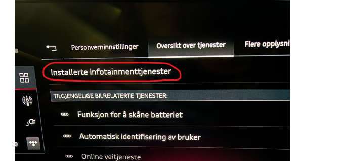
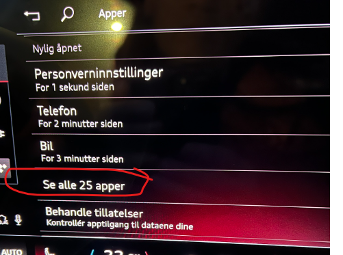
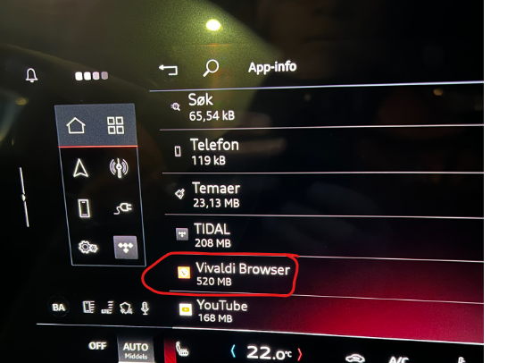
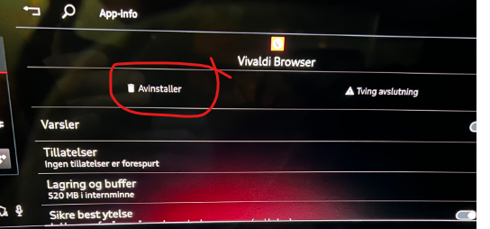
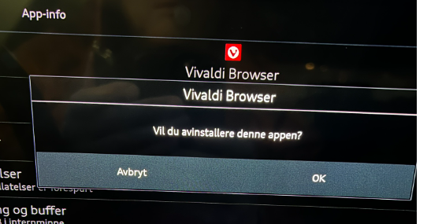
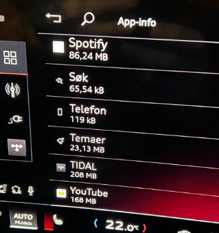
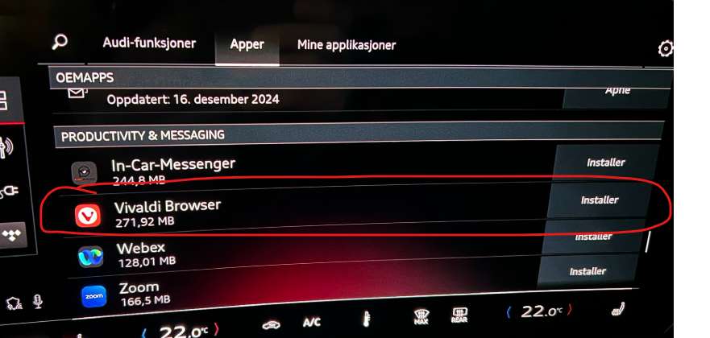

Certains utilisateurs ont constaté la disparition d'applications installées d'un profil MMI tout en restant disponibles dans d'autres profils. Si une application comme Spotify ou Vivaldi est absente du menu principal, elle peut encore être listée comme étant installée dans les paramètres de confidentialité.

Jusqu'à ce que le problème de logiciel sous-jacent soit résolu, désinstaller et réinstaller l'application cachée peut le restaurer:

1. Ouvrir ** Paramètres de confidentialité**.
2. Sélectionnez ** Aperçu du service**, puis **Services de divertissement intégrés**.
3. Sélectionnez **Afficher toutes les applications**.
4. Trouvez l'application manquante et choisissez **Désinstaller**.
5. Confirmez avec **OK**.
6. Retournez à l'app store et installez l'application à nouveau.

Cette solution ne corrige pas la cause profonde, mais elle est moins perturbatrice que la remise en fonction de la voiture pour les réglages d'usine.
