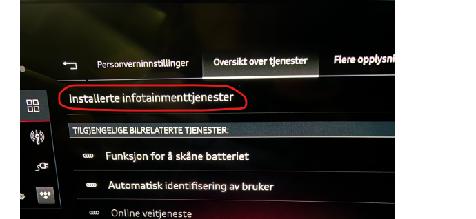
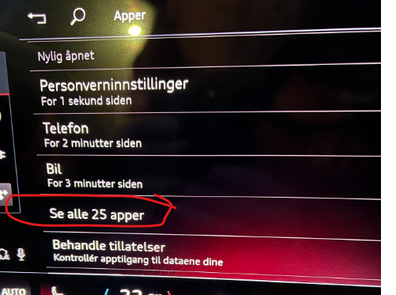
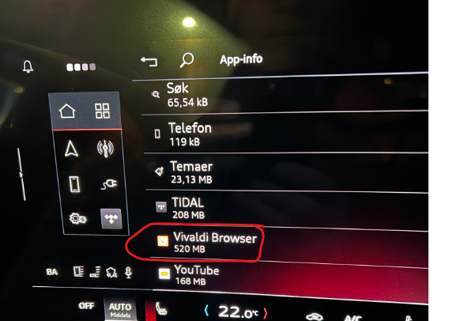
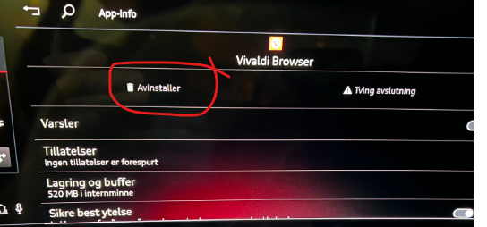
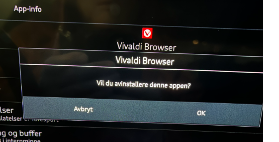
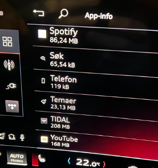
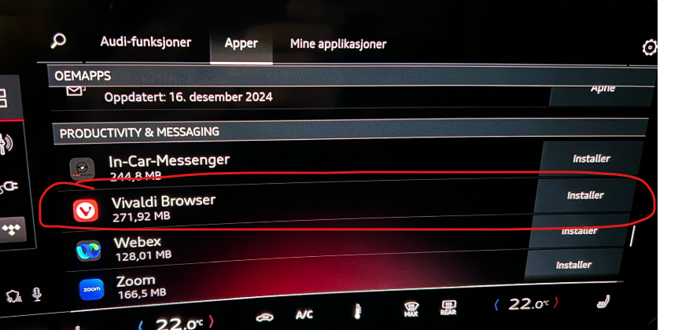
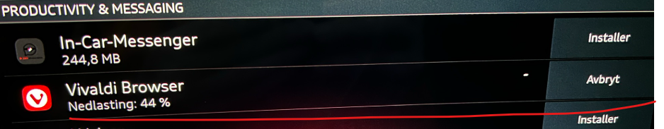

Det er rapportert at flere brukere opplever at installerte Apper bare forsvinner for profilen. Ofte ser man at andre profiler i bilen (om man har dette) ikke har mistet appen, men det er jo litt vanskelig å håndtere hvis det er bilen hovedbruker som har mistet f.eks Spotify eller Vivaldi.

Problemet er fremdeles veldig reelt og er rapportert til Audi, men i mellomtiden finnes det en alternativ løsning for å klare å avinstallerer appen selv om den ikke vises i bilen MMI hovedmeny.

Denen prosedyren er jo bare en workaround til Audi faktisk får skikk på programvaren sin og forhåpentligvis skal du ikke benytte denne rutinen alt for ofte.

Gjør slik :

Går til Personverninnstillinger og velg 'Oversikt over tjenester' og vel 'Installerte infotaingmenttjenester'

Velg se alle xx apper

Forhåpentligvis finner du den appen du har 'mistet'

I dette eksempelet er det Vivaldi, klikk på Avinstaller

Bekreft valget med OK

Appen er da borte

Gå tilbake til appstore, og voila, nå kan du installere appen på nytt

Dette løser selvfølgelige ikke grunnårsaken, men dette er noe enklere enn å fabrikkinstille bilen

Enjoy !

