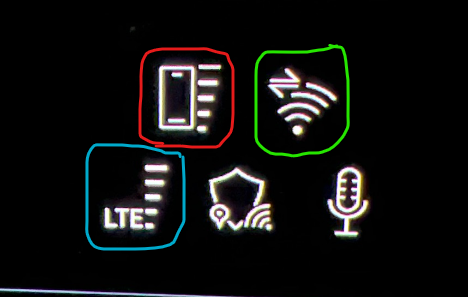
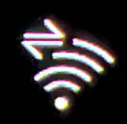

Es gibt bis zu 3 verschiedene drahtlose Verbindungen vom Auto zur Außenwelt.

Sie können diese unten links im Hauptmenü auf dem MMI sehen, und ein Beispiel wird im Bild unten gezeigt:

## Symbol im roten Ring

Das Symbol im roten Ring zeigt die Signalstärke Ihres Telefons an, wenn Sie es über Bluetooth angeschlossen haben.

## Symbol in grünem Ring

Das Symbol im grünen Ring zeigt die Signalstärke Ihrer Smartphone-Datenverbindung an. Dies ist die Verbindung, die bei der Installation von Apps aus dem App Store verwendet wird, und auch die Verbindung, die die installierten Apps verwenden.

Hinweis! Diese Verbindung muss vom Benutzer im Auto installiert werden, damit sie aktiviert werden kann. [Internet in the car](../internet-in-the-car).

Dies ist eine WiFi-Verbindung.

Es gibt auch ein Verkehrssymbol oben links im grünen Ring, das anzeigt, wenn tatsächlich Verkehr auf der Verbindung ist.

## Symbol in blauem Ring

Das Symbol im blauen Ring zeigt den Uplink des Autos. Dies ist die Verbindung, die für die lizenzierten Dienste des Autos verwendet wird.

Es handelt sich um eine mobile Datenverbindung.

Beispiele hierfür sind:

- Kartenaktualisierungen
- Audi Connect/myAudi Updates, d.h. Daten, die in der myAudi App angezeigt werden
- Audi Store Funktionen
- Notrufe
- Notrufe nach Straßenhilfe
- Alle anderen Daten, die von den eingebauten Diensten des Fahrzeugs verwendet werden

Lizenzierte Verbindungen werden erwähnt, da Sie 3 Jahre Audi Connect und 10 Jahre Audi-Notrufe erhalten, wenn das Auto neu ist.

Audi Connect muss als kostenpflichtiger Service erneuert werden, wenn das Auto älter als 3 Jahre ist.
