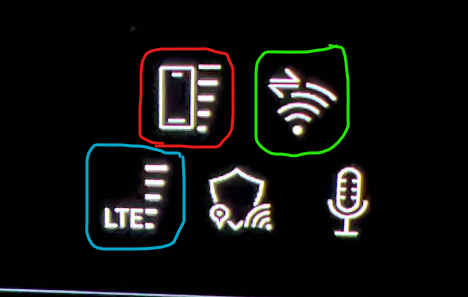
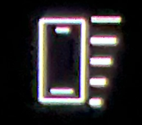
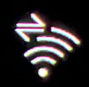
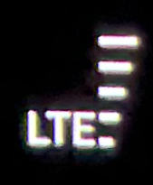

Il y a jusqu'à 3 connexions sans fil différentes de la voiture au monde extérieur.

Vous pouvez les voir en bas à gauche du menu principal du MMI, et un exemple est affiché dans l'image ci-dessous :

## Symbole en anneau rouge

Le symbole de l'anneau rouge indique la force du signal de votre téléphone si vous l'avez connecté via Bluetooth. Il s'agit d'une connexion de données mobiles.

## Symbole en anneau vert

Le symbole de l'anneau vert indique la force du signal de la connexion de données de votre smartphone. Il s'agit de la connexion utilisée lors de l'installation des applications de l'App Store, ainsi que la connexion que les applications installées utiliseront.

Remarque! Cette connexion doit être installée par l'utilisateur dans la voiture pour qu'elle soit activée. Il est décrit comment commander et configurer cette connexion dans le document à propos [Internet in the car](../internet-in-the-car).

C'est une connexion WiFi.

Il y a aussi un symbole de circulation en haut à gauche de l'anneau vert qui montre quand il y a effectivement du trafic sur la connexion.

## Symbole dans l'anneau bleu

Le symbole de la bague bleue montre la liaison montante de la voiture. C'est la connexion utilisée pour les services autorisés de la voiture.

Il s'agit d'une connexion mobile de données.

Voici quelques exemples de ces mesures :

- Mises à jour de la carte
- Mises à jour Audi Connect/myAudi, c'est-à-dire données affichées dans l'application myAudi
- Fonctions du magasin Audi
- Appels d'urgence
- Appels d'assistance routière
- Toutes les autres données utilisées par les services intégrés de la voiture

Les connexions autorisées sont mentionnées, car vous obtenez 3 ans d'Audi Connect et 10 ans d'appels d'urgence Audi lorsque la voiture est neuve.

Audi Connect doit être renouvelé en tant que service payant lorsque la voiture est plus de 3 ans.
