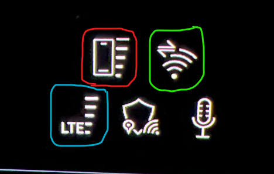
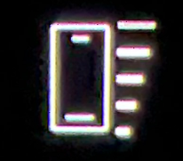
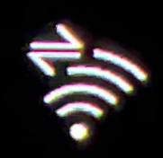
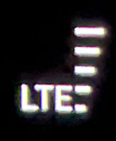

Det finnes opptil 3 ulike trådløse forbindelser fra bilen og ut til verden

Du ser disse nederst til venste i hovemenyen på MMI, og det vises et eksempel i bildet under

## Symbol i rød ring.

Symbolet i rød ring er signalstyrken på din telefon, hvis du har koplet denne til via bluetooth. Dette er en mobildata forbindelse.

## Symbol i grønn ring

Symbolet i grønn ring er signalstyrken for din smarttelefon-dataforbindelse. Det er denne som blir brukt om du installerer app fra App Store og er også den forbindelen som de installerte appene vil bruke.

Obs ! Denne forbindelsen må installeres av brukeren i bilen for at den skal iverksettes. Det er beskrevet hvordan du bestiller og oppretter denne forbindelsen i dokumentet om [Internett i bilen](../internet-in-the-car)

Dette er en WiFi forbindelse

Det er også et trafikksysmbol øverst til venstre i den grønne ringen som viser når det faktisk er trafikk på forbindelsen

## Symbol i blå ring

Symbolet i den blå ringen er bilens up link. Det er den som brukes for bilens lisensierte forbindelser.

Dette er en mobildataforbindelse.

Eksempler på dette er

- Kartoppdateringer
- Audi Connect /myAudi oppdateringer, dvs data som vises i myAudi appen
- Audi butikk funksjoner
- Nød oppringing
- Veihjelp oppringing
- all annen data som brukes av de innebygde tjenestene i bilen.

Det nevnes lisensierte forbindelser, da du får 3 år med Audi Connect og 10 år med Audi nødoppringing, når bilen er ny.

Audi Connect må du fornye som en betalt tjeneste når bilens alder er passert 3 år.

