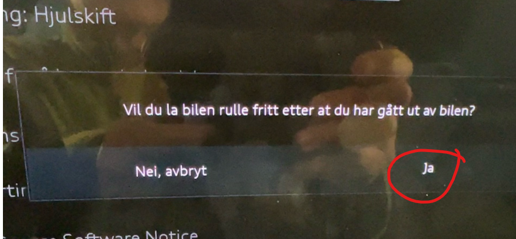
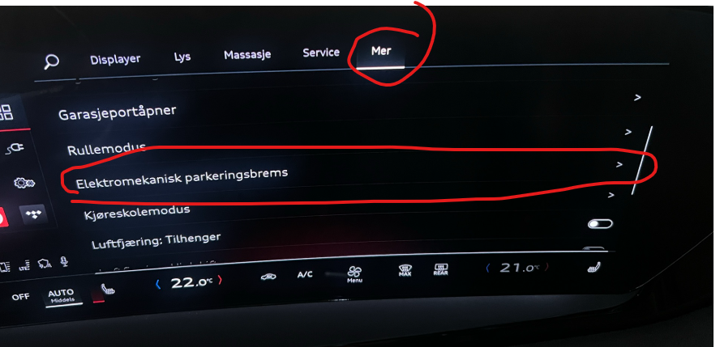
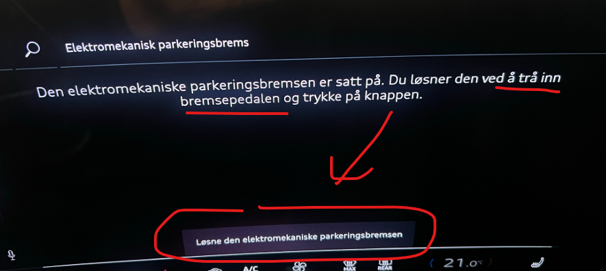
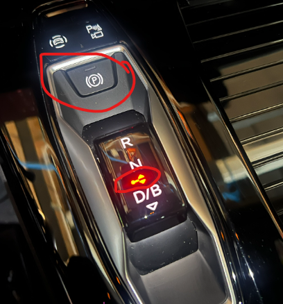
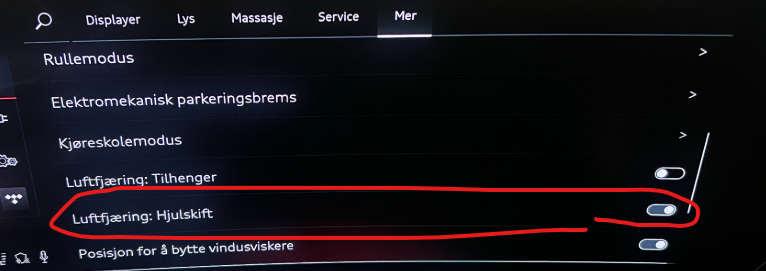

Man könnte meinen, dass der Wechsel der Räder bei Ihrem Audi Q6 allgemein bekannt ist.

Das Problem ist, dass die Hinterradbremsen des Autos eingeschaltet sind, selbst wenn der Radwechselmodus eingestellt ist. Was dann passiert, ist, dass sich die Hinterräder ein paar Grad drehen, wenn Sie das Auto aufheben, was einen erheblichen Druck auf die Radschrauben erzeugt, was sie sehr schwer zu lösen und noch schwieriger macht, wieder einzuschrauben.

Audi oder dem Importeur ist es nicht gelungen, dafür eine Lösung zu finden.

Aber das ist sehr einfach zu tun, Sie müssen nur ein paar kleine Tricks machen, und hier sind sie:

Beachten Sie, dass dies gilt **nur** die Hinterräder, nicht die Vorderräder.

Verwenden Sie dieses Verfahren und es wird gut funktionieren.

HINWEIS!
- **Voraussetzung ist, dass das Fahrzeug auf völlig ebenem Boden steht, und es ist sehr wichtig, dass es nicht wegrollen kann.**

- Sie tun dies auf eigenes Risiko

HINWEIS!

## Hier ist das Verfahren für Option 1

- Du solltest einen richtigen Wagenheber haben, ala Bacho 3000 oder ähnliches.
- Setzen Sie das Auto in N, und Sie erhalten ein Popup, in dem Sie aufgefordert werden, zu bestätigen, dass das Auto frei rollen sollte, wenn Sie aus dem Auto gestiegen sind.

- Beantworten Sie diese Frage mit Ja und bestätigen Sie Ihre Wahl
- Dann können Sie das Auto von hinten aufheben, und wenn das Hinterrad den Boden verlassen hat, können Sie vorsichtig in das Auto steigen und die Feststellbremse aktivieren. Sie werden hören, dass das Auto die Bremse betätigt. Es ist wichtig, dass dies mit dem Rad getan wird, das noch am Auto ist.
- Jetzt ist die Feststellbremse eingeschaltet und Sie können das Hinterrad sicher und gut entfernen, ohne dass die Gefahr besteht, die Radbolzen hinten zu beschädigen.
- Wiederholen Sie den Vorgang am anderen Hinterrad.

## Hier ist das Verfahren für Option 2

- Du solltest einen richtigen Wagenheber haben, wie Bacho 3000 oder ähnliches.
- Das Auto ist im Gang. Das ist völlig normal, aber mit der Feststellbremse. Dann können Sie die Feststellbremse über MMI lösen. Dann gibt es keine Bremsen an, aber das Auto ist im Gang, so dass ein kleines Stück Bewegung erlaubt ist, aber das Auto bewegt sich nicht, weil es tatsächlich im Gang ist.
- Gehen Sie in die MMI und wählen Sie Auto
- elektromechanische Feststellbremse auswählen

- Halten Sie das Bremspedal und klicken Sie auf die Taste im MMI

- Sie werden sehen, dass die Feststellbremse ausgeschaltet ist und dass das Auto im Gang ist

- Wenn Sie Luftfederung haben, sollten Sie die Auswahl im MMI-Menü in den Radwechselmodus ändern

- Dann können Sie das Auto hinten anheben und das Rad wie gewohnt wechseln