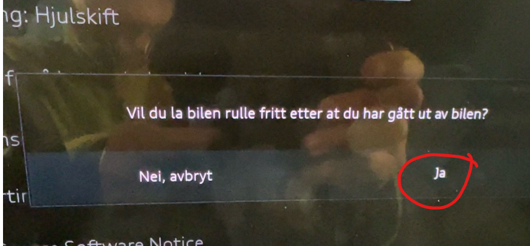
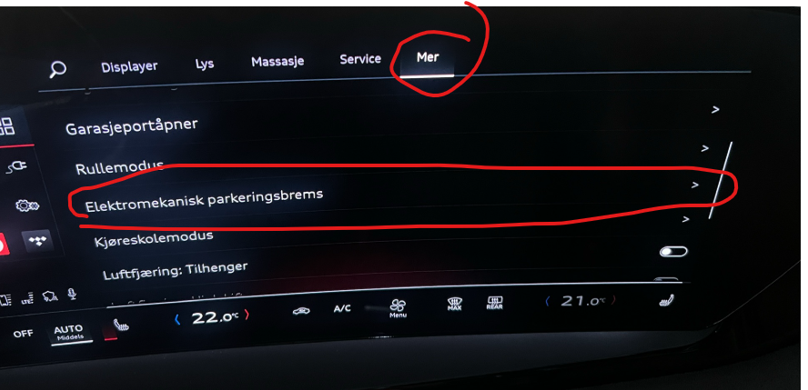
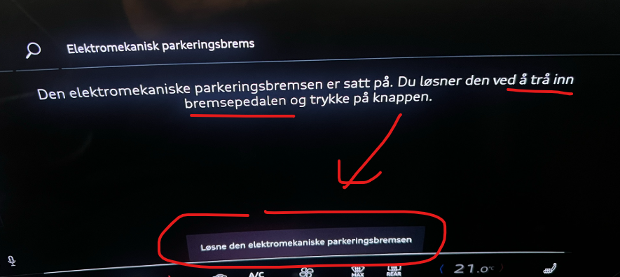
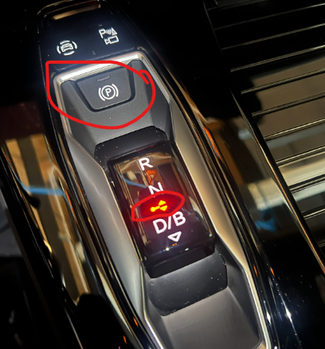
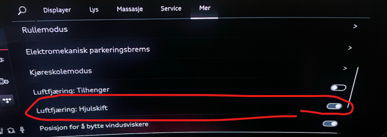

Vous pensez que changer de roues sur votre Audi Q6 est une connaissance commune.

Le problème est que les freins de la roue arrière de la voiture sont enclenchés, même lorsque le mode de changement de roue est réglé. Ce qui arrive alors est que les roues arrière tordent quelques degrés lorsque vous faites monter la voiture, créant une pression importante sur les boulons de la roue, les rendant très difficiles à dévisser et encore plus difficiles à visser.

Audi ou l'importateur n'a pas réussi à trouver une solution à ce problème.

Mais c'est très facile à faire, il suffit de faire quelques petits tours, et les voici :

Il convient de noter que cela s'applique ** seulement** aux roues arrière, et non aux roues avant.

Utilisez cette procédure et cela fonctionnera bien.

Remarque !
- ** La condition préalable est que la voiture est sur un sol complètement plat. Il est très important que la voiture ne puisse pas rouler.**

- Vous le faites à vos risques et périls

Remarque !

## Voici la procédure pour l'option 1

- Placez votre jack prêt sous la voiture. Vous devriez avoir un bon jack, ala Bacho 3000 ou similaire
- Mettez la voiture en N, et vous obtiendrez un popup vous demandant de confirmer que la voiture devrait rouler librement quand vous êtes sorti de la voiture.

- Réponse oui à cette question et confirmer votre choix
- Ensuite, vous pouvez prendre la voiture de derrière, et lorsque la roue arrière a quitté le sol, vous pouvez entrer soigneusement dans la voiture et activer le frein de stationnement. Vous entendrez la voiture actionner les freins. Il est important que cela soit fait avec la roue toujours sur la voiture. C'est parce que si la voiture devrait décider de rouler un peu, la roue est toujours sur la voiture.
- Maintenant, le frein de stationnement est allumé et vous pourrez enlever la roue arrière de manière sûre et sans risquer d'endommager les boulons de la roue à l'arrière.
- Répéter la procédure sur l'autre roue arrière.

## Voici la procédure pour l'option 2

- Placez votre jack prêt sous la voiture. Vous devriez avoir un bon jack, comme Bacho 3000 ou similaire
- Laissez la voiture dans le «pare-feu». C'est-à-dire tout à fait normal, mais avec le frein de stationnement allumé. Ensuite, vous pouvez relâcher le frein de stationnement via le MMI. Ensuite, il n'y a pas de freins allumés, mais la voiture est en vitesse, donc un petit peu de mouvement est permis, mais la voiture ne bougera pas parce qu'elle est en train.
- Allez dans le MMI et sélectionnez Voiture
- sélectionner Frein de stationnement électromécanique

- Maintenez la pédale de frein et cliquez sur le bouton dans le MMI

- Vous verrez que le frein de stationnement est éteint et que la voiture est en vitesse

- Si vous avez une suspension pneumatique, vous devez changer la sélection dans le menu MMI en mode changement de roue

- Ensuite, vous pouvez prendre la voiture à l'arrière et changer la roue comme d'habitude
