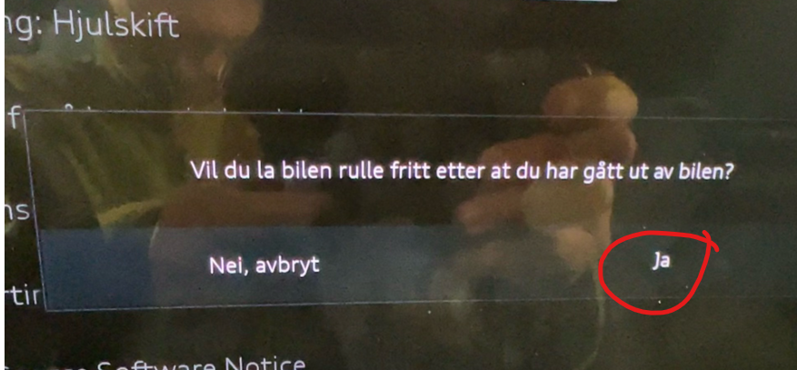
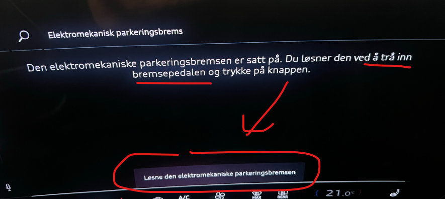
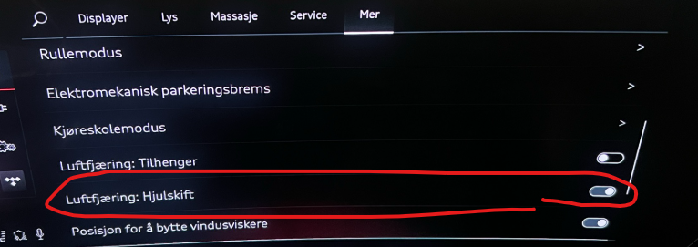

Man skulle tro at dette er almen kunnskap, å bytte hjul på din Audi Q6. Vel, det er det ikke.

Problemet er at bilens bakhjulsbremser er slått på, selv om modus for hjulskift er satt. Det som skjer da er at de bakre hjulpar vris noen grader når du jekker opp og det skaper et stor press på hjulboltene og dette medfører at de blir veldig vanskelige å skru ut og enda vanskeligee å skru inn igjen.

Audi eller importør har ikke klart å få fram noe løsning på dette.

Men dette er veldig enkelt å få til, men må bare gjøre et par små triks, og de får du servert her:

Vær obs på at dette gjelder **kun** bakhjulene, og ikke framhjulene

Bruk en av disse prosedyrene så går det fint.

NB!
- **Forutsetningen er at bilen står på plant underlag. Det er meget viktig at bilen ikke kan trille avgårde.**

- Du gjør dette på eget ansvar

NB!

## Her er prosedyre afor lternativ 1

- Plasser din jekk klar under bilen. Du bør ha en skikkelig jekk, ala Bacho 3000 e.l.
- Sett bilen i N, og du vil få opp en popup som ber deg om å bekrefte at bilen skal rulle fritt når du har gått ut av bilen.

- Svar ja på dette spørsmålet og bekreft ditt valg
- Så kan du jekke opp bilen bak, og når bakhjulet at forlatt bakken, da kan du forsiktig gå inn i bilen og aktivere parkeringsbremsen. Du vil høre at bilen slå på bremsene. Viktig at dette gjøres med hjulet fremdeles er på bilen. Dette er fordi om bilen skulle finne på å trille bitte litt, så er fremdeles hjulet på bilen.
- Nå er parkeringsbremsen på og du vil kunne sku av bakhjulet på en trygg og god måte uten noe risiko for å skade hjulboltene bak.
- Gjenta prosedyren på det andre bakhjulet.

## Her er prosedyren for alternativ 2

- Plasser din jekk klar under bilen. Du bør ha en skikkelig jekk, ala Bacho 3000 e.l.
- La bilen stå i 'gir'. Dvs helt normalt, men parkeringsbrems på. Så kan du løsen parkeringsbremes via MMI. Da er ingen bremser på, men bilen er i gir, så da tillates det bittelitt bevegelse, men bilen vil ikke trikke fordi den faktisk står i gir.
- Gå inn i MMI og valget Bil
- velg Elektromekanisk parkeringsbrems

  
- Hold inn bremsepedalen og klikk på knappen i MMI

  
- Du vil se at park brems er av og at bilen står i gir

  
- Har du luftfjæring bør du endre valget i MMI menyen til hjulskiftmodus

  

- Så kan du jekke opp bilen bak, og bytte hjul som normalt
