## KD2 - 03.10.00/C

- Dies ist KEIN OTA-Update, das Auto muss in der Werkstatt aktualisiert werden
- Es wird auch kein Kampagnen-Update sein, also können nur diejenigen, die Probleme haben, dieses Update erhalten.
- Geliefert auf Neuwagen ab Produktionswoche 34/2025
- Versionsnummer in myAudi App: 03.10.00

### Erscheinungsdatum: Oktober 2025
- TPI 2078923/1

### Allgemeine Beschreibung der Verbesserungen:
- Vermeidung von Bildschirm-/Infotainmentfehlern; schwarze Bildschirme, Resets, Neustarts, Bildschirmeinfrieren
- Optimierungen des Navigationssystems (Anzeige, Routenplanung, Führung, Navigation)
- Verbesserungen im Zusammenhang mit der Konnektivität (APN, Bluetooth, Radio, Navigation, eCall)
- Optimierung von eCall / Radio / Entertainment (kein Audioausgang, fehlender Anschluss, Stabilität)
- Verbesserungen bei Bedienung (Sprachsteuerung) und Navigation
- Verbesserungen bei der Verkehrszeichenerkennung (allgemeine Verbesserung der Erkennung, Fehlfunktion und Deaktivierung von Assistenzsystemen)
- Verbesserungen des Fahrerlebnisses (Startup, Haltefunktion, Ruckeln während der Fahrt, Auto fällt aus dem Gang)
- Verhinderung von nicht autorisierten Warnleuchten (z. B. Abgasemissionswarnlicht und Ereignisspeichereinträge)
- Optimierungen von Ladevorgängen (Ladezeit, Lade-App und Ladestatus, Anzeige, Ladeprobleme)
- Verbesserungen am mobilen Schlüssel (Schlüsselerkennung, Keyless System, etc.)
- Mobiler Key Sharing-Service wird wiederhergestellt
- Kindererkennung im Auto: nicht mehr ohne Grund ausgelöst

### Wichtige Hinweise für die Besitzer:
- Alle persönlichen Einstellungen (Drive Select, Beleuchtung, Radio, Sprache, HUD-Navigation, etc.) müssen nach dem Update neu konfiguriert werden.
- Der Datenschutzmodus wird automatisch deaktiviert und muss manuell wieder aktiviert werden.
- Das Update kann nur mit einem physischen Schlüssel durchgeführt werden – digitale Schlüssel und Schlüsselkarten können während der Installation nicht verwendet werden.
- Updatezeit: ≈ 3,5 Stunden (das Auto startet mehrmals neu und kann 20-30 Minuten lang dunkel sein).

### Technische Informationen (aus den Serviceunterlagen):
- Flash-Codes: BLKD2PPE, DUCLDRM0046, DUCDOORWR
- HV-Ladekabel müssen vor dem Update getrennt werden
- Update nur über USB-Kabel (für Stabilität)

### Zusammenfassung
KD2 ist ein wichtiges Update für Stabilität und Zuverlässigkeit der neuen PPE-basierten Q6 e-tron-Serie. „Eigentümer berichten von einer reibungsloseren Systemleistung, einer besseren Schlüsselerkennung und einer verbesserten Ladelogik nach der Installation.

### Praktische Erfahrungen mit KD2
Autor erhielt KD2 auf seinem SQ6 im November 2025 (Auto wurde im Juli 2024 produziert und hatte zuvor [06XM](../patch06xm) und [06XL](../patch06xl))

Das Update dauerte einen Arbeitstag beim Händler.

Überraschenderweise wurde fast die gesamte Konfiguration beibehalten. Gerüchten zufolge war das Auto fast werksseitig zurückgesetzt, aber das ist nicht der Fall.

Alle installierten Apps im AppStore waren vorhanden und die Icon-Übersicht ist unverändert

Eine Beobachtung ist, dass das Symbol/der Knopf sich geändert hat, um besser zu reflektieren, was es tatsächlich tut. Hier zeigt es deutlicher, dass sowohl Heckscheibe als auch Spiegel beheizt sind.

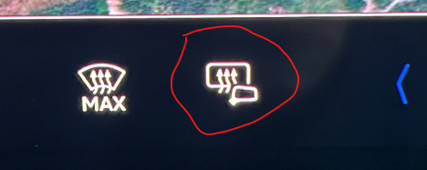

Es ist auch leicht zu bemerken, dass die Umgebungsbeleuchtung ausgeschaltet war (andere haben berichtet, dass sie weiß leuchtet), also musste sie wieder eingestellt werden

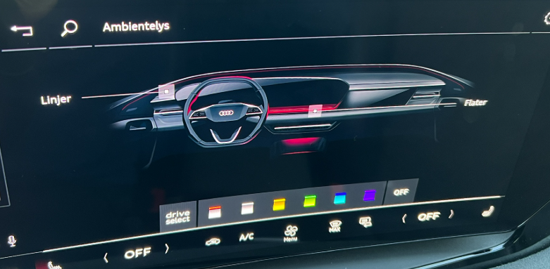

Der externe Sound wurde jedoch nicht zurückgesetzt.

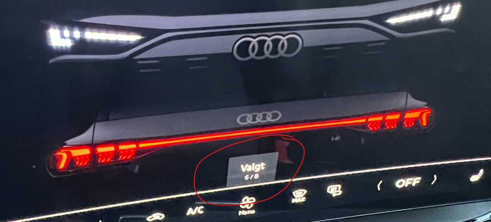

Die Laufwerksauswahl wurde zurückgesetzt und Sie müssen die INDIVIDUELLE Einstellung erneut einrichten, wenn Sie diese zuvor aktualisiert haben.

Im Informationsblatt des Händlers hieß es, dass Radiofavoriten wieder eingestellt werden mussten, aber das war für mich nicht notwendig, alle Favoriten waren vorhanden.

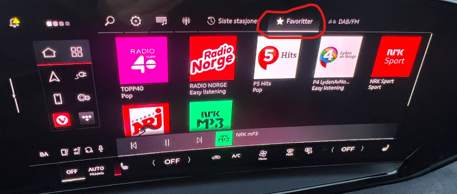

Wie im Informationsblatt angegeben, muss der Garagentoröffner umprogrammiert werden.

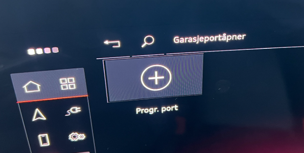

**Fehlermeldungen und Popups** Bleibt im Laufe der Zeit zu sehen, aber die anfängliche gelbe Warnung, dass die Frontunterstützung jetzt initialisiert, scheint nur 10-15 Sekunden zu dauern.

Das Informationsblatt erwähnt auch Verbindungen zu mobilen Geräten, aber für mich funktionierten iPhone und Freisprecher wie zuvor, als wäre nichts passiert

**Car2Phone** Es hat gerade den Namen geändert, wahrscheinlich im Upgrade von myAudi 4.x auf 5.x. Jetzt heißt es Car Connection, sonst funktioniert es wie zuvor.

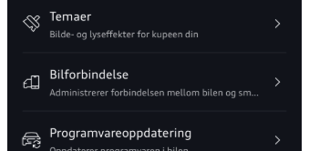

**Navigation** Hier sind alle bisherigen Ziele und Favoriten wie bisher vorhanden. Aber wie im Informationsblatt erwähnt, muss die Anzeige im Head Up Display (HUD) wieder aktiviert werden.

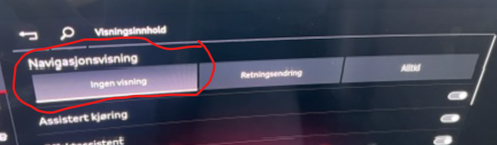

Hier ist, wie es zu tun, wenn Sie Navigation in HUD wollen

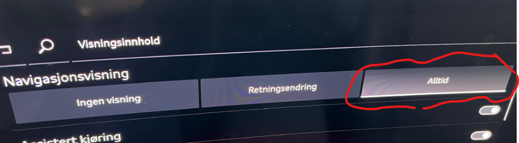

Die Navigations-GUI scheint keine Verbesserungen erhalten zu haben. Ich vermisse zutiefst, dass sie nicht zeigt, dass das Auto einen Ladestopp hinzugefügt hat. Hier müssen Sie die Reise selbst öffnen, um zu sehen, dass dies "plötzlich" vom Auto berechnet wurde, und es ist ein bisschen irritierend.

**Bremsen** Beachten Sie immer noch, dass die Bremsen etwas ruckeln können, wenn Sie plötzlich z.B. in einen Kreisverkehr bremsen müssen, weil ein BMW-Besitzer keine Signalisierung macht und sich entscheidet, ohne Angabe von Hinweisen herumzufahren.

**Ladesystem**: Es wird gesagt, dass die Aufladung verbessert wird.

Sie können zumindest jetzt sehen, dass die verbleibende Zeit in MMI angezeigt wird   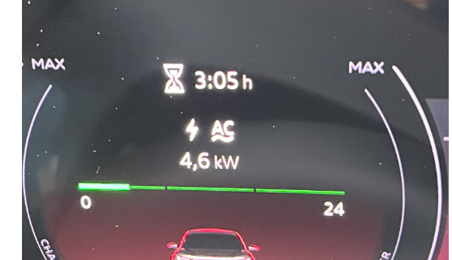   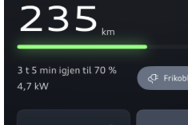

Leider bekommen wir immer noch die Meldung "Ladesystemfehler" für diejenigen, die intelligent laden. Es gibt immer noch nicht ganz korrekte Handhabung des Ladegeräts für zu Hause, das sich trennen kann, um auf günstigere Preise zu warten.

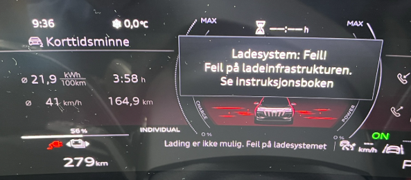    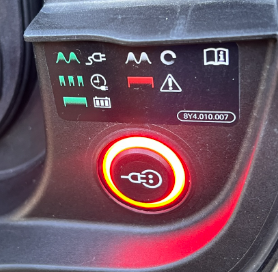

**Digitale Schlüssel**

Das ist jetzt wiederhergestellt, wie es ursprünglich funktionieren sollte. Das bedeutet, dass man bis zu 5 digitale Schlüssel haben kann. [06XM](../patch06xm) und nur auf den Hauptbenutzer in [06XL](../patch06xl)Jetzt ist er wieder vollständig da.

Hier ist es sehr wichtig zu wissen, dass Sie 2 Runden durchlaufen müssen, um einen digitalen Schlüssel für den Hauptbenutzer erstellen und ihn dann mit anderen teilen zu können.

Audi schreibt, dass Sie diesen Vorgang wiederholen müssen, um einen Prozess im Serverteil zu starten, der es ermöglicht, den digitalen Schlüssel wieder zu teilen

Dies wird in dem Informationsblatt beschrieben, das Sie erhalten, aber hier ist eine detailliertere Dokumentation des Verfahrens:

Autor hatte digitalen Schlüssel konfiguriert, aber es ist jetzt weg von Auto, myAudi App und iPhone (wenn Sie doppelt auf dem iPhone mit dem rechten mobilen Knopf drücken, ist das Auto weg von der Liste der Zahlungskarten).

Im Auto sehen Sie diese Nachricht erscheinen

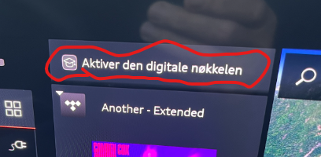

Hier gibt es noch einige Verwirrung, denn wenn Sie sich entscheiden, den Prozess von MMI aus zu starten, werden Sie gebeten, das Telefon in das mobile Ladegerät zu legen und Anweisungen zu befolgen.

Glücklicherweise gibt es eine etwas andere Art, dies zu tun, so dass es unten im Detail beschrieben wird.

1. Bringen Sie Ihren mobilen und physischen Schlüssel in das Auto.
2. Navigieren Sie in MMI zu Digital Key und Administration, aber Sie müssen nicht "Hauptgerät einrichten" drücken
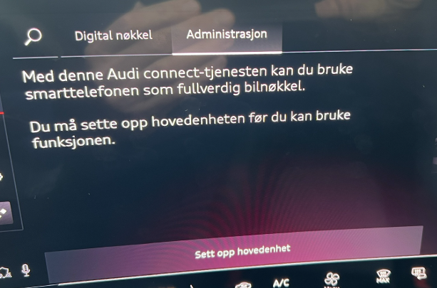

3. Halten Sie einfach Ihr Handy in der Hand, während Sie im Auto sitzen. Navigieren Sie zum Digital Key in myAudi App  
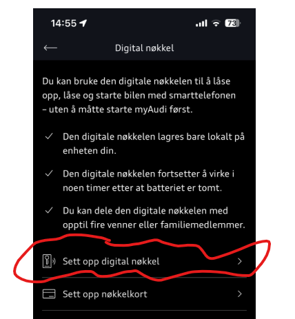

4. Im nächsten Bild klicken Sie auf   
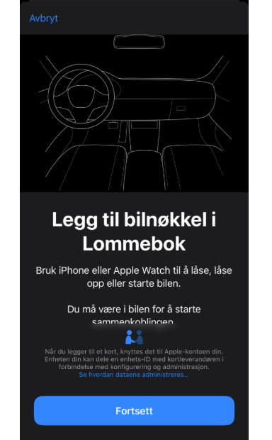

5. Der Prozess beginnt ... Was passiert, ist, dass ein Schlüssel erstellt wird, der als "Kreditkarte" in Ihrem iPhone hinzugefügt wird.  
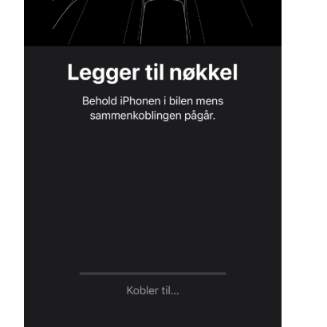

6. Gleichzeitig werden Sie sehen, dass der MMI-Bildschirm auch aktualisiert, dass etwas "passiert"  
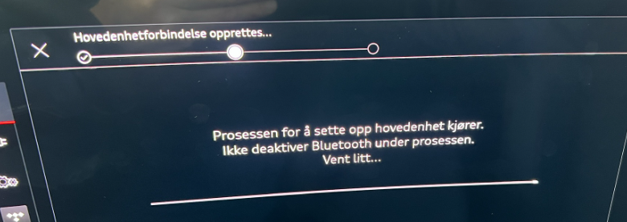

7. Dieser Punkt ist der kritischste, da es Kommunikation zwischen Auto, Telefon und Internet gibt. Dies scheitert leider manchmal, dann starten Sie einfach den Prozess erneut.

8. Wenn dies erfolgreich war, sehen Sie, dass der MMI-Bildschirm mit dem nächsten Schritt fortfährt  
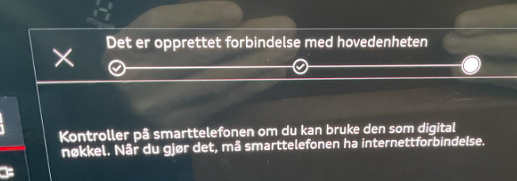  Und Ihr iPhone zeigt ein "Kreditkarten-ähnliches Bild", wie unten gezeigt   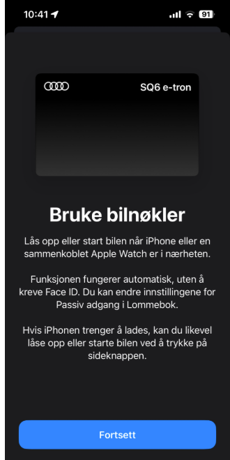

9. Wenn Sie in der myAudi App auf Weiter klicken, gehen Sie weiter zu  
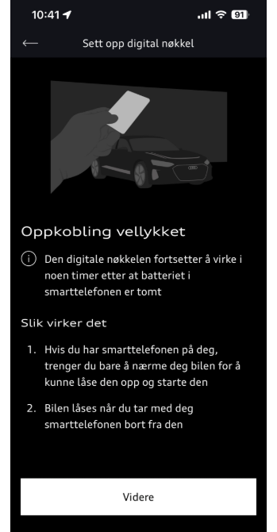

10. Und zu diesem Bild, wenn Sie Weiter drücken. Hier sehen Sie, dass Sie einen digitalen Schlüssel erstellt haben.  
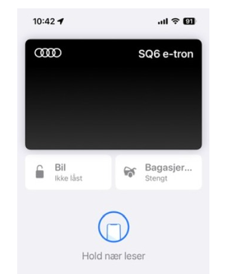

11. Wenn Sie nun den rechten Knopf auf Ihrem iPhone doppelt drücken, öffnen Sie Ihr Auto als Kreditkarte und können dann hier Auto und Kofferraum öffnen und schließen. Dies geschieht über eine Bluetooth-Verbindung zwischen dem Auto und Ihrem Telefon.

**Wie man den digitalen Schlüssel teilt**

Wenn Sie es geschafft haben, den digitalen Schlüssel nach der obigen Beschreibung zu erstellen, sind Sie bereit, ihn weiter zu teilen. Dies wird auf Ihrem iPhone mit der Option Wallet durchgeführt.
  
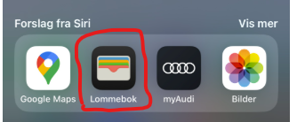
  
Wählen Sie die schwarze Audi-Karte, die wahrscheinlich den Autonamen hat, den Sie selbst angegeben haben
  
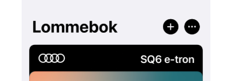
  
Drücken Sie die schwarze Audi-Karte und wählen Sie das Sharing-Icon aus
  
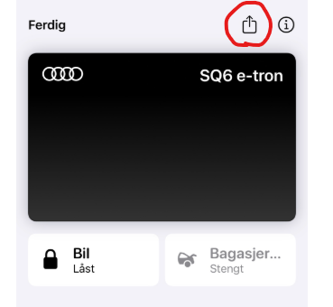
  
Hier hat sich der Unterzeichnete entschieden, mit dem Messenger zu teilen, aber ich denke, andere Methoden funktionieren auch
  
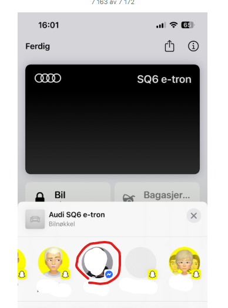
  
Drücken Sie das Namensfeld und Sie erhalten die Möglichkeit, entweder einen Namen aus Ihren Kontakten auszuwählen, oder Sie können einfach den gewünschten Namen schreiben.
  
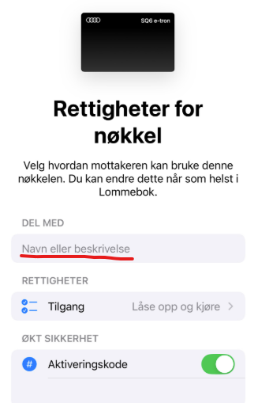
  
Dann haben Sie den digitalen Schlüssel, den Sie als eine Art Anhang über Messenger in diesem Beispiel senden
  
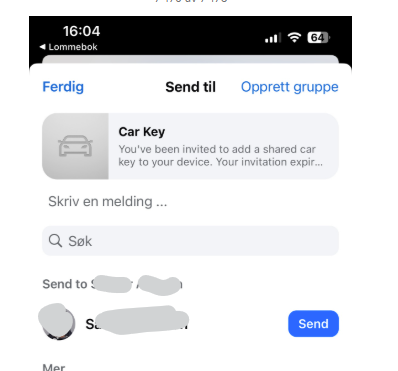
  
Und Sie können sehen, dass der Schlüssel geliefert wird und wenn der Empfänger ihn öffnet, wird er als Schlüssel zu seiner Brieftasche hinzugefügt
  
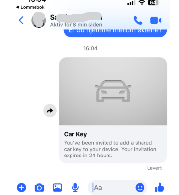
  
Wenn Sie einen erweiterten Sicherheitscode mit Aktivierungscode auswählen, müssen Sie diesen Code mit dem Benutzer per SMS oder auf andere Weise teilen. Normalerweise sitzt dieser neue Benutzer auf dem Platz neben Ihnen... Dieser Code wird benötigt, wenn diese Option eingestellt ist. Sie können natürlich wählen, diese Option nicht zu überprüfen.
  
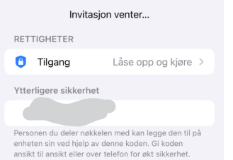
  
Beachten Sie, dass Sie beim Abschluss der ersten Freigabe eine neue Option zum Verwalten und möglicherweise Hinzufügen weiterer Empfänger des digitalen Schlüssels erhalten.
  
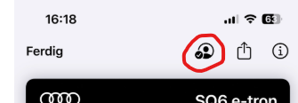
  
Hier erhalten Sie neue Optionen zum Hinzufügen weiterer Key-User
  
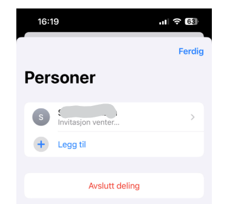
  

### Datenbank für Fragen

Einige der in der Q6 Issues Database registrierten Probleme sind jetzt als in KD2 behoben gekennzeichnet.

sehen [Issues fixed with KD2](https://github.com/electrichasgoneaudi/q6-e-tron/issues?q=label%3A%22fixed%20in%20KD2%22)

sehen [Issues NOT fixed with KD2](https://github.com/electrichasgoneaudi/q6-e-tron/issues?q=state%3Aopen%20label%3A%22Not%20fixed%20in%20KD2%22)

Dieses Problem kann nach der Installation von KD2 auftreten: [Window refuses to close, just open again](https://github.com/electrichasgoneaudi/q6-e-tron/issues/93)

