## KD2 - 03.10.00/C

- Il ne s'agit pas d'une mise à jour en OTA, la voiture doit être mise à jour à l'atelier
- Ce ne sera pas non plus une mise à jour de campagne, donc seuls ceux qui éprouvent des problèmes peuvent recevoir cette mise à jour.
- Livraison sur voitures neuves de la semaine de production 34/2025
- Numéro de version dans l'application myAudi: 03.10.00

### Date de publication: Octobre 2025
- TPI 2078923/1

### Description générale des améliorations:
- Prévention des erreurs d'écran/de divertissement; écrans noirs, réinitialise, redémarre, congélation de l'écran
- Optimisations du système de navigation (affichage, planification de l'itinéraire, guidage, navigation)
- Améliorations liées à la connectivité (APN, Bluetooth, radio, navigation, eCall)
- Optimisation de eCall / radio / divertissement (pas de sortie audio, connexion manquante, stabilité)
- Améliorations au fonctionnement (contrôle de la voix) et à la navigation
- Améliorations de la reconnaissance des signaux de circulation (amélioration générale de la détection, du dysfonctionnement et de la désactivation des systèmes d'assistants)
- Amélioration de l'expérience de conduite (démarrage de la voiture, fonction de maintien, branlement en conduisant, chute de voiture de vitesse)
- Prévention des feux d'avertissement non autorisés (par exemple, feux d'avertissement d'émissions d'échappement et entrées de mémoire d'événements)
- Optimisations des processus de charge (temps de charge, application de charge et état de charge, affichage, problèmes de charge)
- Améliorations de la clé mobile (connaissance de clé, système sans clé, etc.)
- Service mobile de partage de clé est restauré
- Détection d'enfant dans la voiture: ne plus déclencher sans raison

### Notes importantes pour les propriétaires:
- Tous les paramètres personnels (Drive Select, éclairage, radio, langue, navigation HUD, etc.) doivent être reconfigurés après la mise à jour.
- Le mode de confidentialité est automatiquement désactivé et doit être activé manuellement à nouveau.
- La mise à jour ne peut être effectuée qu'avec une clé physique – les clés numériques et les cartes clés ne peuvent pas être utilisées pendant l'installation.
- Temps de mise à jour : - 3,5 heures (la voiture redémarre plusieurs fois et peut être sombre pendant 20-30 minutes).

### Informations techniques (d'après la documentation de service):
- Codes clignotants: BLKD2PPE, DUCLDRM0046, DUCDOORWR
- Le câble de recharge HV doit être déconnecté avant la mise à jour
- Mettre à jour uniquement via le câble USB (pour la stabilité)

### Résumé
KD2 est une mise à jour importante pour la stabilité et la fiabilité de la nouvelle série d'e-trons Q6 basée sur EPI. Les propriétaires signalent des performances plus fluides du système, une meilleure reconnaissance des clés et une meilleure logique de charge après l'installation.

### Expérience pratique avec KD2
L'auteur a reçu KD2 sur son QS6 en novembre 2025 (Car a été produit en juillet 2024 et avait précédemment [06XM](../patch06xm) et [06XL](../patch06xl))

La mise à jour a pris une journée de travail chez le concessionnaire.

Étonnamment, presque toute la configuration a été préservée. Selon des rumeurs, la voiture était presque remise à zéro en usine, mais ce n'est pas le cas. La première chose à faire est de vérifier la version dans le MMI de la voiture.

Toutes les applications installées dans AppStore étaient en place et l'aperçu de l'icône est inchangé

Une observation est que l'icône/bouton a changé pour mieux refléter ce qu'il fait réellement. Ici, il montre plus clairement que la fenêtre arrière et les miroirs sont chauffés. Voir l'image ci-dessous.

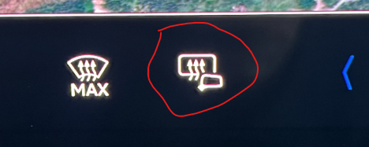

Il est également facile de remarquer que l'éclairage ambiant a été éteint (d'autres ont signalé qu'il allume des lumières blanches), donc il a dû être réglé à nouveau

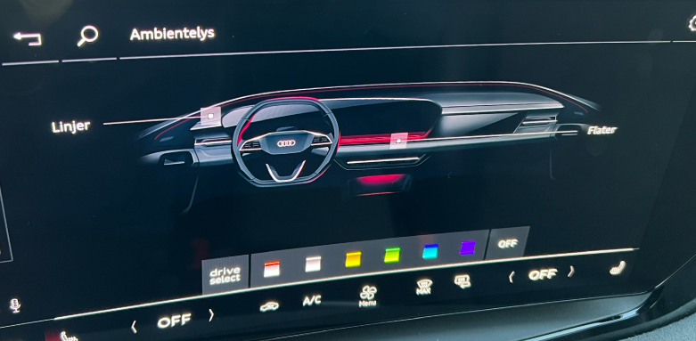

Mais le son externe n'a pas été réinitialisé.

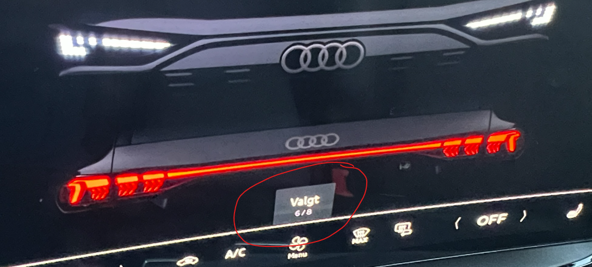

Le lecteur select a été réinitialisé et vous devez configurer le réglage INDIVIDUEL à nouveau, si vous l'aviez mis à jour précédemment.

Dans la fiche d'information du concessionnaire, il a dit que les favoris de radio devaient être remis, mais ce n'était pas nécessaire pour moi, tous les favoris étaient en place.

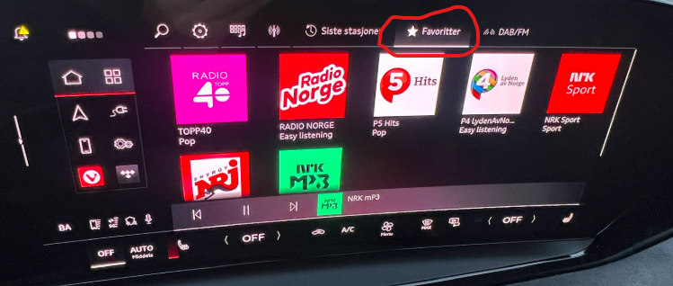

Comme indiqué dans la fiche d'information, l'ouverture de porte de garage doit être reprogrammée.

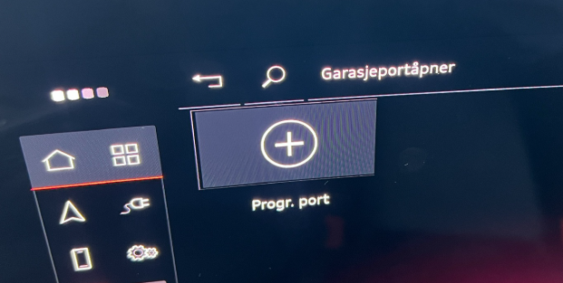

**Messages et popups irréfléchis** Reste à voir au fil du temps, mais l'avertissement jaune initial que l'aide avant est initialisante semble maintenant prendre seulement 10-15 secondes.

La fiche d'information mentionne également les connexions aux appareils mobiles, mais pour moi iPhone et mains libres a fonctionné comme avant comme si rien n'était arrivé

**Car2Phone** semble être parti, mais il n'est pas. Il vient de changer de nom, probablement dans la mise à niveau de myAudi 4.x à 5.x. Maintenant, il est appelé Car Connection, sinon il fonctionne comme avant.

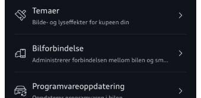

**Navigation** Ici toutes les destinations et les favoris précédents sont en place comme avant. Mais comme mentionné dans la fiche d'information, l'affichage dans l'affichage Head Up (HUD) doit être activé à nouveau

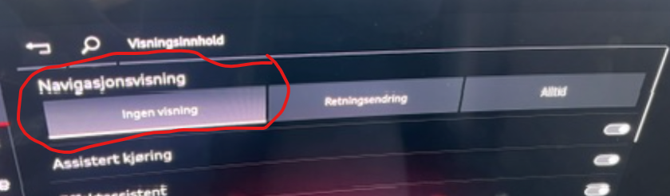

Voici comment le faire si vous voulez la navigation dans HUD

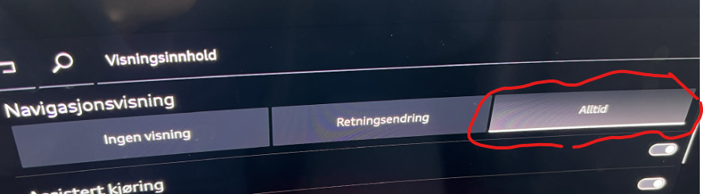

Navigation GUI ne semble pas avoir reçu d'améliorations. Je regrette profondément qu'il ne montre pas que la voiture a ajouté un arrêt de charge. Ici, vous devez ouvrir le voyage lui-même pour voir que ce 'suddenly' peut avoir été calculé par la voiture, et c'est un peu irritant

**Freinage** Notez toujours que les freins peuvent se masturber un peu si vous devez soudainement freiner, par exemple dans un rond-point parce qu'un propriétaire de BMW ne dérange pas la signalisation et choisit de rouler autour sans donner aucune indication.

**Système de recharge**: Il est indiqué que la recharge est améliorée.

Vous pouvez au moins maintenant voir que le temps restant est affiché dans MMI   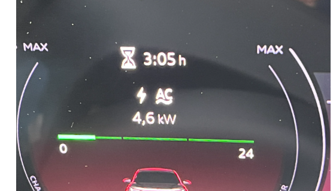   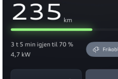

Mais malheureusement nous obtenons toujours le message d'erreur du système de charge pour ceux qui chargent intelligent. Il n'y a toujours pas tout à fait la bonne manipulation du chargeur de la maison étant capable de déconnecter pour attendre des prix moins chers.

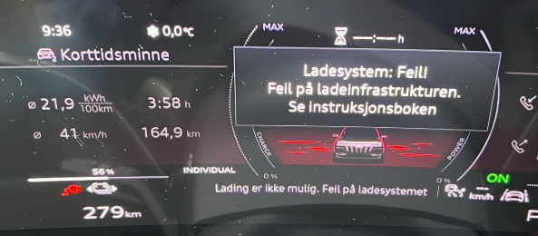    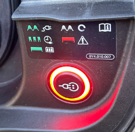

**Clés numériques**

Ceci est maintenant restauré comme il était initialement destiné à fonctionner. Cela signifie que vous pouvez avoir jusqu'à 5 clés numériques. [06XM](../patch06xm) et réduit à l'utilisateur principal dans [06XL](../patch06xl), mais est maintenant de retour dans le plein.

Ici, il est très important de savoir que vous devez passer par 2 tours pour pouvoir créer une clé numérique sur l'utilisateur principal et ensuite pouvoir la partager avec d'autres.

Audi écrit que vous devez répéter cette procédure pour démarrer un processus dans la partie serveur qui permet de partager la clé numérique à nouveau

Ceci est décrit dans la fiche d'information que vous recevez, mais voici une documentation plus détaillée de la procédure:

Auteur avait la clé numérique configurée, mais il est maintenant parti de voiture, myAudi App et iPhone (si vous double-pressez sur iPhone avec le bouton droit mobile, la voiture est partie de la liste des cartes de paiement).

Dans la voiture, vous verrez ce message apparaître

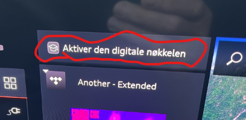

Ici, il y a encore une certaine confusion, car si vous choisissez de commencer le processus à partir de MMI, vous êtes invité à placer le téléphone dans le chargeur mobile et suivre les instructions. Mais il est presque impossible de voir et de presser le téléphone quand il est en position de charge.

Heureusement, il y a une façon légèrement différente de le faire, donc il est décrit en détail ci-dessous.

1. Apportez votre clé mobile et physique dans la voiture.
2. Naviguez dans MMI vers la clé numérique et l'administration, mais vous n'avez pas besoin d'appuyer sur 'Set up main device'
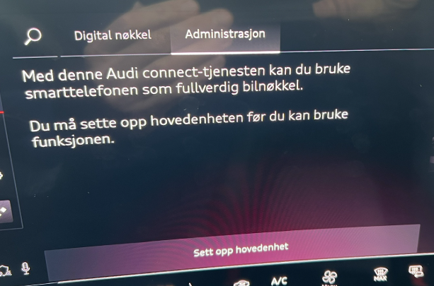

3. Tenez votre mobile dans la main pendant que vous êtes assis dans la voiture.  
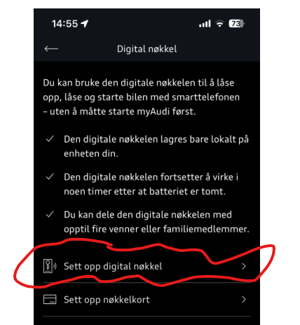

4. Dans l'image suivante cliquez sur   
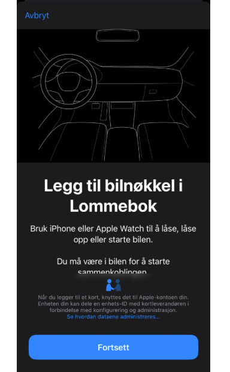

5. Le processus commence... Ce qui se passe, c'est qu'une clé est créée et ajoutée comme carte de crédit dans votre iPhone.  
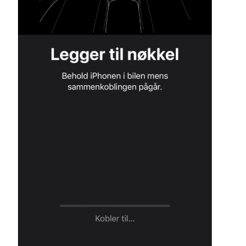

6. En même temps, vous verrez que l'écran MMI met également à jour que quelque chose est « heureux »  
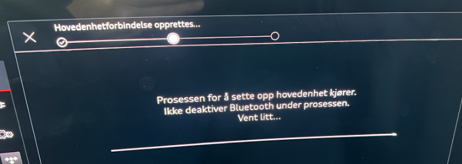

7. Ce point est le plus critique, car il y a la communication entre la voiture, le téléphone et Internet. Cela échoue malheureusement parfois, puis juste commencer le processus à nouveau. Mais attendez un peu 15-30 minutes avant d'essayer de nouveau

8. Si cela a été réussi, vous voyez que l'écran MMI continue à l'étape suivante  
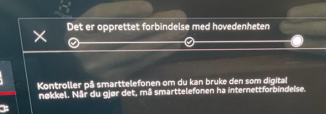  Et votre iPhone affiche une 'image de carte de crédit' comme indiqué ci-dessous   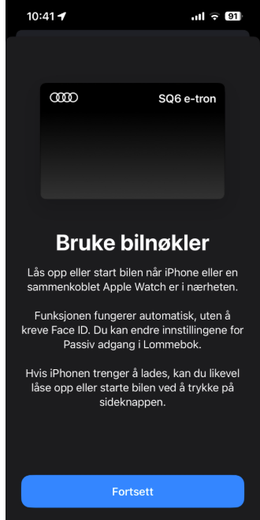

9. Si vous cliquez sur continuer dans l'App myAudi, vous allez à  
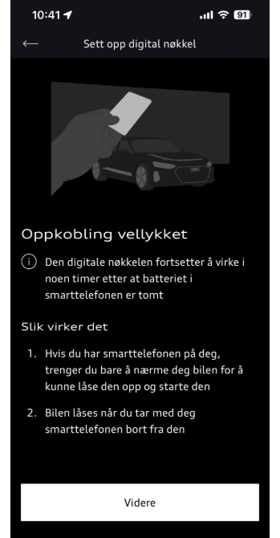

10. Et à cette image quand vous appuyez sur Suivant. Ici vous voyez que vous avez créé une clé numérique.  
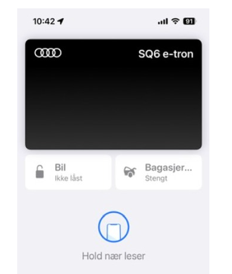

11. Si vous doublez maintenant le bouton droit de votre iPhone, vous ouvrez votre voiture comme une carte de crédit et pouvez alors ici ouvrir et fermer voiture et coffre. Cela se produit via une connexion Bluetooth entre la voiture et votre téléphone.

**Comment partager la clé numérique**

Si vous avez réussi à créer la clé numérique suivant la description ci-dessus, vous êtes prêt à la partager plus loin. Ceci est effectué sur votre iPhone, avec l'option Portefeuille.
  
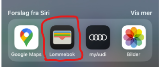
  
Sélectionnez la carte Audi noire qui a probablement le nom de voiture que vous avez vous-même donné
  
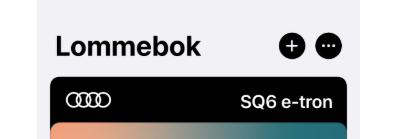
  
Appuyez sur la carte audi noire et sélectionnez l'icône de partage
  
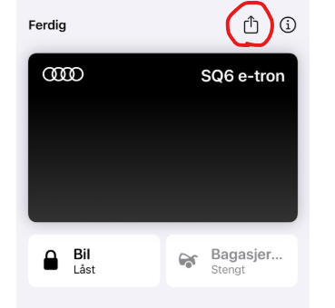
  
Ici, le soussigné a choisi de partager avec messager, mais je suppose que d'autres méthodes fonctionnent aussi
  
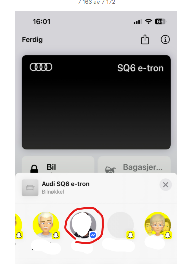
  
Appuyez sur le champ Nom et vous avez la possibilité de sélectionner un nom à partir de vos contacts, ou vous pouvez simplement écrire quel nom vous voulez
  
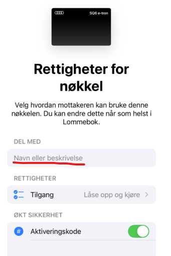
  
Ensuite, vous avez la clé numérique que vous envoyez comme type de pièce jointe via messager dans cet exemple
  
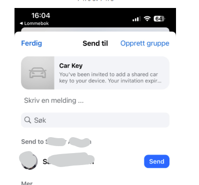
  
Et vous pouvez voir que la clé est livrée et quand le destinataire l'ouvre, elle est ajoutée à leur portefeuille comme une clé
  
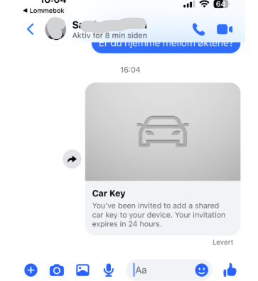
  
Sachez que lorsque la sécurité améliorée avec le code d'activation est sélectionnée, vous devez partager ce code avec l'utilisateur via SMS ou d'autres moyens. Habituellement, ce nouvel utilisateur est assis dans le siège à côté de vous... Ce code est requis lorsque cette option est définie. Vous pouvez bien sûr choisir de ne pas vérifier cette option.
  
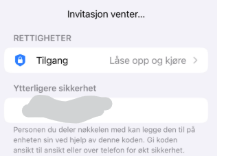
  
Notez que lorsque le premier partage est terminé, vous obtenez une nouvelle option pour gérer et éventuellement ajouter plus de destinataires de la clé numérique.
  
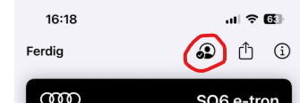
  
Ici vous obtenez de nouvelles options pour ajouter plus d'utilisateurs clés
  
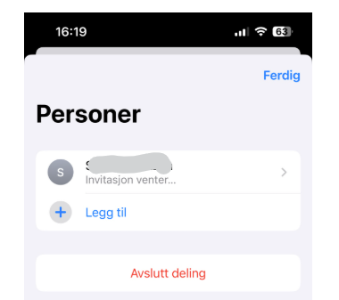
  

### Base de données sur les questions

Plusieurs des problèmes enregistrés dans la base de données Q6 sont maintenant marqués comme corrigés dans KD2

Voir [Issues fixed with KD2](https://github.com/electrichasgoneaudi/q6-e-tron/issues?q=label%3A%22fixed%20in%20KD2%22)

Voir [Issues NOT fixed with KD2](https://github.com/electrichasgoneaudi/q6-e-tron/issues?q=state%3Aopen%20label%3A%22Not%20fixed%20in%20KD2%22)

Ce problème peut survenir après l'installation de KD2 : [Window refuses to close, just open again](https://github.com/electrichasgoneaudi/q6-e-tron/issues/93)
