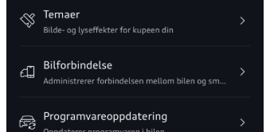
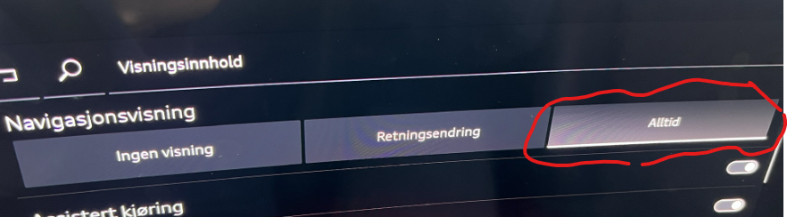
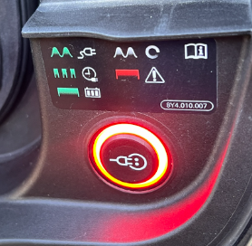
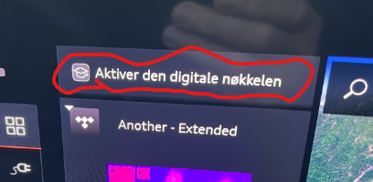
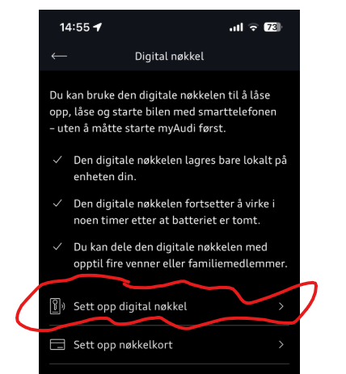
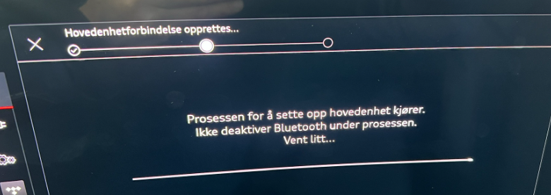
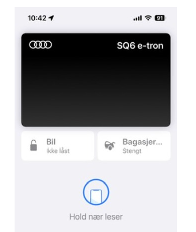
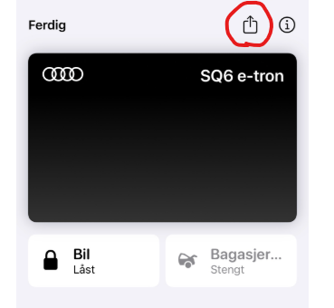
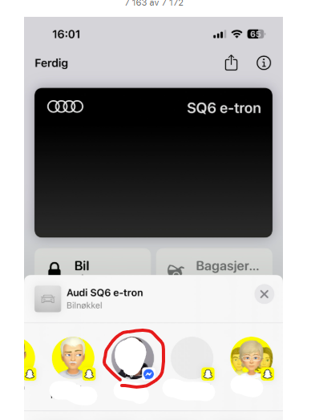
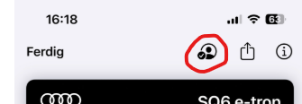

## KD2 - 03.10.01/C (28.13.01)

- Dette er IKKE en OTA oppdatering, bilen må oppdateres på verksted
- Det vil heller ikke blir en kampanje oppdatering, så det er bare de som opplever problem som kan motta denne oppdatering. Så man kontakter sin forhandler om man opplever den type feil som er beskrevet under
- Er levert på nye biler fra produksjonsuke 34/2025
- Versjonsnr i myAudi App : 03.10.01

### Utgivelsesdato: Oktober 2025
- TPI 2078923/1

### Generell beskrivelse av forbedringer : 
- Forebygging av feil på skjerm/infotainment;  svarte skjermer, tilbakestilling, omstarter, skjermfrysninger
- Optimaliseringer av navigasjonssystemet (visning, ruteplanlegging, veiledning, navigasjon)
- Forbedringer knyttet til tilkobling (APN, Bluetooth, radio, navigasjon, eCall)
Optimalisering av eCall / radio / underholdning (ingen lydutgang, manglende tilkobling, stabilitet)
- Forbedringer av betjening (talestyring) og navigasjon
- Forbedringer av trafikkskiltgjenkjenning (generell forbedring av deteksjon, funksjonsfeil og deaktivering av assistentsystemer)
- Forbedringer av kjøreopplevelse(oppstart bil, hold-funksjon, rykk under kjøring, bilen faller ut av gir)
- Forebygging av uberettigede varsellamper (f.eks. varsellampe for eksosutslipp og hendelsesminneoppføringer)
- Optimaliseringer av ladeprosesser (ladetid, ladeapp og ladestatus, visning, ladeproblemer)
- Forbedringer av mobilnøkkel (nøkkelgjenkjenning, nøkkelfritt system, osv.)
- Tjeneste for deling av mobilnøkkel er gjenopprettet
- Registrering av barn i bilen: utløses ikke lenger uten grunn

### Viktige merknader for eiere:
- Alle personlige innstillinger (Drive Select, belysning, radio, språk, HUD-navigasjon osv.) må konfigureres på nytt etter oppdateringen.
- Personvernmodus deaktiveres automatisk og må aktiveres manuelt på nytt.
- Oppdateringen kan bare utføres med en fysisk nøkkel – digitale nøkler og nøkkelkort kan ikke brukes under installasjonen.
- Oppdateringstid: ≈ 3,5 timer (bilen starter på nytt flere ganger og kan være mørk i 20–30 minutter).

### Teknisk informasjon (fra servicedokumentasjon):
- Flash-koder: BLKD2PPE, DUCLDRM0046, DUCDOORWR
- HV-ladekabelen må kobles fra før oppdateringen
- Oppdatering kun via USB-kabel (for stabilitet)

### Sammendrag
KD2 er en viktig oppdatering for stabilitet og pålitelighet for den nye PPE-baserte Q6 e-tron-serien.
Eiere rapporterer om jevnere systemytelse, bedre nøkkelgjenkjenning og forbedret ladelogikk etter installasjon.

### Praktiske erfaring med KD2
Forfatter har fått KD2 på sin SQ6 i november 2025 (Bilen er produsert Juli 2024 hadde fra før [06XM](../patch06xm) og [06XL](../patch06xl) )

Oppdateringen tok en arbeidsdag hos forhandler.

Overraskende nok, så var nesten all konfigurasjon ivaretatt. Ryktene sa at bilen var tilnærmet fabrikkinnstillt, men det er altså ikke tilfelle. 
Første ting å gjøre er å sjekke versjon i bilens MMI. Det er som forventet 03.10.00/C.

Alle installerte apper i AppStore var på plass og ikonoversikten er ikke endret

En obervasjon er at ikon/knapp er endret for å bedre reflektere hva det faktisk gjør. Her vises det tydeligere at det er både bakrute og speil som varmes. Se bildet under.

Det er også lett å oppdage at ambientelyset var slått av (andre har meldt at det lyser hvitt), så det måtte settes på nytt

Men utvendige lyd ble ikke resatt.

Drive select var resatt og man må stille in INDIVIDUAL innstillingen på nytt, om man hadde oppdatert denne tidligere. 

I infoskrivet fra forhandler stod det at radiofavoritter måtte settes på nytt, men det var ikke nødvendig hos meg, alle favoritteer var på plass.

Som oppgitt i infoskrivet må garasjeportåpner må programmeres på nytt.

**Feilmeldinger og popups**
Gjenstår å se over litt tid, men den initielle gule varselet om at front assistent initialiseres, ser ut til å bare ta 10-15 sekunder nå. 

Infoskrivet omtaler også forbindelser til mobile enheter, men hos meg fungerte iPhone og handsfree som før som om ingenting hadde skjedd

**Car2Phone** ser ut til å være borte, men det er det ikke. Den har bare endret navn, sannsynligvis i oppgraderingen av myAudi 4.x til 5.x. Nå heter det Bilforbindelse, ellers virker det som før.

**Navigasjon** Her er alle tidligere mål og favoritter på plass som før. Men som nevnt i infoskriv må vising i Head Up Display (HUD) aktiveres på nytt

Slik gjør du om du vil ha navigasjon i HUD

Navigasjons GUI ser ikke ut til å ha fått noe forbedringer. Savner dypt at det ikke vises at bilen har lagt inn en ladestopp. Her må man åpne selve turen for å se at dette 'plutselig' kan da blitt kalkulert inn av bilen, og det er litt irriterende

**Ladesystemet**: Det er oppgitt at lading er forbedret.

Man ser i allefall nå at nå vises gjenstående tid i MMI   
  

Men dessverre så får vi fremdeles 'Feil på ladesystem' melding for de som smartlader. Det er fremdeles ikke helt korrekt håndtering av at hjemmeladeren kan kople fra for å vente på billigere priser. Men initiell erfaring er at det er forbedret håndtering.

   

**Digitale nøkler**

Dette er nå gjenopprettet som det opprinnelig var ment å fungere. Det vil si at man kan ha inntil 5 digitale nøkler. dette ble introdusert i [06XM](../patch06xm) og nedskalert til bare hovedbruker i [06XL](../patch06xl), men er altså nå tilbake for fullt.

Her er det veldig viktig å være klar over at man må gjennom 2 runder for å kunne få opprettet digital nøkkel på 
hovedbruker og deretter kunne dele den med andre.

Audi skriver at man er nødt til å gjenta den prosedyren for å starte en rposess i serverdelen som gjør det mulig å dele den digital nøkkellen igjen

Dette er beskrevt i infoskrivet man mottar, men her er det mer detaljert dokumentasjon av fremgangmåten:

Forfatter hadde digital nøkkel konfigurert, men den er nå borte fra bil, myAudi App og iPhone (dobbelttrykker man på iPhone med den høyre mobilknappen er bilen borte fra listen over betalingskort).

I bilen vil du se denne meldingen dukke opp

Her er det fremdeles noe forvirring, fordi om man velger å starte prosessen fra MMI så blir du bedt om å legge mobilen i mobilladeren og følge anvisningene. Men det er jo tilnærmet umulig å både se og trykke på mobilen når den ligger i ladeposisjon.

Heldigvis finnes det en litt annen måte å gjøre det på, så det beskriver under i detalj.

1. Ha med deg mobil og fysisk nøkkel inn i bilen. 
2. Naviger i MMI til Digital Nøkkel og Administrasjon, men du trenger ikke trykke på 'Sett opp hovedenhet'

3. Bare hold din mobil i hånden mens du sitter i bilen. Naviger til Digital Nøkkel i myAudi App  

4. I neste bilde klikk på   

5. Prosessen starter ... Det som skjer er at det lages en nøkkel som legges inn som 'Kredittkort' i din iPhone.  

6. Samtidig vil du se at MMI skjermen også oppdateres at det skjer 'noe'  

7. Akkurat dette punktet er det mest kritiske, for her er det kommunikasjon mellom bil, telefon og internet. Dette feiler dessverre av og til, da er det bare å starte prosessen på nytt. Men vent litt 15-30 minutter før du prøver på nytt

8. Ble dette vellykket ser du at MMI skjermen går videre til neste steg  
 
Og din iPhone viser et 'kredittkort-liknende bilde' som vist under  

9. Klikker du på fortsett i myAudi Appen, så kommer du videre til  

10. Og til dette bildet når du trykker Videre. Her ser du at du har fått opprettet en digital nøkkel.  

11. Hvis du nå dobbelttrykker på høyre knapp på din iPhone, så åpr du opp din bil som et Kredittkort og kan da her åpne og lukke bil og bagasjerom. dette skjer da via en bluetooth forbindelse mellom bilen og telefonen din.

**Hvordan dele den digitale nøkkelen**

Om du klare å opprette den digitale nøkkelen etter beskrivelsen over, så er du klar for å dele denne videre. Dette utføres på din iPhone, med valget Lommebok.
  

  
Velg den sorte Audi kortet som sannsynligvis har bilnavnet du har gitt deg på
  

  
Trykk på den sorte audi kortet og velg deling ikonet
  

  
Her har undertegnede valgt å dele med messenger, men jeg tipper andre metoder også fungerer
  

  
Trykk på feltet for navn og du får mulighet til å enten velge et navn fra dine kontakter, eller så kan du bare skrive det navnet du måtte ønske
  

  
Da har du den digitale nøkkelen som du sender som en type vedlegg via messenger i dette eksemplet
  

  
Og man kan se at nøkkelen er levert og når mottaker åpner den så blir den lagt inn i vedkomnes lommebok som en nøkkel
  

  
Vær obs på at når Økt sikkerhet med aktiveringskode er valgt, så må du dele den koden med brukeren via SMS eller på andre måter. Vanligvis er vel denne nye brukeren plassert i stolen ved siden av deg... Denne koden er påkrevd når dette valget er satt. Man kan selvfølgelig velge å ikke sjekke ut det valget.
  

  
Legg merke til at når første deling er gjennomført, så får du et nytt valg for å administrere og ev legge til flere mottakere av den digitale nøkkelen.
  

  
Her får du da opp nye valg for å legge til flere nøkkelbrukere
  

  

### Issues databasen

Flere av issuene som er registrert i Q6 Issues Database er nå merket med fikset i KD2

se [Issues fikset med KD2](https://github.com/electrichasgoneaudi/q6-e-tron/issues?q=label%3A%22fixed%20in%20KD2%22)

 